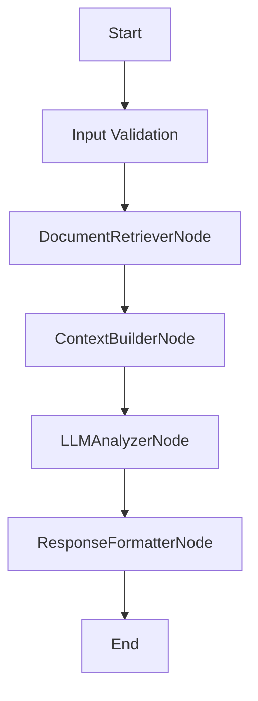

# Design Document

> Spec: TestContentAnalyzer
> Created: 2025-08-13
> Status: Design Phase
> Framework: PocketFlow

**CRITICAL**: This design document MUST be completed before any code implementation begins.

## Requirements

### Problem Statement
Test content analyzer using RAG pattern for validation

### Success Criteria
- Successful implementation of RAG pattern
- All nodes execute correctly in sequence
- Proper error handling and validation
- Complete test coverage

### Design Pattern Classification
**Primary Pattern:** RAG
**Secondary Patterns:** FastAPI Integration(enabled)

### Input/Output Specification
- **Input Format:** Request data from API or direct invocation
- **Output Format:** Processed results with metadata
- **Error Conditions:** Validation errors, processing failures, timeout errors

## Flow Design

### High-Level Architecture


### Node Sequence
1. **DocumentRetrieverNode** - Retrieve relevant documents from vector store
2. **ContextBuilderNode** - Build context from retrieved documents
3. **LLMAnalyzerNode** - Analyze content using LLM with context
4. **ResponseFormatterNode** - Format analysis results for response

## Utilities

Following PocketFlow's "implement your own" philosophy, specify all utility functions needed.

### Required Utility Functions

#### retrieve_documents
- **Purpose:** Retrieve documents from vector database
- **Input:** query: str, limit: int
- **Output:** List[Dict[str, Any]]

#### call_llm_analyzer
- **Purpose:** Call LLM for content analysis
- **Input:** context: str, query: str
- **Output:** str


## Data Design

### SharedStore Schema
Following PocketFlow's shared store pattern, all data flows through a common dictionary.

```python
SharedStore = {
    "input_query": str,
    "retrieved_docs": List[Dict[str, Any]],
    "context": str,
    "llm_response": str,
    "analysis_result": Dict[str, Any],
    "timestamp": datetime,
}
```

## Node Design

### DocumentRetrieverNode
- **Type:** AsyncNode
- **Purpose:** Retrieve relevant documents from vector store
- **Input:** `input_query` from SharedStore
- **Output:** `retrieved_docs` list

### ContextBuilderNode
- **Type:** Node
- **Purpose:** Build context from retrieved documents
- **Input:** `retrieved_docs` from SharedStore
- **Output:** `context` string

### LLMAnalyzerNode
- **Type:** AsyncNode
- **Purpose:** Analyze content using LLM with context
- **Input:** `context` and `input_query` from SharedStore
- **Output:** `analysis_result` dictionary

### ResponseFormatterNode
- **Type:** Node
- **Purpose:** Format analysis results for response
- **Input:** `analysis_result` from SharedStore
- **Output:** Final formatted response

## Implementation Notes

- Pattern: RAG
- Nodes: 4
- Utilities: 2
- FastAPI Integration: Enabled

This design document was generated automatically. Please review and complete with specific implementation details.