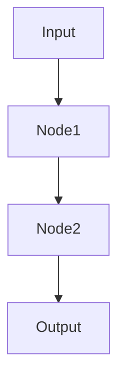

# Claude Code Agents Update Plan for Python/PocketFlow Integration

> **Status**: Planning Phase
> **Created**: 2025-01-09
> **Priority**: High - Required for complete Agent OS + PocketFlow integration

## Executive Summary

The claude-code agents currently support generic Agent OS workflows but need significant updates to align with our new Python-based PocketFlow paradigm. This plan outlines the comprehensive changes needed to transform these agents from generic Ruby/Rails-focused tools to Python/FastAPI/PocketFlow-optimized specialists.

## Current State Assessment

### Agent Analysis Results

| Agent | Current State | Python/PocketFlow Alignment | Priority | Complexity |
|-------|---------------|------------------------------|----------|------------|
| **file-creator.md** | Ruby/Rails templates, generic Agent OS | ❌ **Critical Gap** | 🔴 Highest | High |
| **context-fetcher.md** | Generic file awareness | ⚠️ **Partial** | 🟡 Medium | Low |
| **git-workflow.md** | Generic git operations | ⚠️ **Missing Python tooling** | 🟡 Medium | Medium |
| **test-runner.md** | Generic test patterns | ⚠️ **Missing pytest/uv** | 🟡 Medium | Low |
| **date-checker.md** | Generic date determination | ✅ **Compatible** | 🟢 Low | None |

## Critical Integration Gaps

### 🔴 Priority 1: file-creator.md (Complete Overhaul Required)

**Current Issues:**
- All templates are Ruby/Rails focused (spec.md, mission.md, etc.)
- No Python project structure templates
- Missing PocketFlow 8-step methodology templates
- No FastAPI/Pydantic integration templates

**Required Updates:**
1. **PocketFlow Project Templates**
   - `docs/design.md` with Mermaid diagrams
   - `main.py` FastAPI application template
   - `flow.py` PocketFlow flows template
   - `nodes.py` PocketFlow nodes template
   - `schemas/` directory with request/response Pydantic models

2. **Python Project Structure Templates**
   - `pyproject.toml` for uv package management
   - `requirements.txt` fallback template
   - Modern Python directory structure
   - Type checking configuration

3. **PocketFlow 8-Step Methodology Templates**
   - Requirements analysis template
   - Flow design with Mermaid integration
   - Utilities template (call_llm.py patterns)
   - Data design (SharedStore schemas)
   - Node design specifications

### 🟡 Priority 2: context-fetcher.md (PocketFlow File Awareness)

**Current Issues:**
- Unaware of PocketFlow-specific files (design.md, flow.py, nodes.py)
- No understanding of Python project structure
- Missing FastAPI/Pydantic file patterns

**Required Updates:**
1. Add PocketFlow file type awareness
2. Update supported file types list
3. Add Python-specific extraction patterns
4. Include design document parsing capabilities

### 🟡 Priority 3: git-workflow.md (Python Tooling Integration)

**Current Issues:**
- No integration with Python linting (ruff)
- Missing type checking workflow (ty)
- No PocketFlow development process awareness

**Required Updates:**
1. Pre-commit Python linting integration
2. Type checking validation in workflow
3. PocketFlow-specific commit patterns
4. FastAPI testing integration

### 🟡 Priority 4: test-runner.md (Python Testing Patterns)

**Current Issues:**
- Generic test execution patterns
- No uv/pytest integration
- Missing PocketFlow testing approaches

**Required Updates:**
1. uv-based test execution (`uvx pytest`)
2. Python test pattern recognition
3. PocketFlow node/flow testing patterns
4. FastAPI test execution

## Detailed Update Specifications

### file-creator.md Transformation

#### New Template Categories Required

**1. PocketFlow Core Templates**
```
PocketFlow Project Structure:
├── docs/design.md           # Mandatory design document
├── main.py                  # FastAPI application
├── flow.py                  # PocketFlow flows
├── nodes.py                 # PocketFlow nodes
├── schemas/
│   ├── requests.py          # API request models
│   └── responses.py         # API response models
├── utils/
│   └── call_llm.py          # LLM integration utilities
└── tests/
    ├── test_nodes.py        # Node testing
    ├── test_flows.py        # Flow testing
    └── test_api.py          # FastAPI testing
```

**2. Python Package Templates**
```
Python Package Configuration:
├── pyproject.toml           # uv package management
├── requirements.txt         # Traditional fallback
├── .python-version          # Python version specification
└── ruff.toml               # Linting configuration
```

**3. Design Document Template (Critical)**
```markdown
# [Project Name] Design Document

## 1. Requirements
[AI system requirements analysis]

## 2. Flow Design


## 3. Utilities Design
[External API wrappers and integrations]

## 4. Data Design (SharedStore)
[Pydantic model schemas]

## 5. Node Design
[PocketFlow node specifications]

## 6. Implementation Plan
[Step-by-step implementation approach]
```

#### Template Replacement Strategy

**Phase 1: Core PocketFlow Templates**
- Replace all Ruby/Rails templates with Python/PocketFlow equivalents
- Maintain Agent OS folder structure compatibility
- Add PocketFlow 8-step methodology integration

**Phase 2: Integration Templates**
- FastAPI + PocketFlow integration patterns
- Pydantic model generation templates
- MCP server integration templates

**Phase 3: Advanced Templates**
- Multi-agent system templates
- Complex flow orchestration
- Production deployment patterns

### context-fetcher.md Enhancement

#### New File Type Support
```yaml
PocketFlow Files:
  - docs/design.md           # Design document parsing
  - flow.py                  # Flow definition extraction
  - nodes.py                 # Node implementation details
  - schemas/*.py             # Pydantic model definitions
  - utils/call_llm.py        # LLM utility patterns

Python Project Files:
  - pyproject.toml           # Dependency extraction
  - requirements.txt         # Package list parsing
  - ruff.toml               # Linting configuration
  - .python-version          # Python version info
```

#### Smart Extraction Patterns
- **Design Documents**: Extract specific sections (requirements, flow design, data models)
- **PocketFlow Files**: Parse node definitions and flow structures
- **Python Config**: Extract dependencies and tool configurations

### git-workflow.md Python Integration

#### Pre-commit Workflow Enhancement
```bash
Standard Python Commit Workflow:
1. Run ruff check --fix . && ruff format .
2. Run uvx ty check
3. Run pytest (if tests exist)
4. Stage changes
5. Create commit with enhanced message format
6. Push with validation
```

#### PocketFlow-Aware Commit Messages
```
Format: [type]: [description] - [component]

Examples:
- feat: Add user authentication flow - nodes
- fix: Update Pydantic schema validation - schemas
- docs: Enhance design document - design
- test: Add comprehensive node testing - tests
```

### test-runner.md Python Testing

#### uv Integration Patterns
```bash
Test Execution Commands:
- uvx pytest                     # Full test suite
- uvx pytest tests/test_nodes.py # Node-specific tests  
- uvx pytest tests/test_flows.py # Flow-specific tests
- uvx pytest -k "test_auth"      # Pattern-based tests
- uvx pytest --cov=.            # Coverage reporting
```

#### PocketFlow Testing Patterns
- **Node Testing**: Individual node validation
- **Flow Testing**: End-to-end flow execution
- **Integration Testing**: FastAPI endpoint testing
- **Schema Testing**: Pydantic model validation

## Implementation Timeline

### Phase 1: Critical Updates (Week 1)
- ✅ Complete file-creator.md overhaul with PocketFlow templates
- ✅ Add Python project structure templates
- ✅ Implement design.md template integration

### Phase 2: Workflow Integration (Week 2)
- ✅ Update context-fetcher.md with PocketFlow file awareness
- ✅ Enhance git-workflow.md with Python tooling integration
- ✅ Update test-runner.md with pytest/uv patterns

### Phase 3: Validation & Testing (Week 3)
- ✅ Test all agents with real PocketFlow projects
- ✅ Validate template generation and workflow integration
- ✅ Document new agent capabilities

## Success Criteria

### Technical Validation
- [ ] file-creator.md generates valid PocketFlow project structures
- [ ] context-fetcher.md successfully parses design.md and Python files
- [ ] git-workflow.md integrates ruff/ty into commit workflow
- [ ] test-runner.md executes pytest with uv successfully
- [ ] All agents work cohesively in PocketFlow development workflow

### Integration Validation
- [ ] Agents support complete PocketFlow 8-step methodology
- [ ] Templates generate production-ready Python/FastAPI code
- [ ] Workflow maintains Agent OS conventions while embracing Python patterns
- [ ] Type safety enforced throughout generated code and workflows

## Risk Mitigation

### Backward Compatibility
- Maintain Agent OS folder structure compatibility
- Preserve existing command interfaces
- Support gradual migration from old templates

### Quality Assurance  
- Test with multiple PocketFlow project types
- Validate against existing Agent OS projects
- Ensure generated code passes linting and type checking

## Next Steps

1. **Review and Approve Plan** - Stakeholder approval of comprehensive update approach
2. **Begin Implementation** - Start with Priority 1 (file-creator.md) transformation
3. **Iterative Testing** - Test each agent update with real project scenarios
4. **Integration Validation** - Ensure cohesive workflow across all updated agents
5. **Documentation Updates** - Update Agent OS documentation to reflect Python/PocketFlow capabilities

---

**Note**: This update plan transforms Agent OS from a generic development framework to a Python/PocketFlow-optimized system while maintaining its core workflow management strengths. The result will be a fully integrated development environment specifically designed for building LLM applications with modern Python tooling.