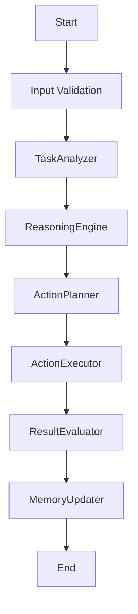

# Design Document

> Spec: BaselineAGENTWorkflow
> Created: 2025-09-03
> Status: Design Phase
> Framework: PocketFlow

**CRITICAL**: This design document MUST be completed before any code implementation begins.

## Requirements

### Problem Statement
Baseline generation snapshot for AGENT pattern

### Success Criteria
- Successful implementation of AGENT pattern
- All nodes execute correctly in sequence
- Proper error handling and validation
- Complete test coverage

### Design Pattern Classification
**Primary Pattern:** AGENT
**Secondary Patterns:** FastAPI Integration (Universal)

### Input/Output Specification
- **Input Format:** Request data from API or direct invocation
- **Output Format:** Processed results with metadata
- **Error Conditions:** Validation errors, processing failures, timeout errors

## Flow Design

### High-Level Architecture


### Node Sequence
1. **TaskAnalyzer** - Analyze incoming tasks and requirements
2. **ReasoningEngine** - Apply reasoning and decision-making logic
3. **ActionPlanner** - Plan sequence of actions to accomplish task
4. **ActionExecutor** - Execute planned actions and tools
5. **ResultEvaluator** - Evaluate results and determine next steps
6. **MemoryUpdater** - Update agent memory with new information

## Utilities

Following PocketFlow's "implement your own" philosophy, specify all utility functions needed.

### Required Utility Functions

#### llm_reasoning
- **Purpose:** Apply LLM-based reasoning to analyze problems
- **Input:** context: str, task: str
- **Output:** str

#### action_planning
- **Purpose:** Generate step-by-step action plan
- **Input:** goal: str
- **Output:** List[Dict[str, str]]


## Data Design

### SharedStore Schema
Following PocketFlow's shared store pattern, all data flows through a common dictionary.

```python
SharedStore = {
    "task": str,
    "context": Optional[str],
    "reasoning_steps": List[str],
    "action_plan": List[Dict[str, str]],
    "actions_taken": List[str],
    "result": str,
    "memory": Dict[str, Any],
}
```

## Node Design

Following PocketFlow's node-based architecture, each processing step is implemented as a discrete node.

### 1. TaskAnalyzer
**Purpose:** Analyze incoming tasks and requirements

**Inputs:** SharedStore
**Outputs:** Updates SharedStore

### 2. ReasoningEngine
**Purpose:** Apply reasoning and decision-making logic

**Inputs:** SharedStore
**Outputs:** Updates SharedStore

### 3. ActionPlanner
**Purpose:** Plan sequence of actions to accomplish task

**Inputs:** SharedStore
**Outputs:** Updates SharedStore

### 4. ActionExecutor
**Purpose:** Execute planned actions and tools

**Inputs:** SharedStore
**Outputs:** Updates SharedStore

### 5. ResultEvaluator
**Purpose:** Evaluate results and determine next steps

**Inputs:** SharedStore
**Outputs:** Updates SharedStore

### 6. MemoryUpdater
**Purpose:** Update agent memory with new information

**Inputs:** SharedStore
**Outputs:** Updates SharedStore


## Implementation Notes

- Pattern: AGENT
- Nodes: 6
- Utilities: 2
- FastAPI Integration: Enabled (Universal)

This design document was generated automatically. Please review and complete with specific implementation details.