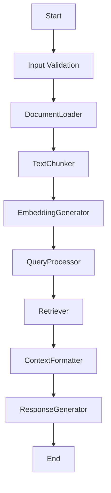

# Design Document

> Spec: BaselineRAGWorkflow
> Created: 2025-09-03
> Status: Design Phase
> Framework: PocketFlow

**CRITICAL**: This design document MUST be completed before any code implementation begins.

## Requirements

### Problem Statement
Baseline generation snapshot for RAG pattern

### Success Criteria
- Successful implementation of RAG pattern
- All nodes execute correctly in sequence
- Proper error handling and validation
- Complete test coverage

### Design Pattern Classification
**Primary Pattern:** RAG
**Secondary Patterns:** FastAPI Integration (Universal)

### Input/Output Specification
- **Input Format:** Request data from API or direct invocation
- **Output Format:** Processed results with metadata
- **Error Conditions:** Validation errors, processing failures, timeout errors

## Flow Design

### High-Level Architecture


### Node Sequence
1. **DocumentLoader** - Load and preprocess documents for indexing
2. **TextChunker** - Split documents into manageable chunks
3. **EmbeddingGenerator** - Generate embeddings for text chunks
4. **QueryProcessor** - Process and analyze incoming queries
5. **Retriever** - Retrieve relevant documents based on query
6. **ContextFormatter** - Format retrieved context for response generation
7. **ResponseGenerator** - Generate response using retrieved context

## Utilities

Following PocketFlow's "implement your own" philosophy, specify all utility functions needed.

### Required Utility Functions

#### vector_search
- **Purpose:** Search vector database for similar embeddings
- **Input:** query_embedding: List[float], top_k: int
- **Output:** List[Dict[str, Any]]

#### chunk_text
- **Purpose:** Split text into semantic chunks
- **Input:** text: str, chunk_size: int
- **Output:** List[str]


## Data Design

### SharedStore Schema
Following PocketFlow's shared store pattern, all data flows through a common dictionary.

```python
SharedStore = {
    "query": str,
    "documents": List[Dict[str, Any]],
    "embeddings": List[List[float]],
    "search_results": List[Dict[str, Any]],
    "context": str,
    "response": str,
}
```

## Node Design

Following PocketFlow's node-based architecture, each processing step is implemented as a discrete node.

### 1. DocumentLoader
**Purpose:** Load and preprocess documents for indexing

**Inputs:** SharedStore
**Outputs:** Updates SharedStore

### 2. TextChunker
**Purpose:** Split documents into manageable chunks

**Inputs:** SharedStore
**Outputs:** Updates SharedStore

### 3. EmbeddingGenerator
**Purpose:** Generate embeddings for text chunks

**Inputs:** SharedStore
**Outputs:** Updates SharedStore

### 4. QueryProcessor
**Purpose:** Process and analyze incoming queries

**Inputs:** SharedStore
**Outputs:** Updates SharedStore

### 5. Retriever
**Purpose:** Retrieve relevant documents based on query

**Inputs:** SharedStore
**Outputs:** Updates SharedStore

### 6. ContextFormatter
**Purpose:** Format retrieved context for response generation

**Inputs:** SharedStore
**Outputs:** Updates SharedStore

### 7. ResponseGenerator
**Purpose:** Generate response using retrieved context

**Inputs:** SharedStore
**Outputs:** Updates SharedStore


## Implementation Notes

- Pattern: RAG
- Nodes: 7
- Utilities: 2
- FastAPI Integration: Enabled (Universal)

This design document was generated automatically. Please review and complete with specific implementation details.