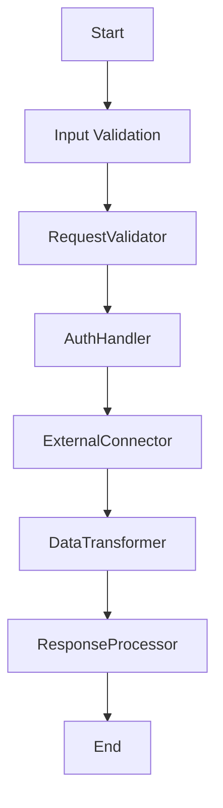

# Design Document

> Spec: BaselineTOOLWorkflow
> Created: 2025-09-03
> Status: Design Phase
> Framework: PocketFlow

**CRITICAL**: This design document MUST be completed before any code implementation begins.

## Requirements

### Problem Statement
Baseline generation snapshot for TOOL pattern

### Success Criteria
- Successful implementation of TOOL pattern
- All nodes execute correctly in sequence
- Proper error handling and validation
- Complete test coverage

### Design Pattern Classification
**Primary Pattern:** TOOL
**Secondary Patterns:** FastAPI Integration (Universal)

### Input/Output Specification
- **Input Format:** Request data from API or direct invocation
- **Output Format:** Processed results with metadata
- **Error Conditions:** Validation errors, processing failures, timeout errors

## Flow Design

### High-Level Architecture


### Node Sequence
1. **RequestValidator** - Validate incoming API requests
2. **AuthHandler** - Handle authentication and authorization
3. **ExternalConnector** - Connect to external APIs and services
4. **DataTransformer** - Transform data between formats
5. **ResponseProcessor** - Process and format API responses

## Utilities

Following PocketFlow's "implement your own" philosophy, specify all utility functions needed.

### Required Utility Functions

#### http_client
- **Purpose:** Make HTTP requests to external APIs
- **Input:** url: str, method: str, headers: Dict[str, str]
- **Output:** Dict[str, Any]

#### data_mapper
- **Purpose:** Map data between different schemas
- **Input:** data: Dict[str, Any], mapping_config: Dict[str, str]
- **Output:** Dict[str, Any]


## Data Design

### SharedStore Schema
Following PocketFlow's shared store pattern, all data flows through a common dictionary.

```python
SharedStore = {
    "request_data": Dict[str, Any],
    "auth_token": Optional[str],
    "external_response": Dict[str, Any],
    "transformed_data": Dict[str, Any],
    "response_data": Dict[str, Any],
}
```

## Node Design

Following PocketFlow's node-based architecture, each processing step is implemented as a discrete node.

### 1. RequestValidator
**Purpose:** Validate incoming API requests

**Inputs:** SharedStore
**Outputs:** Updates SharedStore

### 2. AuthHandler
**Purpose:** Handle authentication and authorization

**Inputs:** SharedStore
**Outputs:** Updates SharedStore

### 3. ExternalConnector
**Purpose:** Connect to external APIs and services

**Inputs:** SharedStore
**Outputs:** Updates SharedStore

### 4. DataTransformer
**Purpose:** Transform data between formats

**Inputs:** SharedStore
**Outputs:** Updates SharedStore

### 5. ResponseProcessor
**Purpose:** Process and format API responses

**Inputs:** SharedStore
**Outputs:** Updates SharedStore


## Implementation Notes

- Pattern: TOOL
- Nodes: 5
- Utilities: 2
- FastAPI Integration: Enabled (Universal)

This design document was generated automatically. Please review and complete with specific implementation details.