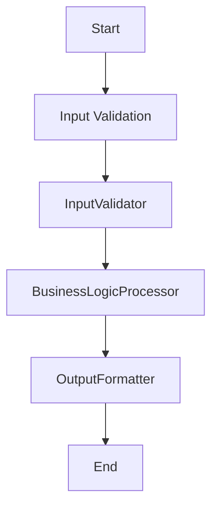

# Design Document

> Spec: BaselineWORKFLOWWorkflow
> Created: 2025-10-02
> Status: Design Phase
> Framework: PocketFlow

**CRITICAL**: This design document MUST be completed before any code implementation begins.

## Requirements

### Problem Statement
Baseline generation snapshot for WORKFLOW pattern

### Success Criteria
- Successful implementation of WORKFLOW pattern
- All nodes execute correctly in sequence
- Proper error handling and validation
- Complete test coverage

### Design Pattern Classification
**Primary Pattern:** WORKFLOW
**Secondary Patterns:** FastAPI Integration (Universal)

### Input/Output Specification
- **Input Format:** Request data from API or direct invocation
- **Output Format:** Processed results with metadata
- **Error Conditions:** Validation errors, processing failures, timeout errors

## Flow Design

### High-Level Architecture


### Node Sequence
1. **InputValidator** - Validate and sanitize input data
2. **BusinessLogicProcessor** - Execute core business logic
3. **OutputFormatter** - Format output data for consumers

## Utilities

Following PocketFlow's "implement your own" philosophy, specify all utility functions needed.

### Required Utility Functions


## Data Design

### SharedStore Schema
Following PocketFlow's shared store pattern, all data flows through a common dictionary.

```python
SharedStore = {
    "input_data": Dict[str, Any],
    "validation_result": Dict[str, Any],
    "processed_data": Dict[str, Any],
    "output_data": Dict[str, Any],
}
```

## Node Design

Following PocketFlow's node-based architecture, each processing step is implemented as a discrete node.

### 1. InputValidator
**Purpose:** Validate and sanitize input data

**Inputs:** SharedStore
**Outputs:** Updates SharedStore

### 2. BusinessLogicProcessor
**Purpose:** Execute core business logic

**Inputs:** SharedStore
**Outputs:** Updates SharedStore

### 3. OutputFormatter
**Purpose:** Format output data for consumers

**Inputs:** SharedStore
**Outputs:** Updates SharedStore


## Implementation Notes

- Pattern: WORKFLOW
- Nodes: 3
- Utilities: 0
- FastAPI Integration: Enabled (Universal)

This design document was generated automatically. Please review and complete with specific implementation details.