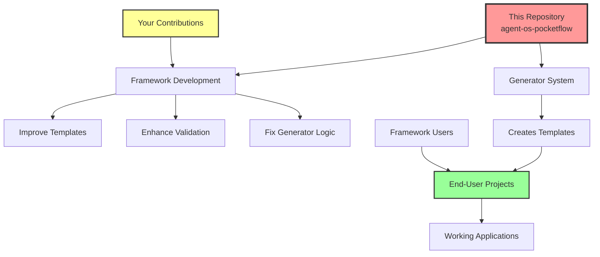
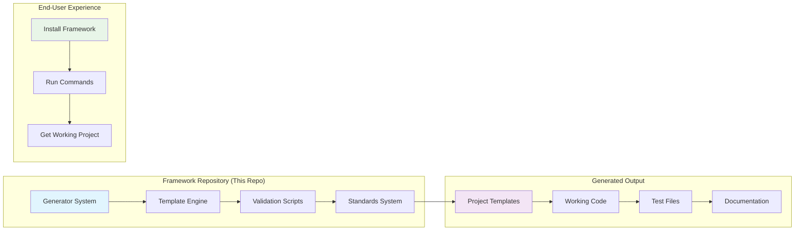

# Developer Quick Start Guide

> **New Contributor Onboarding for Agent OS + PocketFlow Framework**

## 🚨 Understanding This Repository

**You are contributing to the framework itself, not using it.**

This repository contains the Agent OS + PocketFlow **meta-framework** - the system that generates templates and workflows for other projects. Understanding this distinction is critical for effective contribution.



## Framework Architecture Overview

### Meta-Framework Concept



## Code Tour: Key Components

### 🔧 Generator System
**Location:** [`.agent-os/workflows/generator.py`](./.agent-os/workflows/generator.py)

**What it does:**
- Creates complete PocketFlow projects from YAML specifications
- Generates 12+ files per workflow pattern
- Handles template substitution and validation

**Key functions:**
- `PocketFlowGenerator.generate_workflow()` - Main generation logic
- `save_workflow()` - File creation and directory structure
- Template rendering with variable substitution

**When to modify:**
- Adding new PocketFlow patterns
- Improving code generation logic
- Fixing template rendering issues

### ✅ Validation Framework
**Location:** [`./scripts/validation/`](./scripts/validation/)

**What it does:**
- 75+ tests ensuring framework reliability
- Validates generated code quality
- Integration and end-to-end testing

**Key scripts:**
- `validate-integration.sh` - Framework installation validation
- `validate-orchestration.sh` - Agent coordination testing  
- `validate-end-to-end.sh` - Complete system testing
- `run-all-tests.sh` - Master test runner

**When to modify:**
- Adding new validation rules
- Testing new framework features
- Improving error reporting

### 📋 Template System
**Location:** [`templates/`](templates/)

**What it does:**
- Defines code templates for generation
- Variable substitution patterns
- Standards enforcement

**Key files:**
- `pocketflow-templates.md` - PocketFlow-specific patterns
- `fastapi-templates.md` - FastAPI integration templates
- `task-templates.md` - Task breakdown templates

**When to modify:**
- Updating code patterns
- Adding new template types
- Improving generated code quality

### 🎯 Standards & Guidelines
**Location:** [`standards/`](standards/)

**What it does:**
- Framework development guidelines
- Code style enforcement
- Best practices documentation

**Key files:**
- `pocket-flow.md` - PocketFlow implementation patterns
- `code-style.md` - Python/FastAPI style guide
- `best-practices.md` - Development guidelines

**When to modify:**
- Updating development standards
- Adding new style rules
- Documenting best practices

## Development Workflow

### 1. Framework Development Setup

```bash
# Clone the framework repository
git clone https://github.com/pickleton89/agent-os-pocketflow.git
cd agent-os-pocketflow

# Install development dependencies
uv init
uv add --dev pytest ruff ty

# Run validation tests
./scripts/run-all-tests.sh
```

### 2. Making Framework Changes

```bash
# Create feature branch
git checkout -b improve-generator-logic

# Make your changes to framework code
# (generator.py, templates/, standards/, etc.)

# Test your changes
uv run ruff check .
uv run ty check
./scripts/run-all-tests.sh

# Commit changes
git add .
git commit -m "enhance: Improve generator template logic"
```

### 3. Testing Generated Output

```bash
# Test the generator system
cd .agent-os/workflows
python generator.py example-workflow-spec.yaml

# Validate generated workflow
python validate-generation.py ./generated-workflow/

# Test generated code works
cd generated-workflow
uv run pytest
```

## ❌ What NOT to Do

> **Critical:** These are common mistakes that indicate misunderstanding the meta-framework concept

### Don't Try to Fix "TODO" Placeholders
```python
# ❌ Wrong - These are intentional templates!
class SomeNode(Node):
    def exec(self, prep_result):
        # TODO: Implement your logic here  ← Don't "fix" this!
        pass
```

**Why:** TODO stubs in `generator.py` and templates are intentional starting points for end-users, not bugs to fix.

### Don't Install PocketFlow as a Dependency
```bash
# ❌ Wrong - PocketFlow gets installed in target projects
uv add pocketflow  # Don't do this!
```

**Why:** This framework creates projects that use PocketFlow. PocketFlow is installed in the generated projects, not here.

### Don't Invoke the Orchestrator Agent
```bash
# ❌ Wrong - Orchestrator is for end-user projects
/plan-product  # This command is for projects using the framework
```

**Why:** The orchestrator agent is designed for end-user projects that have installed the framework, not for developing the framework itself.

### Don't Expect Application Tests
```bash
# ❌ Wrong - Looking for app tests in a meta-framework
pytest tests/test_my_app.py  # This won't exist
```

**Why:** This repository tests the framework itself (generator, validation, templates), not applications built with the framework.

### Don't Treat Import Errors as Bugs
```python
# ❌ These import errors in generated templates are expected
from pocketflow import Node  # Will fail here, works in target projects
```

**Why:** Generated templates are designed to work when PocketFlow is installed in target projects.

## ✅ What TO Do

### Improve the Generator Logic
```python
# ✅ Enhance template generation
def generate_node_template(self, node_spec):
    # Improve how nodes are generated
    return enhanced_template
```

### Add New Validation Rules
```bash
# ✅ Add tests for new framework features
./scripts/validation/validate-new-feature.sh
```

### Update Templates
```markdown
# ✅ Improve code patterns in templates
## Node Template
Enhanced template with better patterns...
```

### Enhance Documentation
```markdown
# ✅ Improve framework documentation
Better explanations of meta-framework concepts...
```

## Common Contribution Areas

### 1. Generator Improvements
- **Smart Defaults:** Better pattern recognition for node types
- **Template Quality:** Improved generated code patterns
- **Error Handling:** Better validation and error messages

### 2. Validation Enhancements
- **New Test Cases:** Coverage for edge cases
- **Performance Testing:** Framework generation speed
- **Integration Testing:** End-to-end workflow validation

### 3. Template System
- **Pattern Updates:** Modern Python/FastAPI patterns
- **New Templates:** Additional PocketFlow patterns
- **Variable Substitution:** Better template engine features

### 4. Documentation
- **Architecture Diagrams:** Visual framework explanations
- **Code Examples:** Better framework usage examples
- **Troubleshooting:** Common issue resolution

## Getting Help

- **Architecture Questions:** Review [`docs/architecture-documentation-plan.md`](architecture-documentation-plan.md)
- **Code Patterns:** Check [`standards/`](../standards/) directory
- **Validation Issues:** Run [`./scripts/run-all-tests.sh`](../scripts/run-all-tests.sh)
- **Template Problems:** Review [`templates/`](../templates/) directory

## Next Steps

1. **Read [`CONTRIBUTING.md`](../CONTRIBUTING.md)** - Detailed contribution guidelines
2. **Run the tests** - `./scripts/run-all-tests.sh`
3. **Explore the generator** - `.agent-os/workflows/generator.py`
4. **Review templates** - `templates/` directory
5. **Check validation** - `scripts/validation/` directory

Remember: You're improving the system that creates PocketFlow applications, not creating PocketFlow applications yourself!