# Agent OS + PocketFlow Framework Documentation

## ⚠️ CRITICAL: This IS the Framework Repository

**You are viewing the Agent OS + PocketFlow framework itself - NOT a project using it.**

```mermaid
graph LR
    A[🏗️ This Repository<br/>Framework Development] --> B[📦 Template Generation]
    B --> C[📁 End-User Projects]
    C --> D[🚀 Working Applications]
    
    style A fill:#ff9999,stroke:#333,stroke-width:3px
    style B fill:#ffff99,stroke:#333,stroke-width:2px
    style C fill:#99ff99,stroke:#333,stroke-width:2px
    style D fill:#99ccff,stroke:#333,stroke-width:2px
```

### Framework vs Usage Distinction

| Framework Repository (This Repo) | Usage Repository (End-User Projects) |
|----------------------------------|-------------------------------------|
| 🏗️ **We BUILD** the generator | 🚀 **They USE** generated templates |
| 🔧 **We CREATE** template systems | ✅ **They IMPLEMENT** business logic |
| 📝 **We WRITE** placeholder TODOs | 💻 **They COMPLETE** placeholder TODOs |
| 🧪 **We TEST** the framework itself | ✅ **They TEST** their applications |
| 📦 **Dependencies**: Template generation tools | 📦 **Dependencies**: PocketFlow + runtime libs |

**Key Principle**: Missing implementations in generated templates are **features, not bugs**. This framework creates starting points for developers, not finished applications.

---

## 📖 Documentation Navigation

### 🏗️ Framework Development
*For contributors to this framework*

- **[Framework Quickstart](framework-development/QUICKSTART.md)** - Contributing to the framework
- **[Architecture](architecture/README.md)** - Framework's internal structure  
- **[Configuration](framework-development/CONFIGURATION.md)** - Framework setup
- **[Testing](framework-development/TESTING.md)** - Testing the framework

### 🎨 Template Generation
*What this framework produces*

- **[Generation Overview](template-generation/README.md)** - How the generator works
- **[Sub-Agents System](template-generation/sub-agents/overview.md)** - Template validation & patterns
- **[PocketFlow Patterns](template-generation/patterns/README.md)** - RAG, Agent, Tool patterns
- **[Placeholder Philosophy](template-generation/placeholders.md)** - Why TODOs are intentional

### 👥 For End-Users
*If you received a generated template*

- **[Template Recipients Guide](for-end-users/README.md)** - You probably want generated docs
- **[Understanding Templates](for-end-users/understanding-templates.md)** - What the templates mean
- **[Implementing TODOs](for-end-users/implementing-todos.md)** - Completing placeholders

### 📚 Additional Resources

- **[Architecture Details](architecture/README.md)** - System components and data flow
- **[Release Notes](releases/)** - Version history and changes
- **[Archive](archive/)** - Historical documentation

---

## 🚨 Are You in the Right Place?

### ✅ You're in the right place if you want to:
- Contribute to the framework
- Improve template generation
- Enhance validation systems
- Add new PocketFlow patterns
- Fix generator bugs

### ❌ You might be in the wrong place if you want to:
- Build an application with PocketFlow
- Implement business logic
- Complete TODO stubs
- Use generated templates

**If you received a generated template**, you want the documentation that comes **with your generated project**, not this framework documentation.

---

## 🎯 Framework Mission

The Agent OS + PocketFlow framework transforms AI coding agents from confused assistants into architectural decision-makers by providing:

1. **Pattern Recognition** - Automatically identifies optimal PocketFlow patterns
2. **Template Generation** - Creates structured, educational starting points  
3. **Intelligent Placeholders** - TODO stubs that teach proper implementation
4. **Validation Systems** - Ensures generated templates follow best practices

We build the tools that help AI agents think architecturally and generate production-ready patterns.