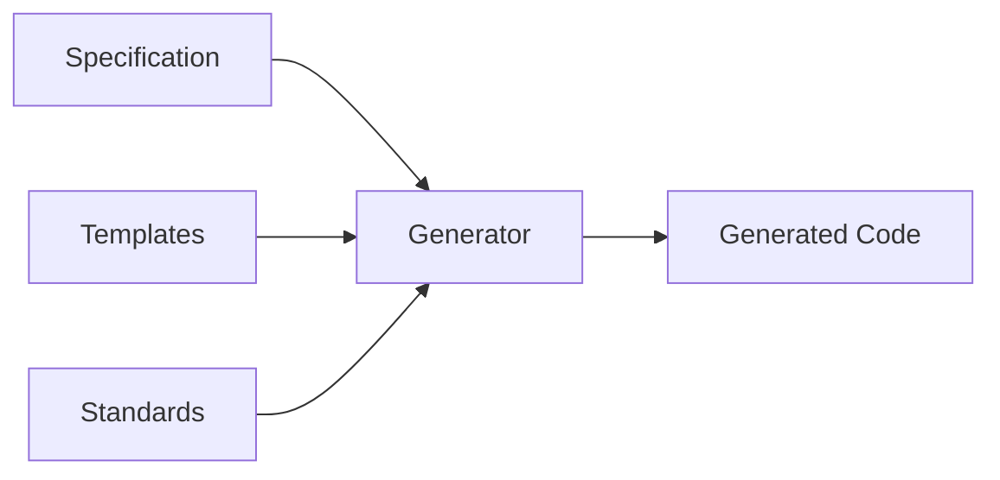
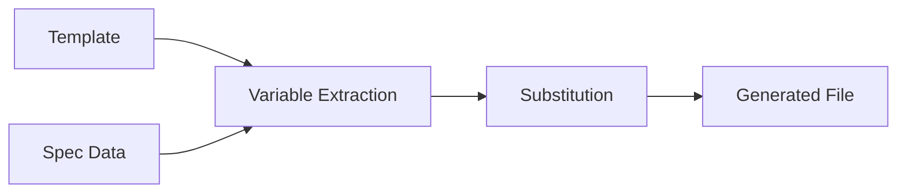
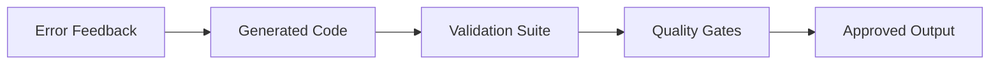

# Architecture Documentation

> **Comprehensive architectural documentation for the Agent OS + PocketFlow meta-framework**

## Overview

This directory contains detailed architectural documentation for the Agent OS + PocketFlow integration. The documentation is designed to help both framework contributors and users understand the system's design, components, and data flows.

## Document Structure

### 1. [System Overview](./system-overview.md)
**Purpose:** High-level system architecture and conceptual understanding  
**Audience:** All stakeholders - contributors, users, decision makers  
**Key Content:**
- Meta-framework vs application distinction
- High-level component architecture  
- System boundaries and integration points
- Installation and deployment architecture

### 2. [Component Architecture](./components.md)
**Purpose:** Detailed breakdown of system components  
**Audience:** Framework contributors and maintainers  
**Key Content:**
- Generator engine architecture
- Template system design
- Validation framework structure
- Component interaction patterns

### 3. [Data Flow Documentation](./data-flow.md)
**Purpose:** Comprehensive data transformation analysis  
**Audience:** Developers working on data processing logic  
**Key Content:**
- Input processing workflows
- Template variable transformations
- Code generation pipelines
- Validation and error handling flows

### 4. [Generator Workflow Diagrams](./generator-workflow.md)
**Purpose:** Visual documentation of generation processes  
**Audience:** Contributors working on generator improvements  
**Key Content:**
- Complete generation workflow visualization
- Stage-by-stage processing diagrams
- Performance optimization insights
- Quality assurance workflows

### 5. [Code Pointers and Cross-References](./code-pointers.md)
**Purpose:** Navigation guide for the codebase  
**Audience:** All developers working with the codebase  
**Key Content:**
- File path and line number references
- Cross-component navigation
- IDE navigation patterns
- Quick reference for all major components

## Architecture Documentation Goals

### For Framework Contributors
- **Clear Component Boundaries:** Understand where to make changes
- **Data Flow Understanding:** Know how data transforms through the system
- **Code Navigation:** Quickly find relevant implementation details
- **Design Decision Context:** Understand why architectural choices were made

### For Framework Users
- **System Understanding:** Know what the framework does vs. what their projects do
- **Integration Patterns:** Understand how to integrate with existing projects
- **Troubleshooting:** Diagnose issues using architectural knowledge
- **Planning:** Make informed decisions about framework usage

### For Framework Maintainers
- **Change Impact Analysis:** Understand consequences of modifications
- **Performance Optimization:** Identify bottlenecks and optimization opportunities
- **Quality Assurance:** Ensure changes maintain architectural integrity
- **Documentation Maintenance:** Keep architectural docs synchronized with code

## Key Architectural Principles

### 1. Meta-Framework Design
**Principle:** Generate frameworks rather than being one  
**Implementation:** This repository creates PocketFlow applications for users  
**Benefits:** Reusable across projects, consistent output, maintainable templates

### 2. Template-Based Generation
**Principle:** Use templates with intelligent variable substitution  
**Implementation:** Smart defaults based on naming patterns and descriptions  
**Benefits:** High-quality generated code, consistent patterns, easy customization

### 3. Design-First Enforcement
**Principle:** Require design documents before implementation  
**Implementation:** Mandatory design.md generation with validation gates  
**Benefits:** Better planning, reduced technical debt, clearer requirements

### 4. Quality-Gated Development
**Principle:** Validate at every stage of generation  
**Implementation:** 75+ tests across 5 validation suites  
**Benefits:** Production-ready output, early error detection, reliable system

### 5. Separation of Concerns
**Principle:** Clear boundaries between framework and generated applications  
**Implementation:** Framework development vs. framework usage patterns  
**Benefits:** Reduced confusion, focused development, better maintenance

## Architectural Patterns

### Generator Pattern

### Template Processing Pattern

### Validation Pattern

## Reading Guide

### For New Contributors
1. Start with [System Overview](./system-overview.md) to understand the big picture
2. Read [Component Architecture](./components.md) to understand the parts
3. Use [Code Pointers](./code-pointers.md) to navigate the codebase
4. Reference [Generator Workflow](./generator-workflow.md) when working on generation logic

### For Experienced Developers
1. Jump to [Code Pointers](./code-pointers.md) for quick navigation
2. Reference [Data Flow](./data-flow.md) for understanding transformations
3. Use [Component Architecture](./components.md) for detailed component information

### For Framework Users
1. Read [System Overview](./system-overview.md) to understand framework vs. usage context
2. Reference [Generator Workflow](./generator-workflow.md) to understand what gets generated
3. Use architecture knowledge to troubleshoot integration issues

## Documentation Maintenance

### Keeping Documentation Current
- **Code Changes:** Update line number references when significant changes occur
- **New Components:** Add new components to component architecture documentation
- **New Patterns:** Update workflow diagrams when generation patterns change
- **Performance Changes:** Update performance metrics when optimizations are made

### Review Schedule
- **Quarterly Reviews:** Validate architectural documentation accuracy
- **Release Reviews:** Update documentation for major changes
- **Contribution Reviews:** Ensure new features are documented architecturally

### Update Triggers
- Major refactoring of generator logic
- Addition of new PocketFlow patterns
- Changes to validation framework
- Performance optimizations
- New template types

## Integration with Development Workflow

### Documentation in Code Reviews
- Reference architectural documentation in code review discussions
- Validate changes against documented architectural principles
- Update documentation as part of feature development

### Onboarding Process
- New contributors should read system overview first
- Pair programming sessions should reference component documentation
- Architecture documentation should be part of project setup

### Troubleshooting Workflow
- Use data flow documentation to trace issues
- Reference component architecture for isolation
- Follow code pointers for detailed investigation

---

**Next Steps:** Start with [System Overview](./system-overview.md) for the big picture, then dive into specific documents based on your role and needs.