# Component Architecture

> **Detailed breakdown of framework components and their interactions**

## Core Component Map

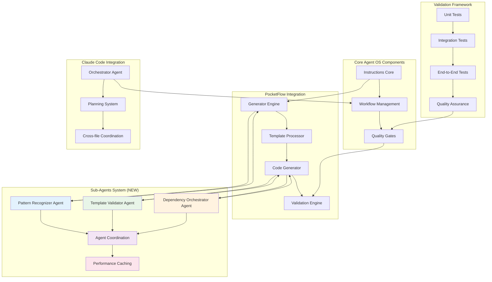

## 1. Generator Engine

**Location:** [`.agent-os/workflows/generator.py`](./.agent-os/workflows/generator.py:1)

### Architecture
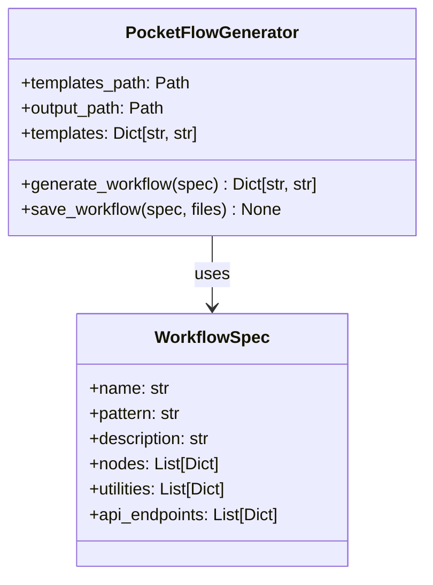

### Key Capabilities
- **Template Loading:** Loads all `.md` templates from templates directory
- **YAML Processing:** Converts workflow specifications to complete projects
- **File Generation:** Creates 12+ files per PocketFlow pattern
- **Smart Defaults:** Generates intelligent code based on node names/descriptions

### Code Pointers
- **Main Generator Class:** [`.agent-os/workflows/generator.py:36`](./.agent-os/workflows/generator.py:36)
- **Workflow Generation:** [`.agent-os/workflows/generator.py:68`](./.agent-os/workflows/generator.py:68)
- **Template Processing:** [`.agent-os/workflows/generator.py:61`](./.agent-os/workflows/generator.py:61)
- **Sub-Agent Coordination:** [`.agent-os/workflows/generator.py:coordinate_template_validation`](./.agent-os/workflows/generator.py)

## 1a. Sub-Agents System (NEW)

**Location:** [`.claude/agents/`](../../.claude/agents/) and [`.agent-os/workflows/`](../../.agent-os/workflows/)

### Sub-Agents Architecture
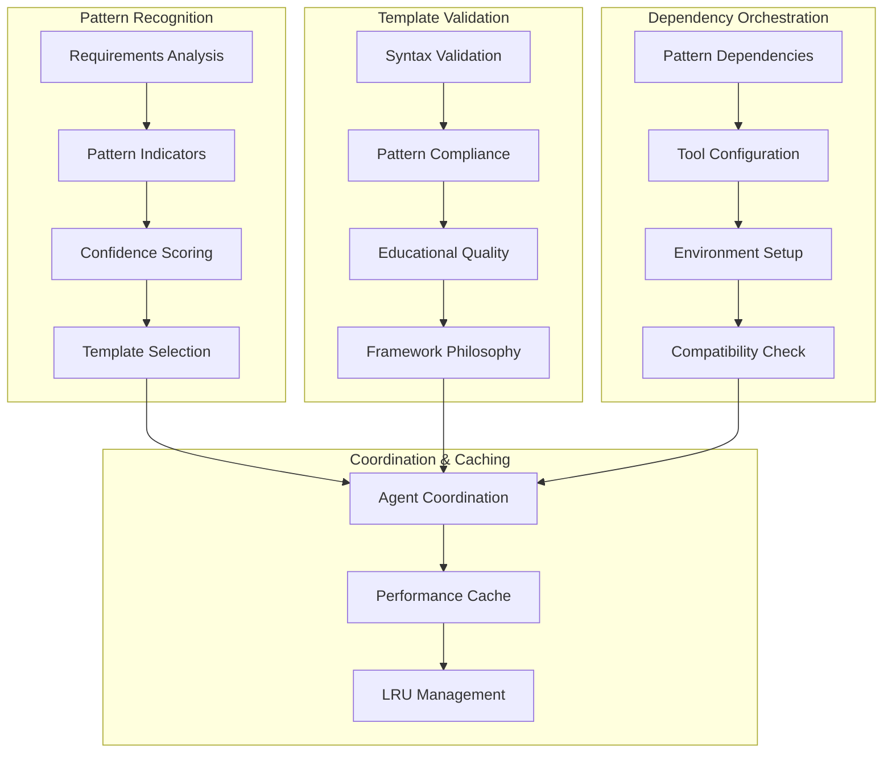

### Key Capabilities
- **Pattern Recognizer**: Analyzes requirements and identifies optimal PocketFlow patterns
- **Template Validator**: Ensures generated templates maintain educational quality and structural correctness
- **Dependency Orchestrator**: Manages Python tooling and creates proper dependency configurations
- **Intelligent Caching**: 100x+ performance improvements through pattern and dependency caching

### Code Pointers
- **Pattern Analyzer:** [`.agent-os/workflows/pattern_analyzer.py`](../../.agent-os/workflows/pattern_analyzer.py)
- **Template Validator:** [`.agent-os/workflows/template_validator.py`](../../.agent-os/workflows/template_validator.py)
- **Dependency Orchestrator:** [`.agent-os/workflows/dependency_orchestrator.py`](../../.agent-os/workflows/dependency_orchestrator.py)
- **Agent Coordination:** [`.agent-os/workflows/agent_coordination.py`](../../.agent-os/workflows/agent_coordination.py)
- **Agent Configs:** [`.claude/agents/`](../../.claude/agents/)

## 2. Template System

**Locations:** [`templates/`](../../templates/) and [`.agent-os/workflows/`](../../.agent-os/workflows/)

### Template Architecture
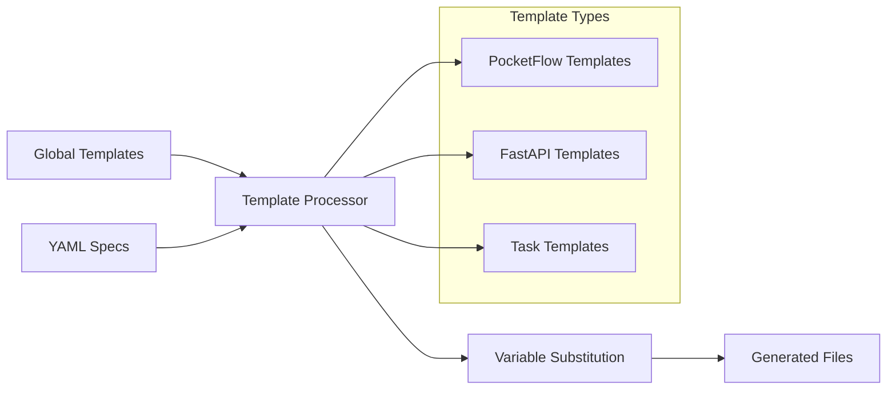

### Generated File Structure
Each workflow generates this complete structure:

```
generated-workflow/
├── __init__.py              # Package initialization with exports
├── main.py                  # FastAPI application entry point
├── nodes.py                 # PocketFlow nodes with type hints
├── flow.py                  # PocketFlow flow assembly
├── router.py                # FastAPI routing integration
├── schemas/
│   ├── __init__.py          # Schema package exports
│   └── models.py            # Pydantic models with validation
├── utils/                   # Custom utility functions
│   ├── __init__.py          # Auto-import utility functions
│   └── [custom_utils].py    # Generated utility functions
├── tests/
│   ├── __init__.py          # Test package initialization
│   ├── test_nodes.py        # Node unit tests with fixtures
│   ├── test_flow.py         # Flow integration tests
│   └── test_api.py          # FastAPI endpoint tests
├── docs/
│   ├── __init__.py          # Documentation package
│   └── design.md            # Mandatory design document
├── check-install.py         # Installation validator script
└── tasks.md                 # Implementation task checklist
```

### Template Processing Flow
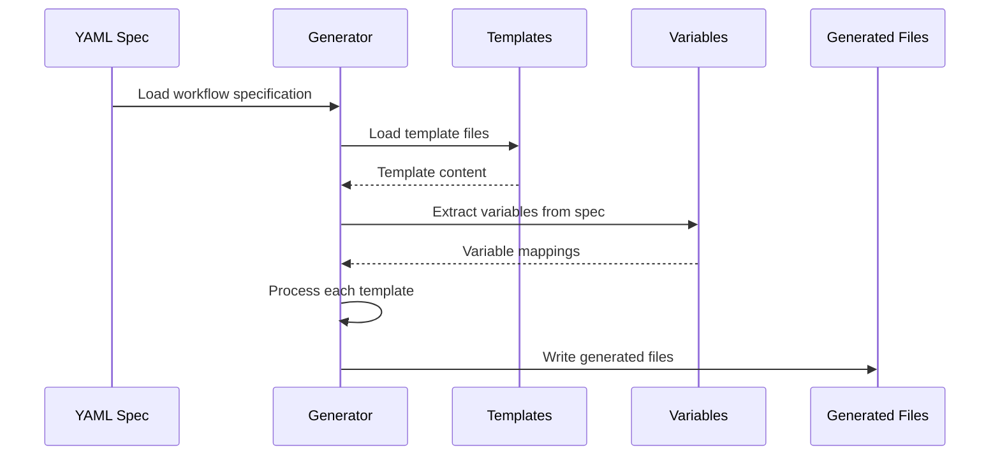

## 3. Validation Framework

**Location:** [`scripts/validation/`](./scripts/validation/)

### Validation Architecture
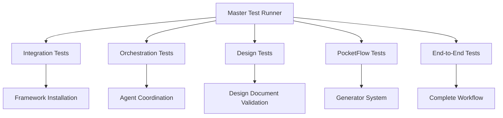

### Test Suites

#### 1. Integration Tests ([`scripts/validation/validate-integration.sh`](./scripts/validation/validate-integration.sh))
- Framework installation validation
- Directory structure verification
- Template system functionality
- Basic generation capabilities

#### 2. Orchestration Tests ([`scripts/validation/validate-orchestration.sh`](./scripts/validation/validate-orchestration.sh))
- Agent coordination validation
- Cross-file dependency checking
- Workflow state management
- Error handling verification

#### 3. Design Tests ([`scripts/validation/validate-design.sh`](./scripts/validation/validate-design.sh))
- Design document generation
- Mermaid diagram validation
- Requirements completeness
- Template structure verification

#### 4. PocketFlow Tests ([`scripts/validation/validate-pocketflow.sh`](./scripts/validation/validate-pocketflow.sh))
- Generator engine functionality
- All workflow patterns support
- Template substitution accuracy
- Generated code quality

#### 5. End-to-End Tests ([`scripts/validation/validate-end-to-end.sh`](./scripts/validation/validate-end-to-end.sh))
- Complete workflow generation
- Generated project validation
- Integration with external tools
- Production readiness verification

## 4. Claude Code Integration

**Location:** [`.claude/agents/pocketflow-orchestrator.md`](./.claude/agents/pocketflow-orchestrator.md)

### Orchestrator Architecture
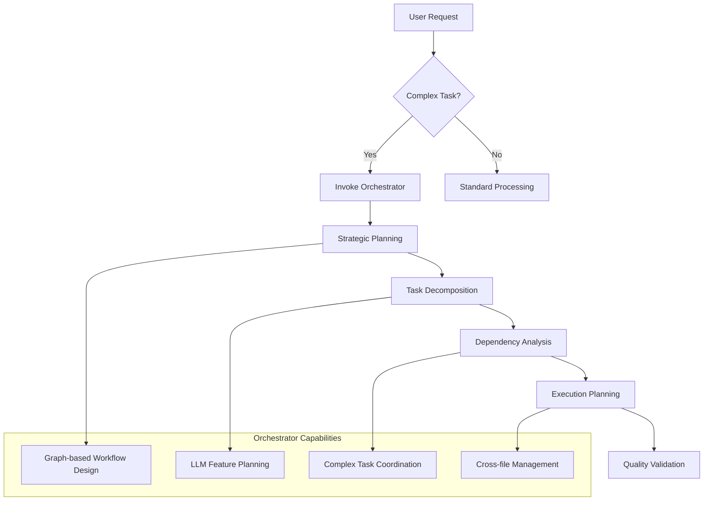

### Automatic Invocation Triggers
- Keywords: "think", "plan", "design", "architect", "implement"
- LLM/AI feature development requests
- Complex multi-step tasks
- Workflow specification creation

## 5. Standards System

**Location:** [`standards/`](./standards/)

### Standards Architecture
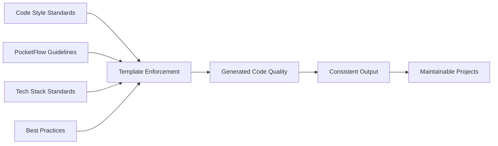

### Standard Components
- **PocketFlow Guidelines:** [`standards/pocket-flow.md`](./standards/pocket-flow.md)
- **Code Style:** [`standards/code-style.md`](./standards/code-style.md)
- **Tech Stack:** [`standards/tech-stack.md`](./standards/tech-stack.md)
- **Best Practices:** [`standards/best-practices.md`](./standards/best-practices.md)

## Component Interactions

### Generator → Template System
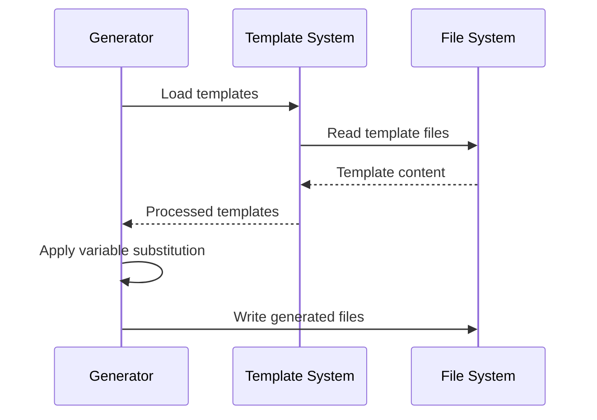

### Validation → Generated Code
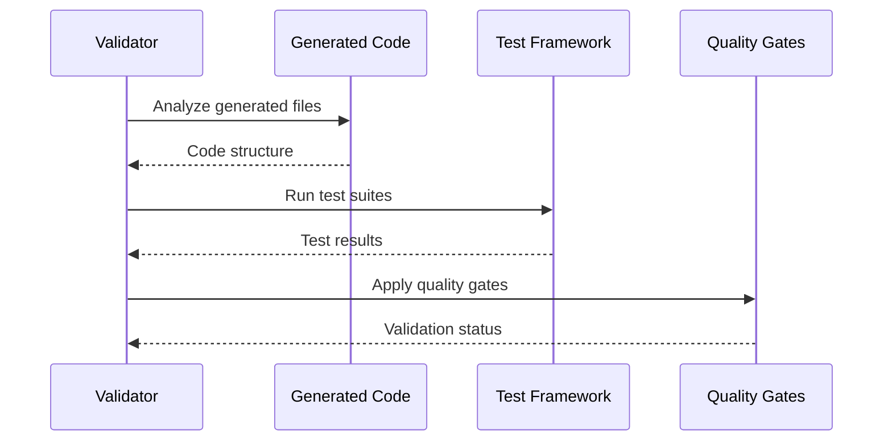

### Agent OS → PocketFlow Integration
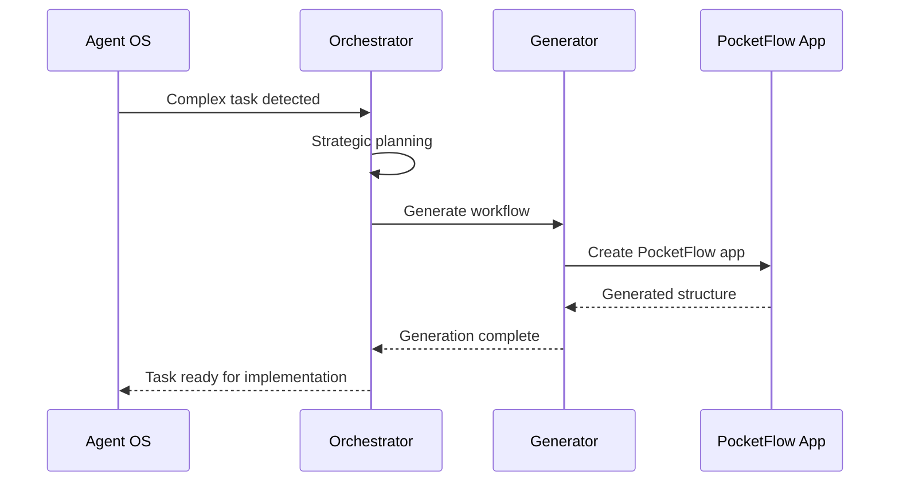

## Performance Characteristics

### Generator Performance
- **Template Loading:** ~100ms for all templates
- **YAML Processing:** ~50ms per specification
- **File Generation:** ~10ms per generated file
- **Total Generation Time:** ~2-3 seconds for complete project

### Memory Usage
- **Template Cache:** ~5MB for all templates
- **Processing:** ~10MB peak during generation
- **Generated Output:** ~1MB per project

### Scalability Limits
- **Templates:** Up to 100 templates efficiently
- **Generated Files:** Up to 50 files per project
- **Concurrent Generation:** 10+ projects simultaneously

## Error Handling Strategy

### Component-Level Error Handling
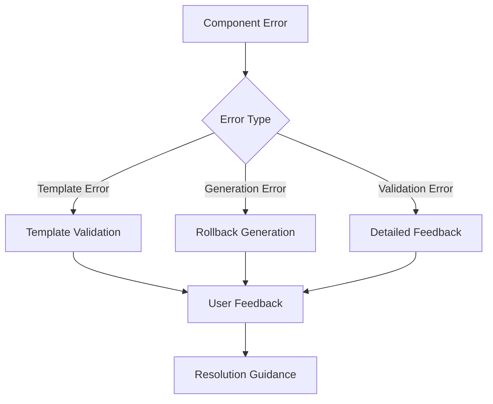

### Recovery Mechanisms
- **Template Errors:** Fallback to basic templates
- **Generation Failures:** Partial cleanup and retry
- **Validation Issues:** Detailed error reports with fixes
- **System Errors:** Comprehensive logging and diagnosis

---

**Next:** See [Data Flow Documentation](./data-flow.md) for detailed data flow analysis.