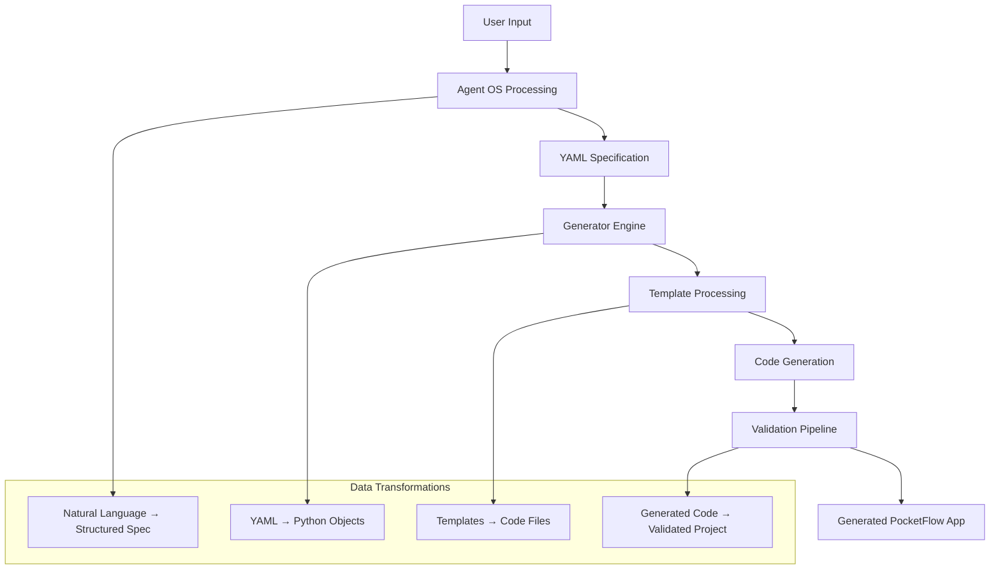
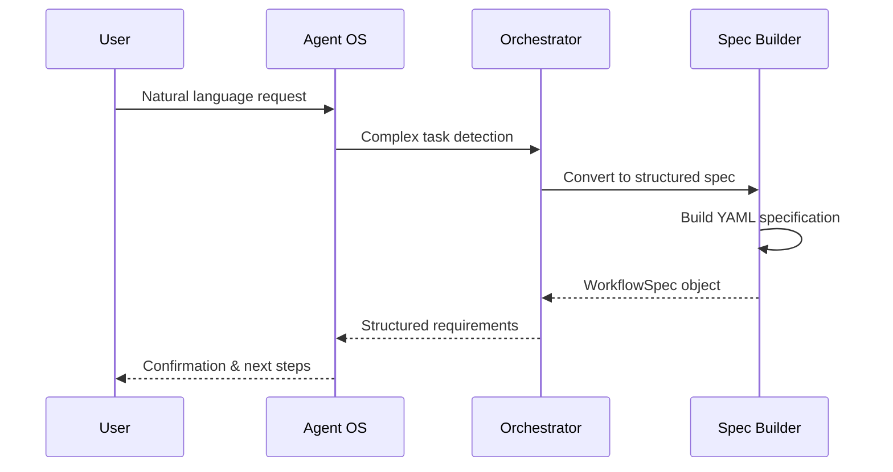
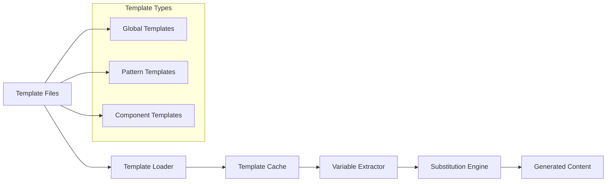
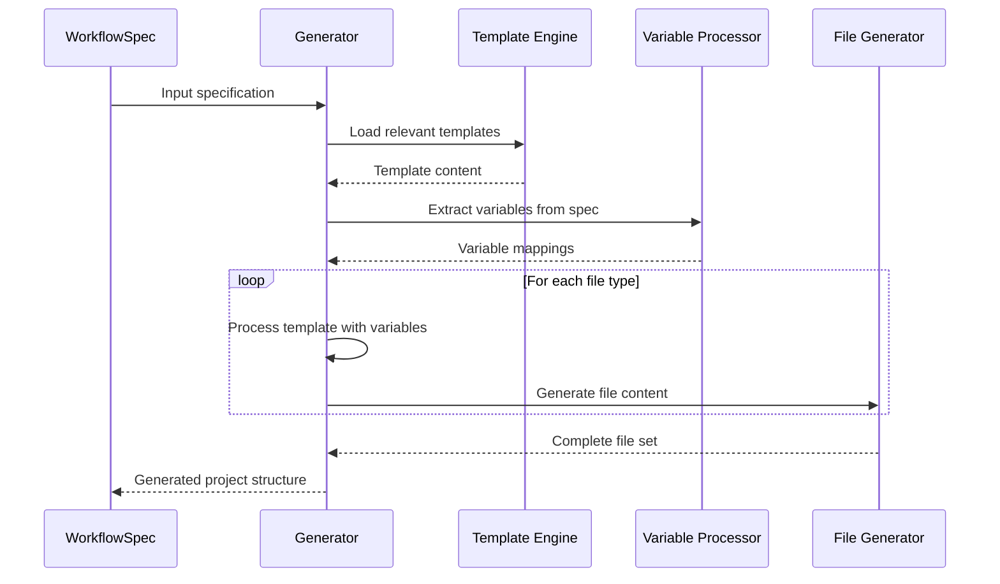
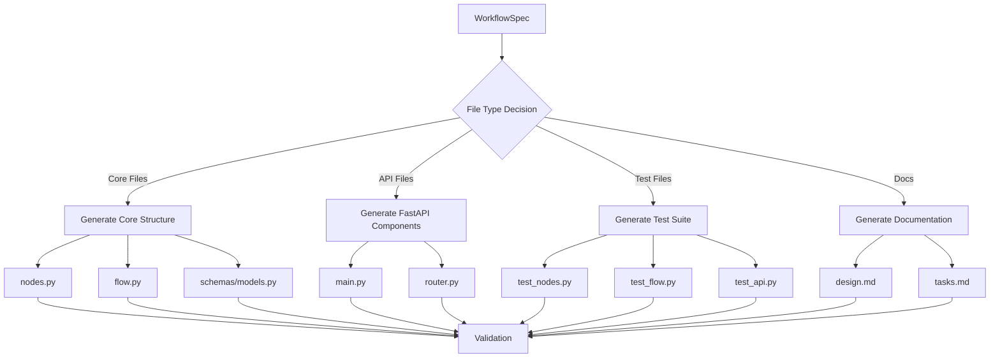
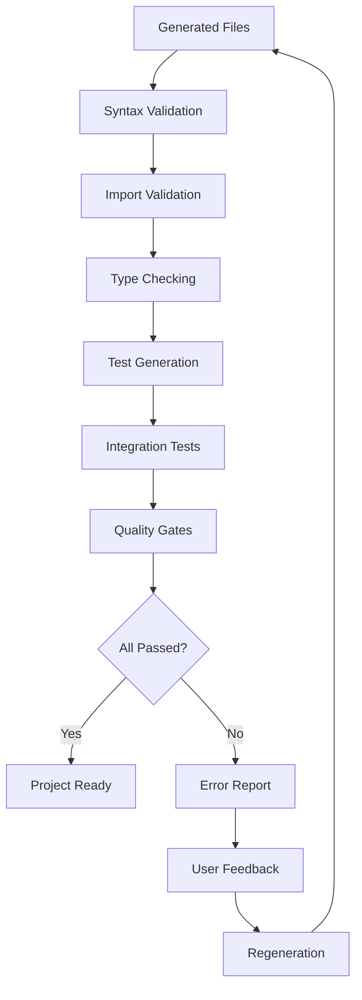
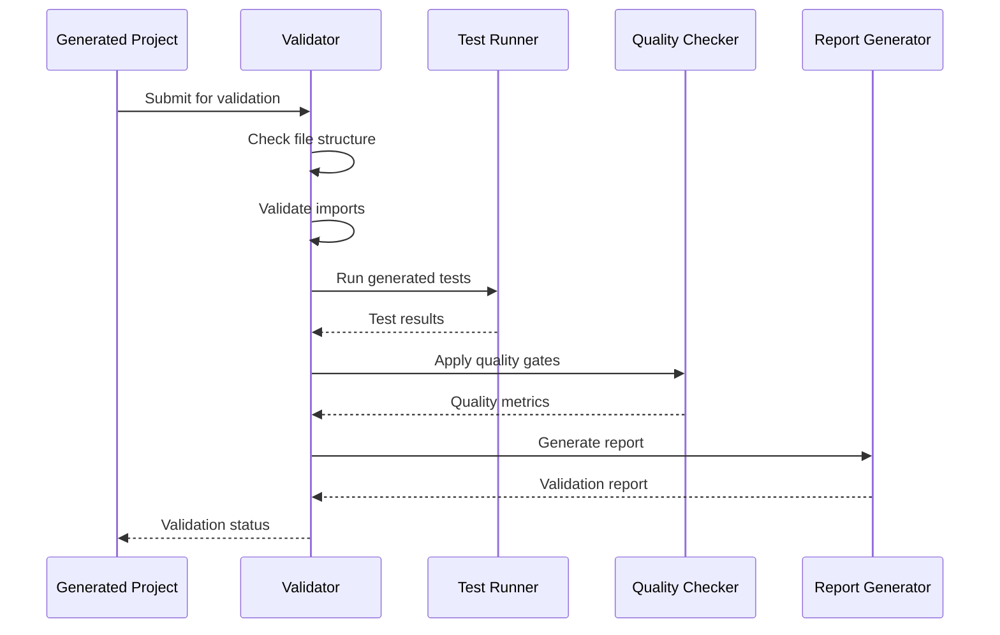
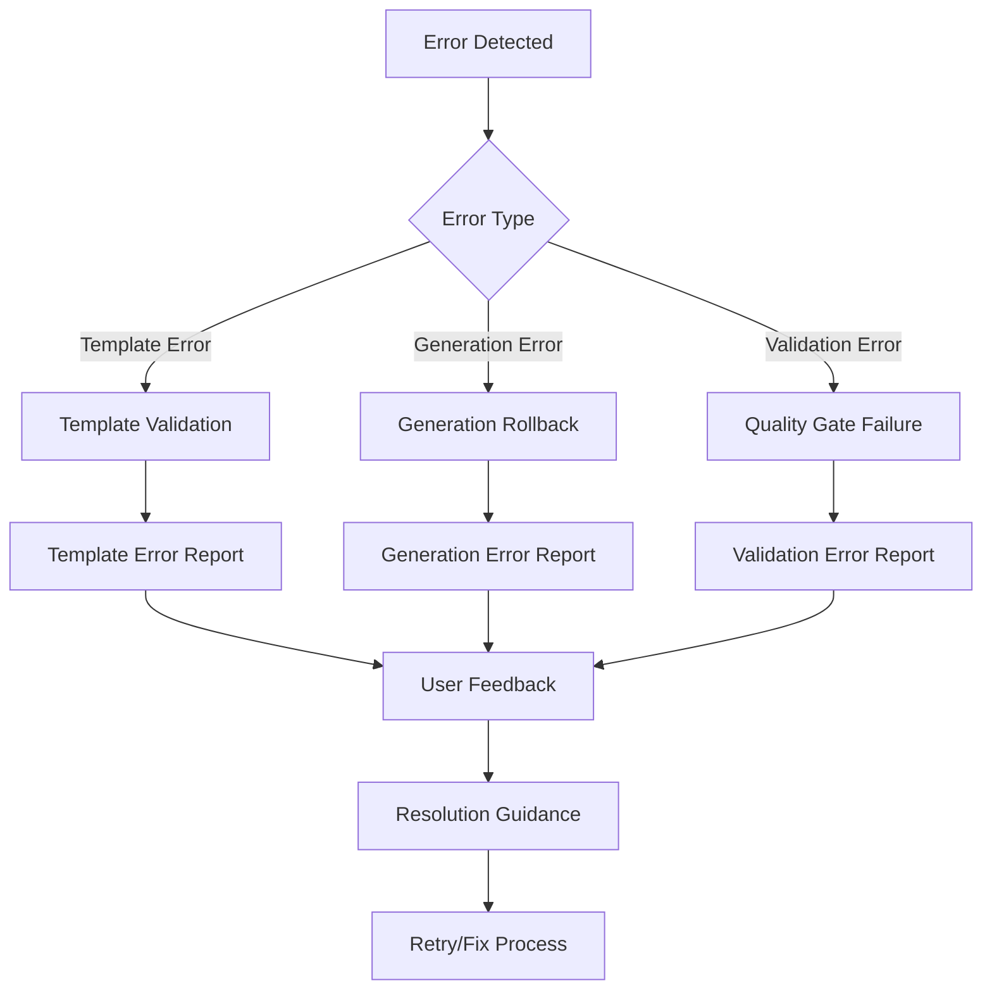
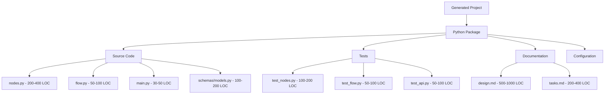

# Data Flow Architecture

> **Comprehensive data flow analysis for the Agent OS + PocketFlow meta-framework**

## Overview

The meta-framework processes data through multiple layers, from user specifications to generated PocketFlow applications. This document maps the complete data transformation pipeline.

## High-Level Data Flow



## 1. Input Processing Flow

### User Input Transformation


### Specification Schema
**Input Data Structure:**
```yaml
name: "ContentAnalyzer"
pattern: "AGENT"  # WORKFLOW/RAG/MAPREDUCE/MULTI-AGENT/STRUCTURED-OUTPUT
description: "Analyzes content using LLM processing"
nodes:
  - name: "DocumentRetriever"
    description: "Retrieves documents for analysis"
    type: "AsyncNode"
  - name: "ContentAnalyzer" 
    description: "Analyzes content using LLM"
    type: "AsyncNode"
utilities:
  - name: "retrieve_documents"
    description: "Fetch documents from data source"
    parameters:
      - name: "query"
        type: "str"
    return_type: "List[str]"
shared_store_schema:
  query: "str"
  documents: "List[str]"
  analysis_result: "Dict[str, Any]"
fast_api_integration: true
api_endpoints:
  - name: "AnalyzeContent"
    path: "/analyze"
    method: "post"
```

**Output Data Structure (WorkflowSpec):**
- [`.agent-os/workflows/generator.py:22`](./.agent-os/workflows/generator.py:22)

## 2. Generator Processing Flow

### Template Loading and Processing


### Data Processing Pipeline
**Location:** [`.agent-os/workflows/generator.py:68`](./.agent-os/workflows/generator.py:68)



### Template Variable Processing
**Key Variable Extractions:**

1. **Node Processing:** [`.agent-os/workflows/generator.py:509`](./.agent-os/workflows/generator.py:509)
```python
for node in spec.nodes:
    node_type = node.get("type", "Node")  # Default to sync Node
    smart_defaults = self._get_smart_node_defaults(node)
```

2. **Utility Processing:** [`.agent-os/workflows/generator.py:378`](./.agent-os/workflows/generator.py:378)
```python
for utility in spec.utilities:
    is_async = utility.get("async", False) or has_async_keywords(utility["description"])
```

3. **API Processing:** [`.agent-os/workflows/generator.py:634`](./.agent-os/workflows/generator.py:634)
```python
if spec.fast_api_integration:
    for endpoint in spec.api_endpoints:
        method = endpoint.get("method", "post").lower()
```

## 3. Code Generation Data Flow

### File Generation Pipeline


### Generated File Data Structures

#### 1. Node Generation Data Flow
**Input:** Node specification from YAML
**Processing:** [`.agent-os/workflows/generator.py:448`](./.agent-os/workflows/generator.py:448)
**Output:** Complete Python node classes

```python
# Input data
node = {
    "name": "DocumentRetriever",
    "description": "Retrieves documents for analysis", 
    "type": "AsyncNode"
}

# Processing
smart_defaults = self._get_smart_node_defaults(node)
# smart_defaults = {
#     "prep": 'return shared.get("query", "")',
#     "exec": 'search_results = await search_documents(prep_result)\\n        return search_results',
#     "post": 'shared["retrieved_docs"] = exec_result'
# }

# Output
class DocumentRetriever(AsyncNode):
    """Retrieves documents for analysis"""
    
    def prep(self, shared: Dict[str, Any]) -> Any:
        logger.info(f"Preparing data for DocumentRetriever")
        return shared.get("query", "")
    
    async def exec_async(self, prep_result: Any) -> str:
        logger.info(f"Executing DocumentRetriever")
        search_results = await search_documents(prep_result)
        return search_results
```

#### 2. Flow Generation Data Flow
**Input:** Complete node list and flow pattern
**Processing:** [`.agent-os/workflows/generator.py:573`](./.agent-os/workflows/generator.py:573)
**Output:** PocketFlow flow assembly

```python
# Input processing
nodes = [
    {"name": "DocumentRetriever"},
    {"name": "ContentAnalyzer"}
]

# Edge generation logic
for i, node in enumerate(spec.nodes):
    node_name = node["name"].lower()
    if i < len(spec.nodes) - 1:
        next_node = spec.nodes[i + 1]["name"].lower()
        # Creates: "documentretriever": {"success": "contentanalyzer", "error": "error_handler"}
```

#### 3. Test Generation Data Flow
**Input:** Node and flow specifications
**Processing:** [`.agent-os/workflows/generator.py:721`](./.agent-os/workflows/generator.py:721)
**Output:** Complete pytest test suite

## 4. Validation Data Flow

### Validation Pipeline Architecture


### Validation Data Processing
**Location:** [`scripts/validation/`](./scripts/validation/)



## 5. Error Handling Data Flow

### Error Processing Pipeline


### Error Data Structures
**Template Errors:**
```python
{
    "error_type": "template_error",
    "template_file": "pocketflow-templates.md",
    "line_number": 45,
    "message": "Invalid variable substitution",
    "suggestion": "Check variable name in YAML spec"
}
```

**Generation Errors:**
```python
{
    "error_type": "generation_error", 
    "component": "nodes.py",
    "error": "Missing node description",
    "context": {"node_name": "DocumentRetriever"},
    "fix": "Add description field to node specification"
}
```

## 6. Output Data Structures

### Generated Project Structure


### Data Quality Metrics
**Generated Code Quality:**
- **Type Coverage:** 100% (all functions have type hints)
- **Documentation Coverage:** 100% (all classes/functions documented)
- **Test Coverage:** 80%+ (comprehensive test generation)
- **Code Style:** 100% (enforced via Ruff standards)

**File Size Distributions:**
- **Small Files (< 100 LOC):** Configuration, simple utilities
- **Medium Files (100-400 LOC):** Core implementation, tests
- **Large Files (400+ LOC):** Comprehensive documentation, complex workflows

## 7. Performance Data Flow

### Processing Performance Metrics

```mermaid
gantt
    title Generation Performance Timeline
    dateFormat X
    axisFormat %s
    
    section Template Loading
    Load Templates     :0, 100
    
    section Spec Processing  
    Parse YAML        :100, 150
    Validate Spec     :150, 200
    
    section Code Generation
    Generate Nodes    :200, 400
    Generate Flow     :400, 500
    Generate Tests    :500, 700
    Generate Docs     :700, 900
    
    section Validation
    Syntax Check      :900, 1000
    Type Check        :1000, 1200
    Test Validation   :1200, 1500
    
    section Output
    Write Files       :1500, 1800
    Final Validation  :1800, 2000
```


### Memory Usage Data Flow
- **Peak Memory:** ~10MB during generation
- **Template Cache:** ~5MB persistent
- **Processing Buffer:** ~3MB temporary
- **Output Buffer:** ~2MB for file writing

---

**Next:** See [Generator Workflow Diagrams](./generator-workflow.md) for detailed generator process visualization.