# Generator Workflow Diagrams

> **Visual documentation of the PocketFlow workflow generation process**

## Overview

The generator workflow transforms YAML specifications into complete PocketFlow applications through a multi-stage pipeline. This document provides detailed visual documentation of each stage.

## Complete Generation Workflow

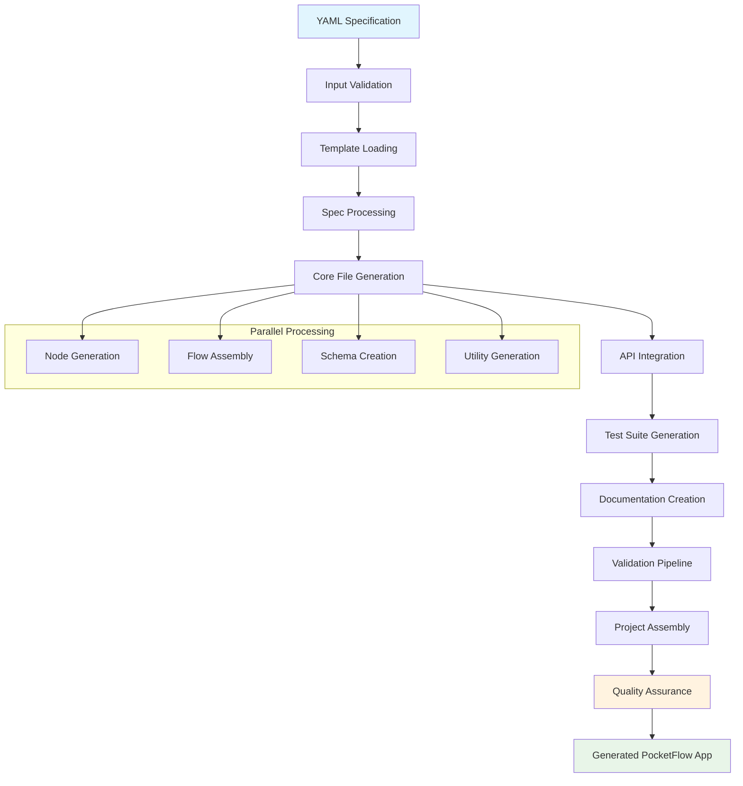

## 1. Input Processing Stage

### YAML Specification Parsing
**Location:** [`.agent-os/workflows/generator.py:1115`](./.agent-os/workflows/generator.py:1115)

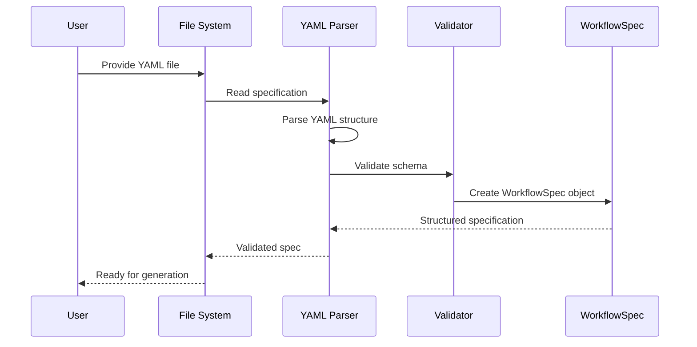

### Specification Validation Flow
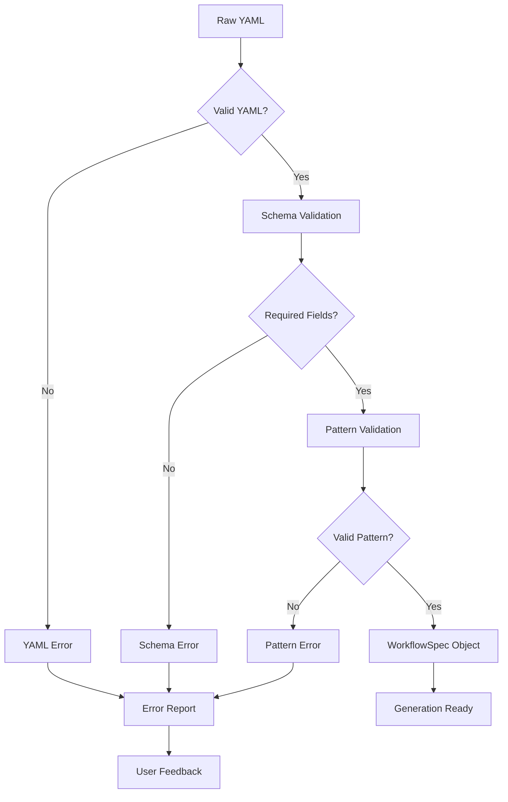

## 2. Template Processing Stage

### Template Loading Architecture
**Location:** [`.agent-os/workflows/generator.py:61`](./.agent-os/workflows/generator.py:61)

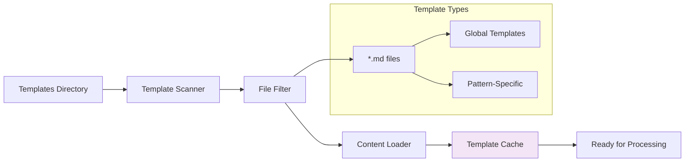

### Template Variable Extraction
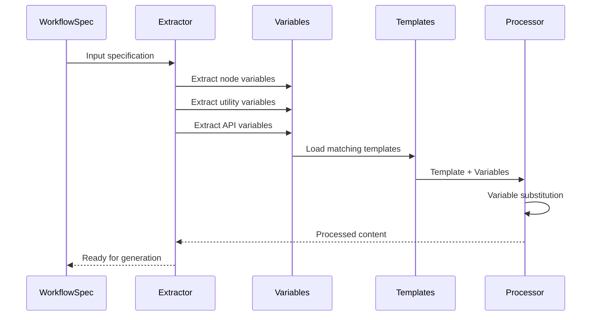

## 3. Code Generation Stages

### Core File Generation Pipeline
**Location:** [`.agent-os/workflows/generator.py:68`](./.agent-os/workflows/generator.py:68)

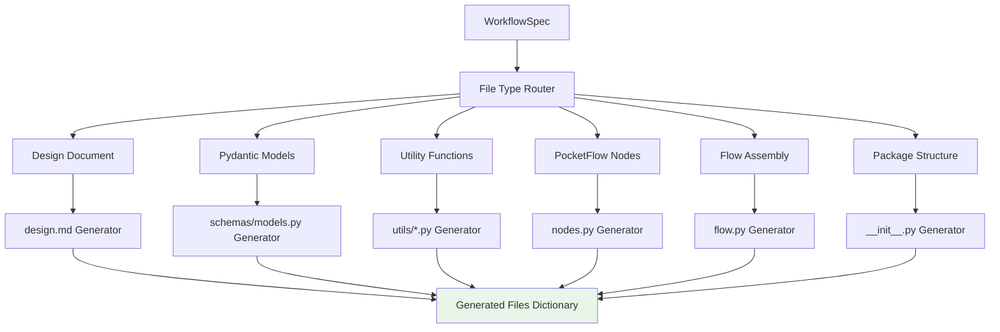

### Node Generation Workflow
**Location:** [`.agent-os/workflows/generator.py:509`](./.agent-os/workflows/generator.py:509)

```mermaid
flowchart TD
    A[Node Specifications] --> B[Node Type Analysis]
    B --> C[Smart Defaults Generator]
    C --> D[Method Generation]
    
    subgraph "Method Generation"
        E[prep() Method]
        F[exec() Method]
        G[post() Method]
    end
    
    D --> E
    D --> F
    D --> G
    
    E --> H[Type Hints Addition]
    F --> H
    G --> H
    
    H --> I[Documentation Generation]
    I --> J[Logging Integration]
    J --> K[Complete Node Class]
    
    subgraph "Smart Defaults Logic"
        L[Name Pattern Matching]
        M[Description Analysis]
        N[Type Inference]
    end
    
    C --> L
    C --> M
    C --> N
```

### Flow Assembly Generation
**Location:** [`.agent-os/workflows/generator.py:573`](./.agent-os/workflows/generator.py:573)

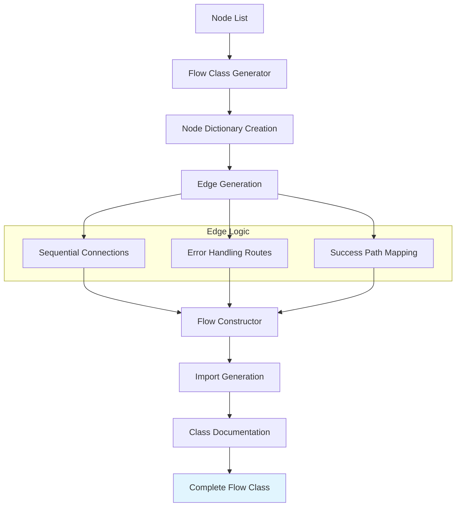

## 4. FastAPI Integration Workflow

### API Generation Pipeline
**Conditional Generation:** Only when `fast_api_integration: true`

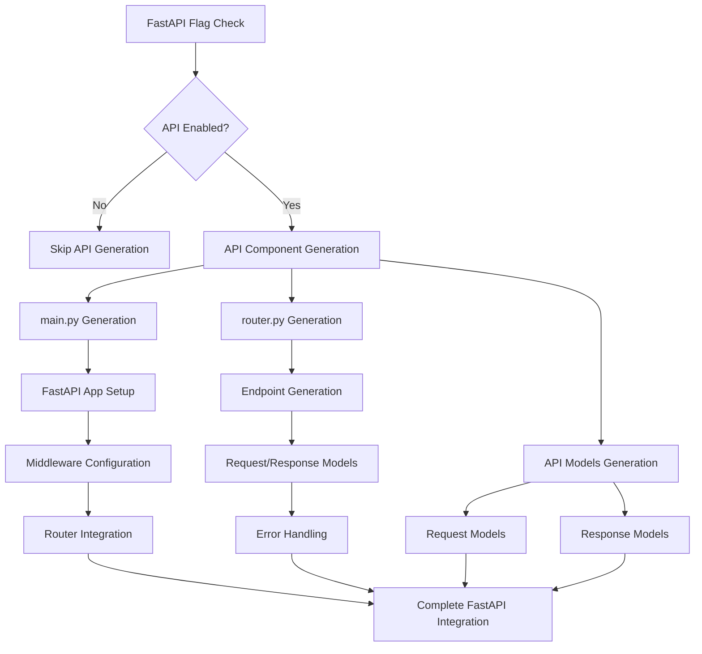

### Endpoint Generation Flow
**Location:** [`.agent-os/workflows/generator.py:667`](./.agent-os/workflows/generator.py:667)

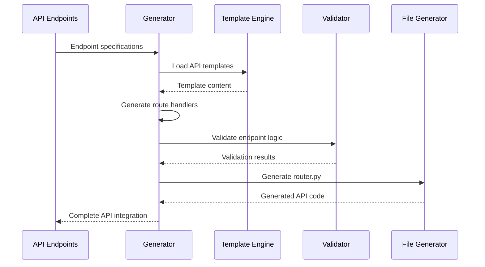

## 5. Test Generation Workflow

### Test Suite Architecture
**Location:** [`.agent-os/workflows/generator.py:721`](./.agent-os/workflows/generator.py:721)

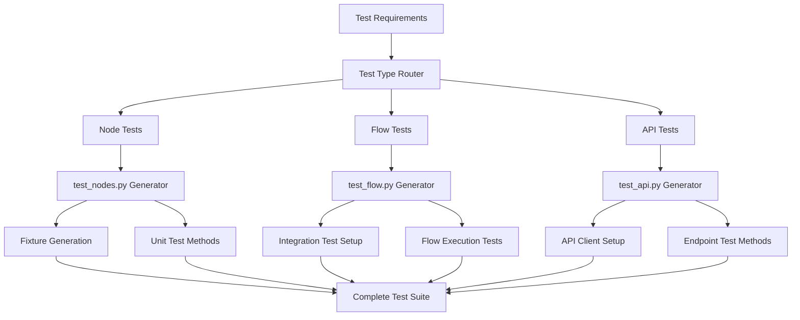

### Test Method Generation Flow
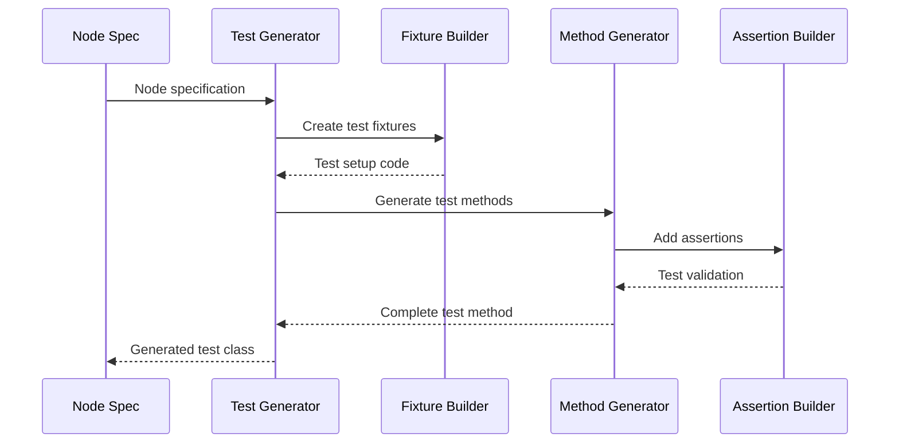

## 6. Documentation Generation Workflow

### Design Document Creation
**Location:** [`.agent-os/workflows/generator.py:210`](./.agent-os/workflows/generator.py:210)

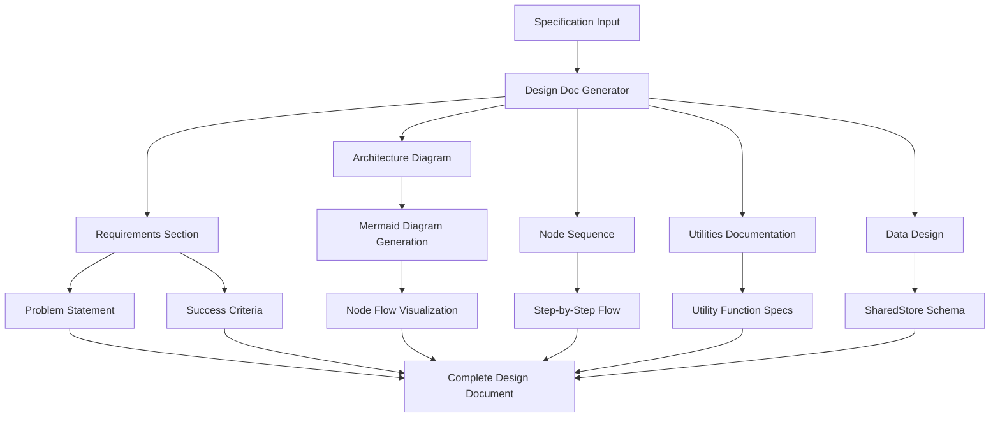

### Task List Generation
**Location:** [`.agent-os/workflows/generator.py:849`](./.agent-os/workflows/generator.py:849)

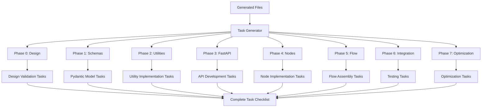

## 7. Validation and Quality Assurance

### Generated Code Validation Pipeline
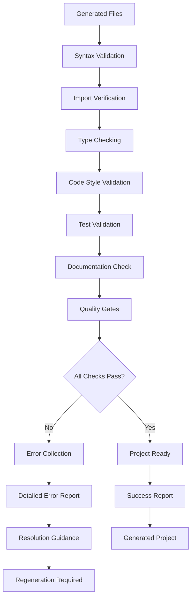

### Quality Gate Workflow
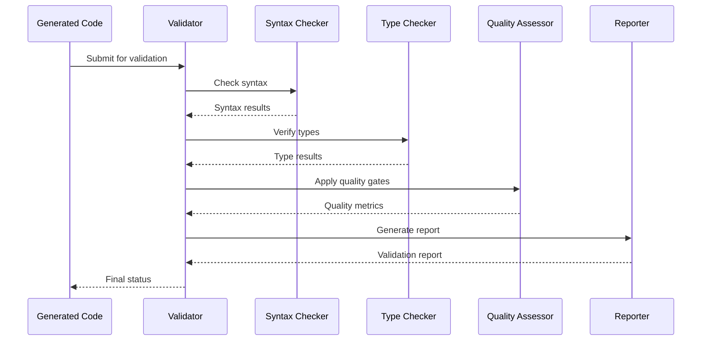

## 8. Project Assembly and Output

### File System Assembly
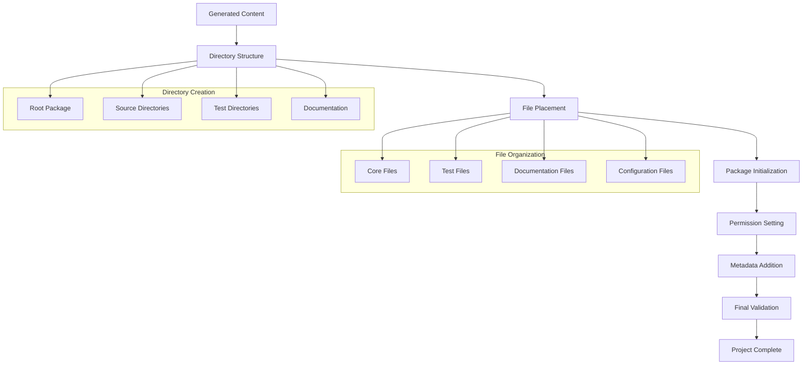

### Project Output Structure
**Location:** [`.agent-os/workflows/generator.py:1062`](./.agent-os/workflows/generator.py:1062)

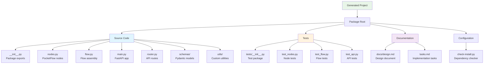

## Performance Optimization Workflow

### Generation Performance Pipeline
```mermaid
gantt
    title Workflow Generation Performance
    dateFormat X
    axisFormat %s
    
    section Initialization
    Template Loading    :0, 100
    Spec Validation     :100, 150
    
    section Core Generation
    Node Generation     :150, 400
    Flow Assembly       :400, 500
    Schema Creation     :150, 300
    
    section Integration
    API Generation      :500, 650
    Test Generation     :650, 900
    
    section Documentation
    Design Document     :900, 1100
    Task Generation     :1100, 1200
    
    section Finalization
    File Assembly       :1200, 1400
    Validation          :1400, 1600
    Quality Check       :1600, 1800
```

---

**Next:** See [Cross-References and Code Pointers](./code-pointers.md) for comprehensive code navigation.