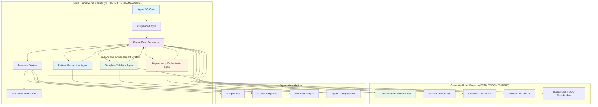
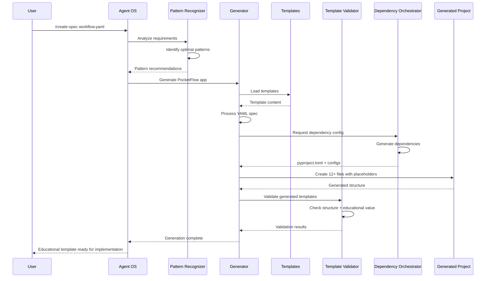
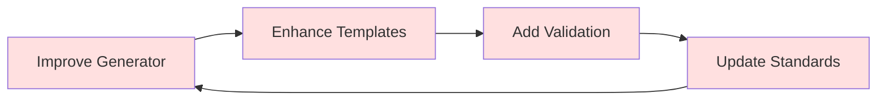
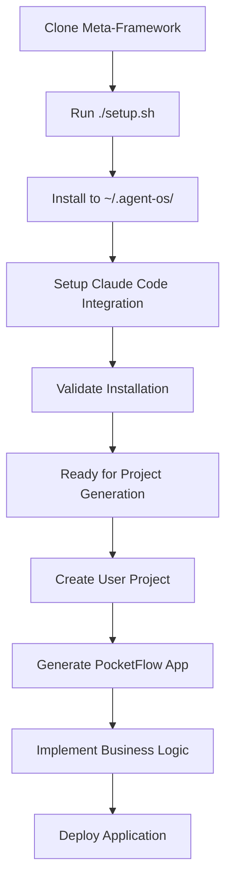
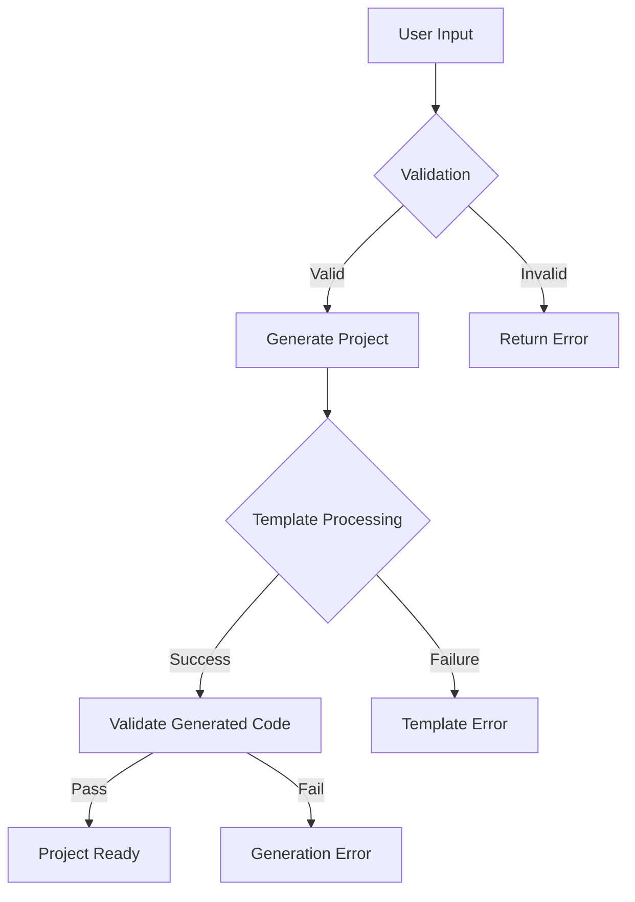

# System Architecture Overview

> **Framework Type:** Meta-Framework that generates PocketFlow applications  
> **Status:** Production Ready  
> **Installation Location:** `~/.agent-os/`  
> **Generated Projects:** Use PocketFlow as dependency

## Executive Summary

The Agent OS + PocketFlow integration is a **meta-framework** that generates educational PocketFlow templates with intentional placeholder TODOs. This is NOT a PocketFlow application itself, but rather the system that creates learning-oriented template projects for end-users to implement.

**Key Principle**: Missing implementations in generated templates are features, not bugs. This framework creates starting points that teach proper implementation patterns.

## High-Level System Architecture

## Component Architecture

### 1. Agent OS Core (`.agent-os/instructions/`)
- **Location:** [`.agent-os/instructions/core/`](./.agent-os/instructions/core/)
- **Purpose:** Workflow management and structured development
- **Key Files:**
  - `analyze-product.md` - Product analysis workflows
  - `create-spec.md` - Specification creation with design-first enforcement
  - `execute-tasks.md` - Quality-gated implementation

### 2. PocketFlow Generator ([`.agent-os/workflows/generator.py`](./.agent-os/workflows/generator.py))
- **Purpose:** Generates complete PocketFlow applications from YAML specs
- **Capabilities:**
  - Creates 12+ files per workflow pattern
  - Supports all PocketFlow patterns (Agent, Workflow, RAG, MapReduce, etc.)
  - Template substitution and validation
- **Output:** Complete Python projects with PocketFlow dependency

### 3. Template System ([`templates/`](./templates/))
- **Global Templates:** Framework-level templates for all projects
- **Generated Templates:** Created per-project by the generator
- **Standards Enforcement:** Code style and best practices

### 4. Validation Framework ([`scripts/validation/`](./scripts/validation/))
- **75+ Tests:** Comprehensive validation across 5 test suites
- **Integration Testing:** Framework installation and generation
- **Quality Assurance:** Generated code validation

## Data Flow Architecture

## Integration Points

### Framework Development vs Usage

**Framework Development (This Repository):**

**Framework Usage (Generated Projects):**

## System Boundaries

### What This Framework Does
- ✅ Installs to `~/.agent-os/` globally
- ✅ Generates PocketFlow applications for users
- ✅ Provides templates and validation
- ✅ Manages workflow standards

### What Generated Projects Do
- ✅ Install PocketFlow as dependency
- ✅ Implement actual business logic
- ✅ Run in production environments
- ✅ Use orchestrator agent for planning

## Installation Architecture

## Key Architectural Decisions

### 1. Meta-Framework Design
- **Decision:** Build system that generates frameworks rather than being one
- **Rationale:** Allows users to create multiple PocketFlow projects
- **Impact:** Clear separation between framework development and usage

### 2. Global Installation Pattern
- **Decision:** Install to `~/.agent-os/` rather than per-project
- **Rationale:** Reusable across multiple projects, consistent tooling
- **Impact:** Single installation serves all user projects

### 3. Template-Based Generation
- **Decision:** Use templates with variable substitution
- **Rationale:** Maintainable, consistent output, easy customization
- **Impact:** High code quality in generated projects

### 4. Design-First Enforcement
- **Decision:** Require design documents before implementation
- **Rationale:** Prevents implementation without planning
- **Impact:** Higher quality, more maintainable applications

## Security Considerations

- **Template Safety:** All templates are static and validated
- **Generated Code:** No dynamic code execution in generation
- **Installation:** Installs to user home directory only
- **Dependencies:** Clear separation between framework and generated project deps

## Performance Characteristics

- **Generation Speed:** ~2-3 seconds for complete PocketFlow application
- **Memory Usage:** Low, primarily file I/O operations
- **Disk Usage:** ~50MB for framework, ~5MB per generated project
- **Scalability:** Linear with number of projects generated

## Error Handling Architecture

## Future Architecture Considerations

- **Plugin System:** Extensible template system for custom patterns
- **Remote Templates:** Template repository for community patterns
- **CI/CD Integration:** Automated validation in development workflows
- **Metrics Collection:** Usage analytics for improvement insights

---

**Next:** See [Component Details](./components.md) for detailed component architecture.