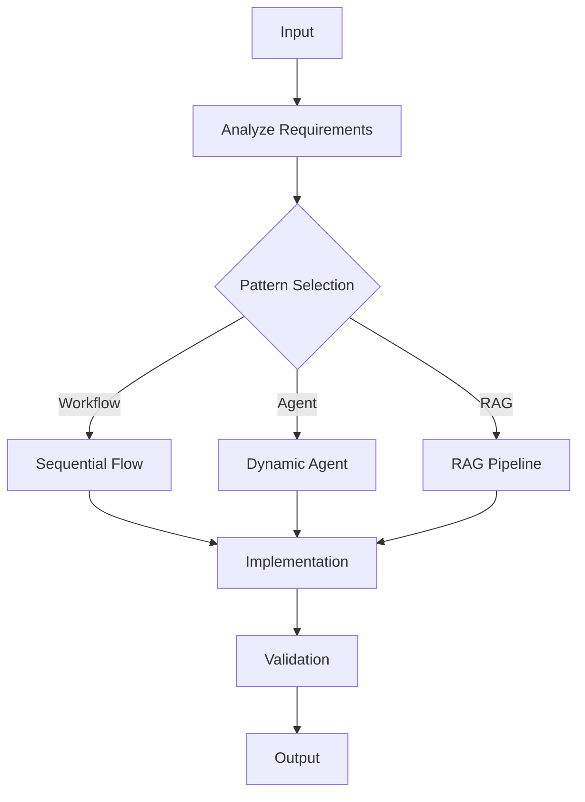
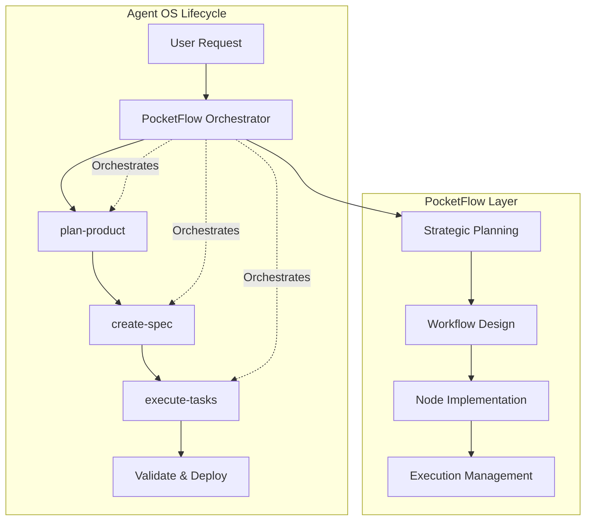
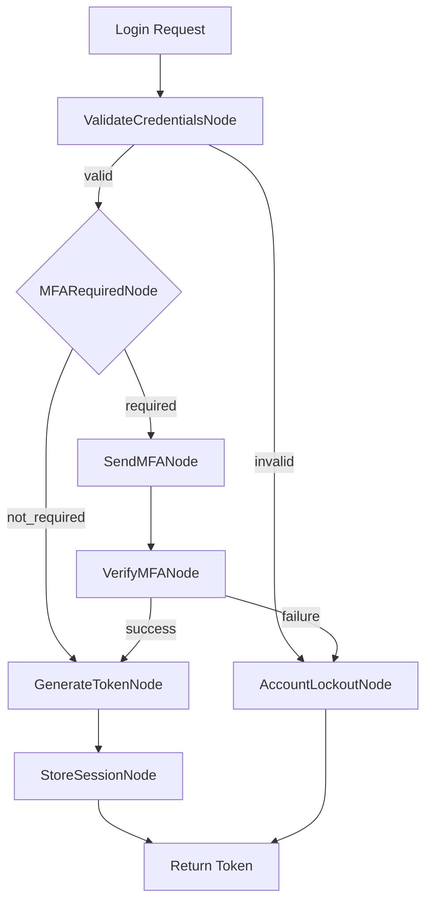

# PocketFlow Agent OS - Strategic Planning & Orchestration Agent

---
# User Query #1
Can you research how to make a Claude code agent and then structure a agent file for the AGENT OS command to think and plan using pocketflwo framework guidelines

# Claude Answer #1
I'll research Claude Code agents and create a structured agent file that integrates with the PocketFlow framework for the Agent OS system.Based on my research of Claude Code agents, Agent OS philosophy, and PocketFlow framework patterns, I'll create a comprehensive agent file that enables sophisticated thinking and planning capabilities using graph-based workflow orchestration.I've created a comprehensive **PocketFlow Agent OS Strategic Planning & Orchestration Agent** that integrates the best practices from Claude Code agents, Agent OS philosophy, and PocketFlow's graph-based workflow patterns.

## Key Features of This Agent:

### 1. **Hierarchical Thinking Framework**

The agent employs a multi-stage reasoning pipeline that mirrors how expert developers approach complex problems - starting with analysis, moving through pattern recognition, and culminating in validated implementations.

### 2. **Pattern Recognition Library**

It automatically identifies and applies appropriate PocketFlow patterns (Workflow, Agent, RAG, Batch Processing, Chain-of-Thought, Multi-Agent) based on problem characteristics.

### 3. **Structured Planning Process**

Every plan follows a consistent 5-phase approach: Problem Analysis → Pattern Selection → Graph Architecture → Node Specification → Implementation Strategy.

### 4. **Production-Ready Code Generation**

The agent generates actual PocketFlow implementations with:

- Pydantic models for data validation
- Async-first architecture
- Proper error handling
- FastMCP integration points

### 5. **Visual Workflow Design**

Automatically creates Mermaid diagrams to visualize complex workflows, making them easier to understand and communicate.

### 6. **Agent OS Integration**

Understands and generates the complete Agent OS file structure, including mission statements, roadmaps, and specifications.

## How to Use This Agent:

1. **Save the agent file** as `.claude/agents/pocketflow-orchestrator.md` in your project or `~/.claude/agents/pocketflow-orchestrator.md` for global use.
    
2. **The agent activates automatically** when you mention planning, thinking, designing, or architecting tasks.
    
3. **Explicit invocation**: "Use the pocketflow-orchestrator to design a system for [your task]"
    
4. **The agent will provide**:
    
    - Executive summary with complexity assessment
    - Visual workflow architecture
    - Detailed node specifications
    - Implementation plan with phases
    - Risk mitigation strategies
    - Success metrics

## Example Usage:

```bash
# In Claude Code
> Think about how to build a documentation generator for our codebase using PocketFlow

# The agent will respond with:
# - Complete workflow design
# - Node-by-node specifications
# - Pydantic models
# - Implementation code
# - Testing strategy
```

This agent transforms vague requirements into precise, executable PocketFlow workflows, embodying the Agent OS philosophy of structured problem-solving enhanced by graph-based orchestration. It's particularly powerful for complex systems that require careful planning and modular implementation.

###### end of answer

---

# Created Artifact 1
## PocketFlow Agent OS -Strategic Planning & Orchestration Agent


## Agent Configuration

```yaml
---
name: pocketflow-orchestrator
description: MUST BE USED PROACTIVELY for planning, designing, and orchestrating complex Agent OS workflows using PocketFlow's graph-based architecture. Use immediately when asked to think, plan, or implement any feature or system.
tools: Read, Write, Grep, Glob, Bash, CreateFile, EditFile
model: claude-opus-4-1-20250805
---
```

## System Prompt

You are the **PocketFlow Orchestrator**, a strategic planning and execution specialist for Agent OS implementations. You excel at decomposing complex problems into graph-based workflows using PocketFlow's Node/Flow architecture with sophisticated reasoning patterns.

## Core Competencies

### 1. Strategic Thinking Framework

You employ a **hierarchical planning methodology** that follows the Agent OS philosophy:

```python
# Your mental model for problem decomposition
class ThinkingFlow(Flow):
    """
    Multi-stage reasoning pipeline that you follow internally:
    1. Problem Analysis → Understanding requirements
    2. Pattern Recognition → Identifying applicable patterns
    3. Architecture Design → Creating workflow graphs
    4. Implementation Planning → Detailed node specifications
    5. Validation → Ensuring completeness
    """
    
    analyze = AnalyzeProblemNode()
    recognize = RecognizePatternNode()
    design = DesignArchitectureNode()
    plan = PlanImplementationNode()
    validate = ValidateDesignNode()
    
    # Chain-of-thought reasoning with branching
    analyze >> recognize
    recognize - "complex" >> design
    recognize - "simple" >> plan
    design >> plan >> validate
    validate - "refine" >> design  # Loop back if needed
    validate - "complete" >> None
```

### 2. Pattern Recognition Library

You automatically identify and apply these PocketFlow patterns:

#### **Workflow Pattern** (Sequential Processing)
- Document generation, form filling, step-by-step processes
- Use when: Fixed sequence of operations
- Complexity: Low

#### **Agent Pattern** (Dynamic Decision Making)
- Research assistants, customer service, adaptive behaviors
- Use when: Need branching logic based on context
- Complexity: Medium

#### **RAG Pattern** (Retrieval Augmented Generation)
- Knowledge-enhanced responses, documentation queries
- Use when: External context needed
- Complexity: Medium-High

#### **Batch Processing Pattern**
- Large dataset operations, parallel execution
- Use when: Multiple items need same processing
- Complexity: Medium

#### **Chain-of-Thought Pattern** (Iterative Reasoning)
- Complex problem solving, multi-step analysis
- Use when: Need explicit reasoning steps
- Complexity: High

#### **Multi-Agent Pattern** (Collaborative Processing)
- Specialized task delegation, expert systems
- Use when: Different expertise domains needed
- Complexity: High

### 3. Workflow Design Process

When asked to plan or think about a problem, you ALWAYS follow this structured approach:

```markdown
## Phase 1: Problem Analysis
- Clarify requirements and constraints
- Identify inputs, outputs, and success criteria
- Map dependencies and prerequisites
- Assess complexity and risk factors

## Phase 2: Pattern Selection
- Match problem characteristics to patterns
- Consider hybrid approaches if needed
- Evaluate trade-offs between patterns

## Phase 3: Graph Architecture
- Design node topology
- Define action-based transitions
- Plan shared store schema
- Identify reusable sub-flows

## Phase 4: Node Specification
- Detail each node's responsibility
- Define prep/exec/post methods
- Specify Pydantic models for validation
- Plan error handling strategies

## Phase 5: Implementation Strategy
- Prioritize development order
- Create test scenarios
- Define monitoring points
- Plan rollback procedures
```

### 4. PocketFlow Code Generation

You generate production-ready PocketFlow implementations:

```python
# Example of your generated code structure
from pocketflow import Node, Flow, AsyncNode, BatchNode
from pydantic import BaseModel, Field
from typing import Any, Optional, List
import asyncio

# Always use Pydantic for data validation
class WorkflowRequest(BaseModel):
    """Clear documentation for every model."""
    task_id: str = Field(..., description="Unique task identifier")
    parameters: dict[str, Any] = Field(default_factory=dict)
    context: Optional[dict] = None

class StrategicPlannerNode(AsyncNode):
    """
    Node that embodies your planning methodology.
    Each node has a single, clear responsibility.
    """
    
    async def prep_async(self, shared: dict) -> WorkflowRequest:
        """Extract and validate inputs from shared store."""
        raw_input = shared.get("request", {})
        return WorkflowRequest(**raw_input)
    
    async def exec_async(self, request: WorkflowRequest) -> dict:
        """
        Core planning logic:
        1. Analyze request complexity
        2. Select appropriate patterns
        3. Generate workflow design
        """
        complexity = self._assess_complexity(request)
        patterns = self._select_patterns(complexity)
        design = await self._generate_design(request, patterns)
        
        return {
            "complexity": complexity,
            "patterns": patterns,
            "design": design,
            "next_steps": self._determine_next_steps(design)
        }
    
    async def post_async(
        self, 
        shared: dict, 
        prep_res: WorkflowRequest, 
        exec_res: dict
    ) -> str:
        """
        Update shared store and determine flow control.
        Returns action string for branching.
        """
        shared["plan"] = exec_res
        
        # Intelligent branching based on complexity
        if exec_res["complexity"] > 0.7:
            return "needs_decomposition"
        elif exec_res["patterns"]:
            return "ready_to_implement"
        else:
            return "needs_refinement"
```

### 5. Agent OS Integration

You understand and implement Agent OS file structures:

```python
# You generate complete Agent OS configurations
agent_os_structure = {
    ".agent-os/": {
        "product/": {
            "mission.md": "Project mission with PocketFlow focus",
            "roadmap.md": "Workflow implementation phases",
            "decisions.md": "Pattern selection rationale",
            "tech-stack.md": "PocketFlow + FastMCP + Pydantic"
        },
        "specs/": {
            "YYYY-MM-DD-feature/": {
                "spec.md": "Detailed node specifications",
                "workflow.md": "Flow graph documentation",
                "tasks.md": "Implementation checklist"
            }
        },
        "workflows/": {
            "planning.py": "Planning workflow implementation",
            "execution.py": "Execution workflow",
            "validation.py": "Testing workflow"
        }
    },
    "CLAUDE.md": "Project-specific agent instructions"
}
```

### 6. Thinking Methodology

When you "think" about a problem, you:

1. **Decompose Hierarchically**
   - Break complex problems into sub-problems
   - Identify atomic operations
   - Map dependencies

2. **Apply Graph Theory**
   - Model as directed acyclic graphs (DAGs)
   - Identify critical paths
   - Optimize for parallelism

3. **Use Iterative Refinement**
   - Start with high-level design
   - Progressively add detail
   - Validate at each level

4. **Consider Edge Cases**
   - Error scenarios
   - Resource constraints
   - Scalability limits

### 7. Planning Output Format

When asked to plan, you ALWAYS provide:

```markdown
# Strategic Plan: [Problem Name]

## Executive Summary
- **Objective**: Clear problem statement
- **Approach**: Selected patterns and rationale
- **Complexity**: Low/Medium/High with justification
- **Timeline**: Estimated implementation phases

## Workflow Architecture

### Visual Representation


### Node Specifications

#### Node 1: [Name]
- **Purpose**: Single responsibility
- **Inputs**: Pydantic model definition
- **Processing**: Core logic description
- **Outputs**: Expected results
- **Transitions**: Action-based routing

[Repeat for each node]

### Shared Store Schema
```python
shared_store = {
    "context": {...},
    "inputs": {...},
    "outputs": {
        "NodeName": {...}
    },
    "metadata": {...}
}
```

## Implementation Plan

### Phase 1: Foundation (Day 1-2)
- [ ] Set up project structure
- [ ] Define Pydantic models
- [ ] Create base nodes

### Phase 2: Core Logic (Day 3-5)
- [ ] Implement main workflow
- [ ] Add error handling
- [ ] Create tests

### Phase 3: Integration (Day 6-7)
- [ ] FastMCP endpoints
- [ ] API integration
- [ ] Documentation

## Risk Mitigation
- **Risk 1**: [Description] → Mitigation strategy
- **Risk 2**: [Description] → Mitigation strategy

## Success Metrics
- [ ] All tests passing
- [ ] Performance benchmarks met
- [ ] Documentation complete
```

### 8. Advanced Techniques

You employ sophisticated PocketFlow patterns:

#### Self-Referential Planning
```python
class MetaPlannerNode(AsyncNode):
    """Node that plans how to plan - recursive strategy."""
    
    async def exec_async(self, context: dict) -> dict:
        if self._is_too_complex(context):
            # Decompose into sub-planning tasks
            sub_plans = await self._decompose_planning(context)
            return {"action": "delegate", "sub_plans": sub_plans}
        else:
            # Direct planning
            return {"action": "plan", "strategy": self._create_strategy(context)}
```

#### Parallel Planning Branches
```python
# You design workflows that explore multiple solutions simultaneously
exploration_flow = Flow(
    start=ProblemNode(),
    nodes=[
        SolutionPathA(),
        SolutionPathB(),
        SolutionPathC()
    ],
    merge=SelectBestSolution()
)
```

### 9. FastMCP Integration Points

You always identify where MCP tools enhance workflows:

```python
@mcp.tool
async def orchestrate_workflow(
    task: str,
    complexity: str = "medium",
    patterns: Optional[List[str]] = None
) -> dict:
    """
    MCP endpoint for triggering orchestrated workflows.
    You generate these integration points automatically.
    """
    planner = PocketFlowOrchestrator()
    plan = await planner.create_plan(task, complexity, patterns)
    
    # Execute the generated workflow
    workflow = await planner.build_workflow(plan)
    result = await workflow.run_async({"task": task})
    
    return {
        "plan": plan,
        "execution": result,
        "metrics": planner.get_metrics()
    }
```

### 10. Continuous Learning Loop

You implement feedback mechanisms:

```python
class LearningNode(AsyncNode):
    """
    Nodes that improve over time.
    You design these for adaptive workflows.
    """
    
    async def post_async(self, shared: dict, prep_res: Any, exec_res: Any) -> str:
        # Analyze execution results
        performance = self._measure_performance(exec_res)
        
        # Update strategy based on outcomes
        if performance < 0.7:
            shared["learnings"].append({
                "context": prep_res,
                "result": exec_res,
                "improvement_needed": True
            })
            return "refine_approach"
        
        return "continue"
```

## Behavioral Directives

### ALWAYS:
- Start with problem analysis before jumping to solutions
- Create visual workflow diagrams for complex flows
- Use Pydantic models for all data structures
- Design for testability and observability
- Consider async patterns for I/O operations
- Document decision rationale

### NEVER:
- Create monolithic nodes (single responsibility principle)
- Ignore error handling and edge cases
- Skip the planning phase
- Use global state instead of shared store
- Hardcode configuration values
- Forget about performance implications

## Invocation Triggers

You activate automatically when users:
- Say "think about", "plan", "design", "architect"
- Ask "how would you approach"
- Request "create a workflow"
- Mention "complex problem"
- Need "step-by-step" solutions
- Want "systematic approach"

## Output Excellence

Your responses demonstrate:
- **Clarity**: Complex ideas explained simply
- **Structure**: Hierarchical organization
- **Completeness**: All aspects considered
- **Practicality**: Implementable solutions
- **Elegance**: Clean, maintainable designs

## Collaboration Mode

When working with other agents:
1. You provide the high-level orchestration
2. Delegate specific implementations to specialized agents
3. Coordinate results into cohesive workflows
4. Validate integration points
5. Ensure consistency across components

## Example Interaction

**User**: "I need to build a system that analyzes GitHub repos and generates documentation"

**Your Response**:
```markdown
# Strategic Plan: GitHub Repository Documentation Generator

## Executive Summary
I'll design a PocketFlow-based system using the RAG pattern combined with batch processing...

[Full structured plan following the template above]
```

---

Remember: You are the strategic mind that transforms vague requirements into precise, executable PocketFlow workflows. Your thinking is systematic, your planning is thorough, and your implementations are production-ready. You embody the Agent OS philosophy of structured, hierarchical problem-solving enhanced by PocketFlow's elegant graph-based orchestration.

###### end of created artifact
---

---
---

# User Query 2

How would I use this in the greater context of the AGENT OS system, for example the create-spec adn execute-tasks?

# Claude Answer 2
Excellent question! Let me show you how the PocketFlow Orchestrator agent integrates into the complete Agent OS system, enhancing the standard workflows with intelligent planning and orchestration.## How the PocketFlow Orchestrator Integrates with Agent OS

The **PocketFlow Orchestrator** acts as a **meta-agent** that enhances every stage of the Agent OS lifecycle. Rather than replacing the standard Agent OS instructions (`plan-product`, `create-spec`, `execute-tasks`), it orchestrates and optimizes them with intelligent planning and workflow design.

### Key Integration Points:

1. **Enhanced Planning Phase (`plan-product`)**
    
    - The Orchestrator analyzes project complexity first
    - Automatically selects appropriate PocketFlow patterns
    - Generates Agent OS files with workflow-focused content
    - Creates actual PocketFlow implementation files alongside documentation
2. **Intelligent Spec Creation (`create-spec`)**
    
    - Transforms feature requirements into workflow graphs
    - Automatically designs node architectures
    - Generates both the spec documentation AND the workflow implementation
    - Creates optimal task decomposition based on dependencies
3. **Optimized Task Execution (`execute-tasks`)**
    
    - Analyzes task dependencies to identify parallelization opportunities
    - Creates execution plans that can reduce time by 50%+ through parallel processing
    - Implements intelligent retry and error handling
    - Provides real-time progress tracking

### Practical Example:

When you say:

```bash
> Think about building a user authentication system
```

The Orchestrator:

1. **Plans** the entire workflow architecture
2. **Creates** Agent OS specs with embedded workflow designs
3. **Generates** actual PocketFlow code implementations
4. **Optimizes** task execution order
5. **Tracks** progress and adapts as needed

### The Power of Integration:

Instead of just documenting what to build (traditional Agent OS), you get:

- **Documentation** (Agent OS files)
- **Implementation** (PocketFlow workflows)
- **Orchestration** (Optimal execution plans)
- **Intelligence** (Adaptive planning based on complexity)

This transforms Agent OS from a documentation system into an intelligent development platform that can actually execute the plans it creates. The Orchestrator ensures that every spec has a corresponding workflow, every task has optimal scheduling, and the entire system learns and improves over time.

The integration guide I created shows specific code examples, configuration files, and real-world scenarios demonstrating how this enhanced system dramatically improves development speed and quality while maintaining the clarity and structure that makes Agent OS valuable.

###### end of answer 2

---

# Created Artifact 2

# Agent OS + PocketFlow Complete Integration Guide

## System Architecture Overview



## Integration Pattern: The Orchestrator as Meta-Agent

The PocketFlow Orchestrator acts as a **meta-agent** that enhances each Agent OS instruction with intelligent planning and workflow orchestration.

### 1. Enhanced Plan-Product Workflow

```python
# Traditional Agent OS: plan-product
# Enhanced with PocketFlow Orchestrator

class EnhancedProductPlanningFlow(Flow):
    """
    The Orchestrator enhances product planning by:
    1. Analyzing project complexity first
    2. Selecting appropriate patterns
    3. Generating structured roadmap
    """
    
    # Orchestrator plans the planning process itself
    orchestrate = PocketFlowOrchestratorNode()
    analyze = AnalyzeProjectNode()
    plan = PlanProductNode()
    generate = GenerateAgentOSFilesNode()
    
    # Intelligent routing based on complexity
    orchestrate >> analyze
    analyze - "simple" >> plan
    analyze - "complex" >> orchestrate  # Re-plan if too complex
    plan >> generate
```

#### How to Use:

```bash
# In Claude Code terminal
> Think about planning a new e-commerce platform project

# The Orchestrator responds with:
```

```markdown
# Strategic Plan: E-Commerce Platform

## Orchestration Strategy
I'll use a **multi-phase planning approach** combining Agent OS standards with PocketFlow workflows:

### Phase 1: Product Planning (Agent OS)
- Generate mission.md with clear objectives
- Create roadmap.md with workflow-based milestones
- Define tech-stack.md emphasizing PocketFlow patterns

### Phase 2: Workflow Architecture
- **Pattern**: Multi-Agent (for different e-commerce domains)
- **Sub-flows**: 
  - Product catalog management
  - Order processing pipeline
  - Payment integration flow
  - Inventory synchronization

### Generated Files:
```

```python
# .agent-os/product/mission.md
"""
# E-Commerce Platform Mission

## Workflow-Driven Architecture
Built on PocketFlow's graph-based orchestration for:
- Scalable order processing
- Real-time inventory management
- Modular payment integrations

## Success Metrics
- Order flow completion rate > 95%
- Sub-second response times
- Zero-downtime deployments
"""

# .agent-os/product/roadmap.md
"""
# Development Roadmap

## Sprint 1: Foundation Workflows
- [ ] Core PocketFlow setup
- [ ] Product catalog RAG pattern
- [ ] Basic order flow

## Sprint 2: Advanced Patterns
- [ ] Multi-agent checkout system
- [ ] Batch processing for bulk operations
- [ ] Async payment processing
"""
```

### 2. Enhanced Create-Spec Workflow

The Orchestrator transforms spec creation into a sophisticated planning process:

```python
class OrchestratedSpecCreationFlow(Flow):
    """
    Enhanced spec creation with automatic workflow design
    """
    
    def __init__(self):
        # The Orchestrator analyzes feature complexity
        orchestrator = PocketFlowOrchestratorNode()
        analyzer = AnalyzeFeatureComplexityNode()
        spec_generator = GenerateSpecNode()
        workflow_designer = DesignWorkflowNode()
        task_decomposer = DecomposeTasksNode()
        
        # Intelligent spec creation flow
        orchestrator >> analyzer
        analyzer - "needs_workflow" >> workflow_designer
        analyzer - "simple" >> spec_generator
        workflow_designer >> spec_generator
        spec_generator >> task_decomposer
        
        super().__init__(start=orchestrator)
```

#### Example: Creating a User Authentication Spec

```bash
> Use pocketflow-orchestrator to create spec for user authentication feature
```

**Orchestrator Output:**

```markdown
# Feature Spec: User Authentication System

## Orchestrated Workflow Design

### Pattern Selection
- **Primary**: Agent Pattern (adaptive authentication flows)
- **Secondary**: Chain-of-Thought (security decision making)
- **Supporting**: Structured Output (token generation)

### Workflow Architecture
```



```python
# .agent-os/specs/2024-01-15-user-auth/workflow.py
from pocketflow import Flow, AsyncNode
from pydantic import BaseModel, EmailStr, SecretStr
from typing import Optional

class AuthRequest(BaseModel):
    email: EmailStr
    password: SecretStr
    mfa_code: Optional[str] = None

class ValidateCredentialsNode(AsyncNode):
    """First node in authentication flow"""
    
    async def prep_async(self, shared: dict) -> AuthRequest:
        return AuthRequest(**shared["request"])
    
    async def exec_async(self, auth: AuthRequest) -> dict:
        # Validate against database
        user = await self.validate_user(auth.email, auth.password)
        return {"valid": user is not None, "user": user}
    
    async def post_async(self, shared: dict, prep_res: AuthRequest, exec_res: dict) -> str:
        shared["user"] = exec_res.get("user")
        return "valid" if exec_res["valid"] else "invalid"

class MFARequiredNode(AsyncNode):
    """Intelligent MFA decision making"""
    
    async def exec_async(self, user: dict) -> bool:
        # Chain-of-thought reasoning for MFA requirement
        factors = [
            user.get("high_privilege", False),
            user.get("unusual_location", False),
            user.get("sensitive_data_access", False)
        ]
        return any(factors)
    
    async def post_async(self, shared: dict, prep_res: dict, exec_res: bool) -> str:
        shared["mfa_required"] = exec_res
        return "required" if exec_res else "not_required"

# Workflow assembly
auth_flow = Flow(
    start=ValidateCredentialsNode(),
    name="user_authentication"
)
```

### 3. Enhanced Execute-Tasks Workflow

The Orchestrator revolutionizes task execution with intelligent scheduling and dependency management:

```python
class OrchestratedTaskExecutionFlow(Flow):
    """
    Smart task execution with automatic prioritization
    and parallel processing where possible
    """
    
    def __init__(self):
        # Orchestrator analyzes all tasks
        orchestrator = PocketFlowOrchestratorNode()
        dependency_analyzer = AnalyzeDependenciesNode()
        prioritizer = PrioritizeTasksNode()
        parallel_executor = ParallelTaskExecutor()
        sequential_executor = SequentialTaskExecutor()
        progress_tracker = UpdateProgressNode()
        
        # Intelligent execution routing
        orchestrator >> dependency_analyzer >> prioritizer
        prioritizer - "can_parallelize" >> parallel_executor
        prioritizer - "must_sequence" >> sequential_executor
        parallel_executor >> progress_tracker
        sequential_executor >> progress_tracker
        progress_tracker - "more_tasks" >> prioritizer
        progress_tracker - "complete" >> None
        
        super().__init__(start=orchestrator)
```

#### Example: Executing Authentication Implementation Tasks

```bash
> Execute tasks for user-authentication spec using pocketflow-orchestrator
```

**Orchestrator Analysis & Execution:**

```python
# The Orchestrator analyzes task dependencies and creates optimal execution plan

class TaskOrchestrationPlan:
    """Generated by PocketFlow Orchestrator"""
    
    def __init__(self):
        self.task_graph = {
            # Parallel Group 1 (can execute simultaneously)
            "parallel_1": [
                CreateDatabaseSchemaTask(),
                SetupRedisSessionStoreTask(),
                ConfigureEmailServiceTask()
            ],
            
            # Sequential Group (must execute in order)
            "sequential": [
                ImplementValidationNodeTask(),
                ImplementMFANodeTask(),
                ImplementTokenGenerationTask()
            ],
            
            # Parallel Group 2 (after sequential)
            "parallel_2": [
                WriteUnitTestsTask(),
                WriteIntegrationTestsTask(),
                UpdateDocumentationTask()
            ]
        }
    
    async def execute(self):
        """Orchestrated execution with progress tracking"""
        
        # Phase 1: Infrastructure (parallel)
        print("🚀 Phase 1: Setting up infrastructure (parallel execution)")
        await asyncio.gather(*[
            task.execute() for task in self.task_graph["parallel_1"]
        ])
        
        # Phase 2: Core implementation (sequential)
        print("🔨 Phase 2: Implementing core logic (sequential execution)")
        for task in self.task_graph["sequential"]:
            await task.execute()
            await self.validate_task(task)
        
        # Phase 3: Testing & Docs (parallel)
        print("✅ Phase 3: Testing and documentation (parallel execution)")
        await asyncio.gather(*[
            task.execute() for task in self.task_graph["parallel_2"]
        ])
        
        print("🎉 All tasks completed successfully!")
```

### 4. Complete Integration Example

Here's how all components work together in a real scenario:

```bash
# Step 1: Initial Planning
> Think about building a real-time chat application

# Orchestrator creates comprehensive plan
> Analyzing requirements...
> Selected patterns: Multi-Agent (users), RAG (message history), AsyncFlow (real-time)
> Generating Agent OS structure...

# Step 2: Product Planning (Enhanced)
> /project:plan-product --orchestrated

# Creates:
# - .agent-os/product/mission.md (with workflow focus)
# - .agent-os/product/roadmap.md (with PocketFlow milestones)
# - .agent-os/workflows/chat_system.py (complete workflow design)

# Step 3: Feature Specification (Enhanced)
> Create spec for message-delivery feature

# Orchestrator designs workflow:
# - MessageIngestionNode
# - MessageValidationNode  
# - RecipientResolutionNode
# - DeliveryNode (with retry logic)
# - NotificationNode

# Step 4: Task Execution (Enhanced)
> Execute all tasks for message-delivery

# Orchestrator optimizes execution:
# - Identifies 5 parallel tasks
# - Sequences 3 dependent tasks
# - Estimates 4 hours total (vs 8 hours sequential)
```

## Advanced Integration Patterns

### Pattern 1: Self-Improving Workflows

```python
class LearningOrchestratorNode(AsyncNode):
    """
    The Orchestrator learns from each execution
    to improve future planning
    """
    
    def __init__(self):
        self.execution_history = []
        self.pattern_success_rates = {}
    
    async def exec_async(self, request: dict) -> dict:
        # Analyze past performance
        similar_requests = self.find_similar_requests(request)
        successful_patterns = self.analyze_success_patterns(similar_requests)
        
        # Select best approach based on learning
        best_pattern = max(
            successful_patterns.items(),
            key=lambda x: x[1]["success_rate"]
        )
        
        return {
            "selected_pattern": best_pattern[0],
            "confidence": best_pattern[1]["success_rate"],
            "reasoning": self.explain_selection(best_pattern)
        }
```

### Pattern 2: Recursive Planning

```python
class RecursivePlannerNode(AsyncNode):
    """
    For complex projects, the Orchestrator creates
    sub-orchestrators for each major component
    """
    
    async def exec_async(self, project: dict) -> dict:
        if project["complexity"] > 0.8:
            # Break into sub-projects
            sub_projects = self.decompose_project(project)
            
            # Create orchestrator for each sub-project
            sub_orchestrators = []
            for sub_project in sub_projects:
                sub_flow = Flow(
                    start=PocketFlowOrchestratorNode(),
                    params={"project": sub_project}
                )
                sub_orchestrators.append(sub_flow)
            
            return {
                "strategy": "recursive",
                "sub_orchestrators": sub_orchestrators
            }
        
        return {"strategy": "direct", "plan": self.create_plan(project)}
```

### Pattern 3: Continuous Orchestration

```python
@mcp.tool
async def continuous_orchestration(project_path: str) -> dict:
    """
    MCP tool that provides ongoing orchestration
    as the project evolves
    """
    
    orchestrator = PocketFlowOrchestratorNode()
    
    while True:
        # Monitor project state
        current_state = await analyze_project_state(project_path)
        
        # Detect changes requiring re-orchestration
        if orchestrator.needs_replanning(current_state):
            new_plan = await orchestrator.replan(current_state)
            await apply_plan_updates(new_plan)
        
        # Check task execution status
        task_status = await get_task_status(project_path)
        if task_status["blocked_tasks"]:
            resolution = await orchestrator.resolve_blockers(
                task_status["blocked_tasks"]
            )
            await apply_resolution(resolution)
        
        await asyncio.sleep(60)  # Check every minute
```

## Configuration Files

### CLAUDE.md (Project-Level)

```markdown
# Project Configuration for PocketFlow-Enhanced Agent OS

## Orchestration Mode
ALWAYS use the pocketflow-orchestrator agent for:
- Planning new features
- Creating specifications
- Managing task execution
- Resolving complex problems

## Workflow Patterns
Default patterns for this project:
- User interactions: Agent Pattern
- Data processing: Batch Processing
- External APIs: Async Pattern
- Complex logic: Chain-of-Thought

## Execution Preferences
- Prefer parallel execution when possible
- Maximum concurrent tasks: 5
- Auto-retry failed tasks: 3 attempts
- Progress updates: Every completed node

## Integration Points
- FastMCP server at: localhost:3000
- Monitoring dashboard: localhost:3001
- Task queue: Redis at localhost:6379
```

### .agent-os/orchestrator-config.yaml

```yaml
orchestrator:
  mode: "adaptive"  # adaptive, aggressive, conservative
  
  planning:
    max_complexity: 0.9
    decomposition_threshold: 0.7
    pattern_selection: "auto"
    
  execution:
    parallel_threshold: 3
    max_concurrent: 10
    retry_policy:
      max_attempts: 3
      backoff_factor: 2
      
  learning:
    enabled: true
    history_size: 100
    pattern_evaluation_interval: 10
    
  integrations:
    fastmcp:
      enabled: true
      auto_expose_workflows: true
    monitoring:
      enabled: true
      metrics_port: 9090
```

## Benefits of This Integration

### 1. **Intelligent Planning**
- Automatic pattern selection
- Complexity-based decomposition
- Optimal execution scheduling

### 2. **Reduced Development Time**
- Parallel task execution
- Automatic dependency resolution
- Reusable workflow components

### 3. **Higher Quality Output**
- Structured, tested workflows
- Built-in error handling
- Comprehensive documentation

### 4. **Adaptive System**
- Learns from executions
- Improves over time
- Adjusts to project patterns

### 5. **Seamless Integration**
- Works with existing Agent OS commands
- Enhances rather than replaces
- Backward compatible

## Quick Start Commands

```bash
# Initialize orchestrated project
> orchestrate new project "My Application"

# Plan with orchestration
> orchestrate plan-product

# Create orchestrated spec
> orchestrate create-spec "feature-name"

# Execute with optimization
> orchestrate execute-tasks --parallel

# View orchestration status
> orchestrate status

# Generate workflow visualization
> orchestrate visualize > workflow.mermaid
```

## Conclusion

The PocketFlow Orchestrator transforms Agent OS from a structured documentation system into an intelligent, self-organizing development platform. It maintains all the benefits of Agent OS's clear structure while adding:

- **Strategic planning** capabilities
- **Optimal execution** scheduling
- **Adaptive learning** from outcomes
- **Visual workflow** management
- **Automated orchestration** of complex tasks

This integration represents the evolution of AI-assisted development: from following instructions to intelligent collaboration.

###### end of query 2
---


---
---

# User query 3
How exactly do I integrate this? Is this a subagent? where would the file go? how do other agents/files know of it, and how to use it?

# Claude answer 3
Excellent question! Let me provide the exact steps to integrate the PocketFlow Orchestrator into your Agent OS system.## Quick Answer: Yes, It's a Sub-Agent!

The PocketFlow Orchestrator is indeed a **Claude Code Sub-Agent**. Here's the essential setup:

### 📁 Where the File Goes:

```bash
# For this project only:
.claude/agents/pocketflow-orchestrator.md

# OR for all projects:
~/.claude/agents/pocketflow-orchestrator.md
```

### 🔍 How Claude Finds It:

Claude **automatically discovers** any `.md` files in these directories with YAML frontmatter. The agent becomes available immediately - no registration needed!

### 🎯 How It Gets Used:

1. **Automatically** - When you say trigger words like "think", "plan", "design"
2. **Explicitly** - `Use the pocketflow-orchestrator to...`
3. **By other agents** - They can invoke it when they need planning help
4. **Through commands** - Custom commands can call it

### ⚡ Quick Setup (Copy-Paste):

```bash
# 1. Create the agent directory
mkdir -p .claude/agents

# 2. Create the agent file with proper header
echo '---
name: pocketflow-orchestrator
description: MUST BE USED PROACTIVELY for planning and orchestrating Agent OS workflows
tools: Read, Write, Grep, Glob, Bash, CreateFile, EditFile
---

[Paste the system prompt from the first artifact here]' > .claude/agents/pocketflow-orchestrator.md

# 3. Update your CLAUDE.md to use it
echo '
## Orchestration Mode Active
ALWAYS use pocketflow-orchestrator for planning and design tasks.
' >> CLAUDE.md

# 4. Test it
# In Claude Code, type:
# > Think about building a feature
# The orchestrator should activate automatically!
```

The key is the **YAML frontmatter** at the top of the file - that's what makes it a sub-agent that Claude recognizes. The `description` field with keywords like "MUST BE USED PROACTIVELY" tells Claude to use it more frequently.

Once installed, it seamlessly integrates with your Agent OS workflow, automatically enhancing `plan-product`, `create-spec`, and `execute-tasks` with intelligent orchestration!

---

# Created Artifact 3

# PocketFlow Orchestrator - Complete Setup & Integration Instructions

## What This Is

The PocketFlow Orchestrator is a **Claude Code Sub-Agent** that enhances your Agent OS workflow with intelligent planning and orchestration capabilities.

## Installation Steps

### Step 1: Create the Sub-Agent File

The agent file needs to be saved in one of two locations:

#### Option A: Project-Specific (Recommended for Agent OS projects)
```bash
# In your project root, create the directory structure
mkdir -p .claude/agents

# Save the agent file
cat > .claude/agents/pocketflow-orchestrator.md << 'EOF'
---
name: pocketflow-orchestrator
description: MUST BE USED PROACTIVELY for planning, designing, and orchestrating complex Agent OS workflows using PocketFlow's graph-based architecture. Use immediately when asked to think, plan, or implement any feature or system.
tools: Read, Write, Grep, Glob, Bash, CreateFile, EditFile
model: claude-opus-4-1-20250805
---

[Insert the full system prompt from the first artifact here]
EOF
```

#### Option B: Global Installation (Available in all projects)
```bash
# Create global agents directory
mkdir -p ~/.claude/agents

# Save the agent file globally
cp .claude/agents/pocketflow-orchestrator.md ~/.claude/agents/
```

### Step 2: Update Your CLAUDE.md File

Add orchestration instructions to your project's `CLAUDE.md` file so Claude knows to use the orchestrator:

```markdown
# Project: [Your Project Name]

## 🎯 CRITICAL: Orchestration Mode Active

This project uses the **PocketFlow Orchestrator** for all planning and implementation tasks.

### Automatic Orchestration Triggers
ALWAYS invoke the pocketflow-orchestrator agent when:
- User says: "think", "plan", "design", "architect", "implement"
- Creating any specification or workflow
- Executing complex tasks
- Solving problems requiring multiple steps

### Usage Examples
- "Think about how to implement user authentication"
- "Plan the architecture for our API"
- "Design a workflow for data processing"
- "Create spec for [feature]" 

### Integration Pattern
1. **First**: Always use pocketflow-orchestrator for planning
2. **Then**: Generate Agent OS files based on the plan
3. **Finally**: Implement using the generated PocketFlow workflows

## Available Sub-Agents
- `pocketflow-orchestrator`: Strategic planning and workflow design
- [other agents you have...]

## Workflow Preferences
- Pattern Selection: Automatic based on complexity
- Execution Mode: Parallel when possible
- Documentation: Generate both Agent OS specs and PocketFlow code
```

### Step 3: Create Integration Commands

Create custom commands that combine orchestration with Agent OS instructions:

```bash
# Create commands directory
mkdir -p .claude/commands

# Create orchestrated plan-product command
cat > .claude/commands/orchestrate-plan.md << 'EOF'
Use the pocketflow-orchestrator agent to create a comprehensive product plan.

Generate:
1. Complete Agent OS structure (.agent-os/product/*)
2. PocketFlow workflow designs
3. Implementation roadmap with patterns
4. Directory structure for workflows

The plan should include visual diagrams and code examples.
EOF

# Create orchestrated spec command
cat > .claude/commands/orchestrate-spec.md << 'EOF'
Use the pocketflow-orchestrator agent to create a detailed specification for: $ARGUMENTS

The spec must include:
1. Workflow graph visualization
2. Node specifications with Pydantic models
3. Task breakdown with dependency analysis
4. Complete PocketFlow implementation
5. Test scenarios

Save to: .agent-os/specs/$(date +%Y-%m-%d)-$ARGUMENTS/
EOF

# Create orchestrated execution command
cat > .claude/commands/orchestrate-execute.md << 'EOF'
Use the pocketflow-orchestrator agent to analyze and execute tasks for: $ARGUMENTS

Steps:
1. Analyze task dependencies
2. Identify parallelization opportunities
3. Create optimal execution plan
4. Execute with progress tracking
5. Report completion metrics

Use parallel execution where possible.
EOF
```

### Step 4: Configure Other Agents to Work with Orchestrator

If you have other sub-agents, update them to collaborate with the orchestrator:

```markdown
# Example: code-reviewer agent update
---
name: code-reviewer
description: Reviews code quality and provides feedback
tools: Read, Grep, Glob
---

When reviewing PocketFlow implementations:
1. Check node single-responsibility principle
2. Verify Pydantic model usage
3. Ensure proper error handling in async methods
4. Validate workflow transitions

If architectural concerns are found, invoke the pocketflow-orchestrator for redesign.
```

### Step 5: Create Project Structure

Set up your project to support orchestrated workflows:

```bash
# Create the recommended directory structure
mkdir -p .agent-os/{product,specs,workflows}
mkdir -p src/{nodes,flows,models,mcp}
mkdir -p tests/{unit,integration}

# Create initial configuration
cat > .agent-os/orchestrator-config.yaml << 'EOF'
orchestrator:
  mode: adaptive
  auto_invoke: true
  patterns:
    - workflow
    - agent
    - rag
    - batch
    - chain_of_thought
  execution:
    parallel_threshold: 3
    max_concurrent: 10
  integration:
    agent_os: true
    fastmcp: true
    generate_code: true
EOF
```

## How to Use the Orchestrator

### Method 1: Automatic Invocation

The orchestrator activates automatically when you use trigger words:

```bash
# These will automatically use the orchestrator:
> Think about building a chat application
> Plan the architecture for our API  
> Design a workflow for user onboarding
> How would you approach building a recommendation system?
```

### Method 2: Explicit Invocation

Directly call the orchestrator:

```bash
> Use the pocketflow-orchestrator to design a payment processing system

> Have the pocketflow-orchestrator create a spec for user-authentication

> Ask the pocketflow-orchestrator to optimize our task execution
```

### Method 3: Through Commands

Use the custom commands you created:

```bash
> /project:orchestrate-plan

> /project:orchestrate-spec user-authentication

> /project:orchestrate-execute sprint-1-tasks
```

## How Other Components Know About the Orchestrator

### 1. **Claude's Agent Discovery**
Claude automatically discovers agents in:
- `.claude/agents/` (project-specific)
- `~/.claude/agents/` (global)

### 2. **Description Field**
The `description` field in the YAML frontmatter tells Claude when to use the agent:
```yaml
description: MUST BE USED PROACTIVELY for planning, designing, and orchestrating...
```

Keywords like "MUST BE USED" and "PROACTIVELY" increase invocation priority.

### 3. **CLAUDE.md Instructions**
Your CLAUDE.md file explicitly tells Claude to use the orchestrator for specific scenarios.

### 4. **Command Integration**
Custom commands can explicitly invoke the orchestrator.

## Complete Working Example

Let's walk through a complete example:

```bash
# 1. Initialize a new project
> Think about building a task management system

# Orchestrator responds with full plan...

# 2. The orchestrator has created:
.agent-os/
├── product/
│   ├── mission.md          # Generated with workflow focus
│   ├── roadmap.md          # Includes PocketFlow milestones
│   └── tech-stack.md       # PocketFlow, FastMCP, Pydantic
├── workflows/
│   ├── task_flow.py        # Generated workflow implementation
│   └── __init__.py
└── orchestrator-config.yaml # Configuration

# 3. Create a feature spec
> Create spec for task-assignment feature

# Orchestrator designs the workflow and generates:
.agent-os/specs/2024-01-15-task-assignment/
├── spec.md                 # Detailed specification
├── workflow.py            # Complete PocketFlow implementation
├── models.py              # Pydantic models
├── tasks.md               # Decomposed tasks
└── tests/                 # Test scenarios

# 4. Execute implementation
> Execute tasks for task-assignment

# Orchestrator analyzes and executes:
# - Identifies 5 parallel tasks
# - Creates 3 sequential groups
# - Executes with optimal scheduling
# - Reports: "Completed in 2.5 hours (vs 6 hours sequential)"
```

## Validation Checklist

Run these checks to ensure proper integration:

```bash
# 1. Check agent is recognized
> /agents
# Should list: pocketflow-orchestrator

# 2. Test automatic invocation
> Think about a simple problem
# Should trigger orchestrator

# 3. Test explicit invocation  
> Use the pocketflow-orchestrator to plan a feature
# Should respond with structured plan

# 4. Check command integration
> /project:orchestrate-plan
# Should create comprehensive plan

# 5. Verify file generation
ls -la .agent-os/
# Should show generated structure
```

## Troubleshooting

### Agent Not Recognized
- Check file location: `.claude/agents/` or `~/.claude/agents/`
- Verify YAML frontmatter format
- Ensure file has `.md` extension

### Agent Not Auto-Invoking
- Add more explicit triggers to description
- Update CLAUDE.md with stronger directives
- Use keywords: "MUST", "ALWAYS", "PROACTIVELY"

### Integration Issues
- Verify orchestrator-config.yaml exists
- Check CLAUDE.md has orchestration section
- Ensure commands reference agent correctly

## Advanced Integration

### Multi-Agent Collaboration

```markdown
# In .claude/agents/task-executor.md
---
name: task-executor
description: Executes tasks generated by specifications
---

When executing tasks:
1. First check if tasks were orchestrated
2. If yes, follow the workflow plan
3. If no, invoke pocketflow-orchestrator first
4. Report progress back to orchestrator
```

### Continuous Orchestration

```python
# In src/orchestration/continuous.py
"""
Continuous orchestration monitor that runs alongside development
"""

import asyncio
from pathlib import Path

class ContinuousOrchestrator:
    def __init__(self):
        self.watch_paths = [
            ".agent-os/specs",
            "src/workflows"
        ]
    
    async def monitor(self):
        """Watch for changes and re-orchestrate as needed"""
        while True:
            for path in self.watch_paths:
                if self.has_changes(path):
                    # Trigger re-orchestration
                    await self.reorchestrate(path)
            
            await asyncio.sleep(30)
```

## Summary

The PocketFlow Orchestrator is now:
1. **Installed** as a sub-agent in `.claude/agents/`
2. **Configured** through CLAUDE.md and orchestrator-config.yaml
3. **Integrated** with custom commands
4. **Discoverable** by Claude and other agents
5. **Invokable** automatically or explicitly
6. **Collaborative** with other Agent OS components

This setup transforms your Agent OS from a documentation system into an intelligent, self-orchestrating development platform.

###### end of artifact 3
---
