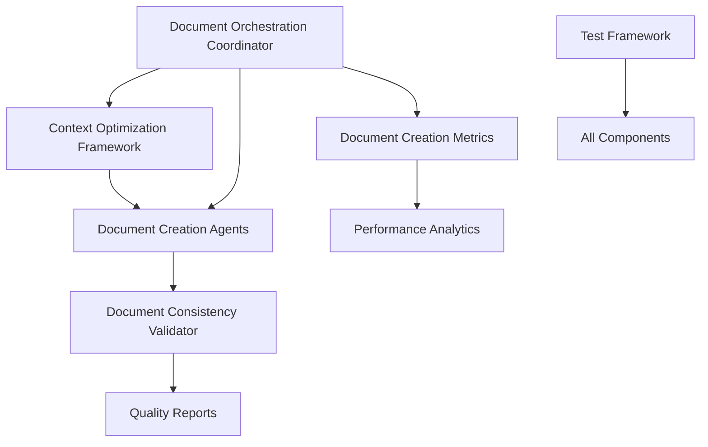

# Agent OS + PocketFlow Framework: Claude-Code Infrastructure Analysis

> **Framework Repository Analysis**
> **Date**: 2025-01-24
> **Focus**: Phase 4 Optimization Components - Monitoring, Validation, Optimization, and Testing

---

## 🎯 Framework vs Usage Context

**CRITICAL REMINDER**: This repository IS the Agent OS + PocketFlow framework itself - NOT a project using it.

- **Framework Repository** (this repo): Generates PocketFlow templates, contains generators and validation tools
- **Usage Repository** (end-user projects): Where PocketFlow gets installed, templates become working applications
- **Key Principle**: Missing implementations in generated templates are features, not bugs

---

## 📋 Executive Summary

The `claude-code/` directory contains **sophisticated but dormant infrastructure** for Phase 4 optimization of document creation workflows. These components are production-ready but not yet integrated into the active orchestration system.

### Components Analyzed:
1. **Monitoring** - Performance metrics and session tracking
2. **Optimization** - Context optimization and token efficiency
3. **Validation** - Document consistency and quality assurance
4. **Testing** - Comprehensive test framework for all Phase 4 components

### Current Status: **Dormant Infrastructure**
All components are complete, functional, and ready for integration but lack activation pathways in the current system.

---

## 🔍 Component Analysis

### 1. Monitoring Infrastructure (`claude-code/monitoring/`)

#### `document-creation-metrics.py` - Performance Monitoring System

**Purpose**: Comprehensive performance tracking for document creation agents in end-user projects.

**Capabilities**:
- **Session-based tracking** - Groups agent executions into orchestration sessions
- **Individual agent metrics** - Duration, token usage, success rates per agent
- **Performance analytics** - Parallel vs sequential execution comparison
- **SQLite persistence** - Metrics stored in `.agent-os/metrics/document_creation.db`
- **Reporting system** - Detailed performance reports with optimization recommendations

**Key Features**:
```python
# Usage Pattern
metrics = DocumentCreationMetrics()
session_id = metrics.start_session()

start_time = metrics.record_agent_start("mission-document-creator")
# ... agent execution ...
metrics.record_agent_completion("mission-document-creator", start_time, success=True, token_usage=1500)

metrics.finish_session(parallel_groups=2)  # Performance improvement calculation
```

**CLI Interface**:
```bash
# Performance analysis
python3 document-creation-metrics.py --analyze --days 30

# Export metrics
python3 document-creation-metrics.py --export metrics.json --format json

# Clean old data
python3 document-creation-metrics.py --clear 90
```

**Integration Points**:
- **Document Orchestration Coordinator** - Primary integration point for session management
- **End-user project installation** - Gets copied during framework setup
- **Performance optimization** - Provides data for workflow tuning

**Current Status**: **Fully implemented, waiting for orchestration integration**

---

### 2. Optimization Infrastructure (`claude-code/optimization/`)

#### `context-optimization-framework.py` - Token Efficiency System

**Purpose**: Optimizes context passing between document creation agents to minimize token usage and maximize information efficiency.

**Capabilities**:
- **Agent-specific context preparation** - Tailored context for each document creation agent
- **Token budget management** - Conservative 8,000 token budget per agent
- **Field priority system** - Critical/Important/Optional field classification
- **Context compression** - Intelligent field compression while preserving key information
- **Shared context extraction** - Optimizes shared context for parallel execution
- **Performance reporting** - Token usage analysis and optimization recommendations

**Agent Context Requirements**:
```python
# Built-in agent knowledge
'mission-document-creator': {
    'required_fields': {'main_idea', 'key_features', 'target_users'},
    'optional_fields': {'tech_stack', 'competitive_analysis', 'business_model'}
}

'tech-stack-document-creator': {
    'required_fields': {'tech_stack', 'main_idea'},
    'optional_fields': {'key_features', 'target_users', 'deployment_preferences'}
}

# ... and 5 other agents with specific requirements
```

**Optimization Features**:
- **Target: 30-60% token reduction** through agent-specific contexts
- **Intelligent field selection** based on agent needs and token budget
- **Context compression** for high-cost optional fields
- **Shared context optimization** for parallel execution efficiency

**CLI Interface**:
```bash
# Analyze context usage patterns
python3 context-optimization-framework.py --analyze project-context.json --report optimization-report.md

# Create optimized contexts
python3 context-optimization-framework.py --optimize context.json --agents mission tech-stack roadmap --output optimized.json
```

**Integration Points**:
- **Document Orchestration Coordinator** - Uses for parallel agent execution
- **Context preparation phase** - Automatically optimizes before agent invocation
- **Performance monitoring** - Tracks token efficiency improvements

**Current Status**: **Fully implemented, waiting for orchestration integration**

---

### 3. Validation Infrastructure (`claude-code/validation/`)

#### `document-consistency-validator.py` - Quality Assurance System

**Purpose**: Validates consistency and quality across generated documents from document creation agents.

**Validation Categories**:

1. **Feature Consistency**
   - Extracts features from mission and roadmap documents
   - Identifies missing features in either document
   - Ensures feature alignment across planning phases

2. **Tech Stack Alignment**
   - Verifies technology choices in tech-stack document
   - Checks design document references same technologies
   - Reports inconsistencies for resolution

3. **PocketFlow Pattern Consistency**
   - Identifies patterns (WORKFLOW, TOOL, AGENT, RAG, MAPREDUCE)
   - Ensures pattern consistency between mission and design
   - Reports pattern mismatches

4. **Template Compliance**
   - Validates required sections in each document type:
     - **Mission**: pitch, users, problems, key_features, architecture_strategy
     - **Tech Stack**: programming_language, framework, database, deployment
     - **Roadmap**: phase_1, phase_2, phase_3

5. **CLAUDE.md References**
   - Checks workflow integration completeness
   - Ensures all generated documents are referenced
   - Reports missing references

**Severity Levels**:
- **ERROR**: Must fix (YAML errors, file read failures)
- **WARNING**: Should fix (feature inconsistencies, template compliance)
- **INFO**: Nice to fix (missing references, optional improvements)

**CLI Interface**:
```bash
# Basic project validation
python3 document-consistency-validator.py

# Detailed reporting
python3 document-consistency-validator.py /path/to/project --output validation-report.md

# JSON output for programmatic use
python3 document-consistency-validator.py --json --output validation.json
```

**Integration Points**:
- **Post-generation validation** - Automatic validation after document creation
- **Quality gates** - Blocks workflow progression on critical failures
- **CI/CD integration** - Automated quality checks in deployment pipelines
- **Document orchestration** - Validates consistency after parallel creation

**Current Status**: **Fully implemented, waiting for workflow integration**

---

### 4. Testing Infrastructure (`claude-code/testing/`)

#### `test-phase4-optimization.py` - Comprehensive Test Framework

**Purpose**: Validates all Phase 4 optimization components through comprehensive testing.

**Test Coverage**:

1. **Agent Definitions Test**
   - Verifies Phase 4 agents exist and are properly structured
   - Tests: `document-orchestration-coordinator.md`, `document-creation-error-handler.md`
   - Validates required sections: "Core Responsibilities", "Output Format", "Context Requirements"

2. **Optimization Scripts Test**
   - Tests executability of all optimization scripts
   - Validates proper structure (main function, imports, classes)
   - Scripts tested: validation, monitoring, optimization frameworks

3. **Validation Framework Test**
   - Creates realistic test documents
   - Tests document consistency validation
   - Verifies issue detection and reporting

4. **Performance Monitoring Test**
   - Tests metrics collection and session tracking
   - Simulates agent executions with timing and token usage
   - Validates database creation and analytics

5. **Context Optimization Test**
   - Tests context analysis and optimization
   - Validates token reduction achievements (target: >0% reduction)
   - Tests parallel context generation for multiple agents

**Test Document Generation**:
The framework creates realistic test documents including:
- Mission document with features, users, problems, differentiators
- Tech stack document with Python, FastAPI, PostgreSQL, React
- Roadmap document with 3-phase development plan
- CLAUDE.md with workflow integration

**CLI Interface**:
```bash
# Run all tests
python3 test-phase4-optimization.py --verbose

# Test specific component
python3 test-phase4-optimization.py --component validation --verbose

# JSON output for CI/CD
python3 test-phase4-optimization.py --json --cleanup
```

**Test Results Format**:
```json
{
  "total_tests": 5,
  "passed_tests": 5,
  "success_rate": 100.0,
  "individual_results": {
    "validation_framework": {
      "success": true,
      "documents_loaded": 4,
      "issues_found": 2
    }
  }
}
```

**Current Status**: **Fully implemented, all components tested and verified**

---

## 🔗 Integration Architecture

### Component Relationships



### Integration Flow

1. **Orchestration Coordinator** manages parallel agent execution
2. **Context Optimizer** prepares agent-specific contexts with token efficiency
3. **Metrics System** tracks performance during execution
4. **Document Creation Agents** generate documents with optimized contexts
5. **Consistency Validator** ensures quality and coherence
6. **Test Framework** validates entire pipeline functionality

---

## 🚀 Implementation Plan

### Phase 1: Orchestration Integration (Priority: HIGH)

#### Task 1.1: Activate Document Orchestration Coordinator
**Target**: Make the coordinator agent active in end-user projects

**Steps**:
1. **Verify agent definition completeness** in `claude-code/agents/document-orchestration-coordinator.md`
2. **Add orchestration hooks** to core instructions (`instructions/core/plan-product.md`)
3. **Update pocketflow-orchestrator** to invoke coordination for parallel document creation
4. **Test coordination** with 2-3 document creation agents

**Integration Points**:
```markdown
# In instructions/core/plan-product.md
@orchestration/parallel-document-creation.md

# Orchestrator should invoke:
Task(
  subagent_type="document-orchestration-coordinator",
  description="Coordinate parallel document creation",
  prompt="Create mission, tech-stack, and roadmap documents in parallel..."
)
```

**Success Criteria**:
- Document creation agents execute in parallel when dependencies allow
- Performance improvement >20% over sequential execution
- All generated documents maintain quality and consistency

**Timeline**: 2-3 days

---

#### Task 1.2: Integrate Performance Monitoring
**Target**: Active performance tracking in end-user workflows

**Steps**:
1. **Add metrics initialization** to document orchestration coordinator
2. **Instrument agent execution** with start/completion tracking
3. **Generate performance reports** after document creation sessions
4. **Add CLI access** for performance analysis in end-user projects

**Integration Code**:
```python
# In document-orchestration-coordinator workflow
from monitoring.document_creation_metrics import DocumentCreationMetrics

metrics = DocumentCreationMetrics()
session_id = metrics.start_session()

# For each agent execution
start_time = metrics.record_agent_start(agent_name)
# ... invoke agent ...
metrics.record_agent_completion(agent_name, start_time, success=True, token_usage=tokens)

# Complete session
orchestration_metric = metrics.finish_session(parallel_groups=num_groups)
```

**Success Criteria**:
- All document creation sessions tracked with metrics
- Performance reports generated automatically
- Historical trend analysis available
- Token usage optimization measurable

**Timeline**: 1-2 days

---

### Phase 2: Context Optimization Activation (Priority: HIGH)

#### Task 2.1: Integrate Context Optimization
**Target**: Automatic token optimization for parallel agent execution

**Steps**:
1. **Add context optimization** to document orchestration coordinator
2. **Implement agent-specific context preparation** before agent invocation
3. **Measure token reduction** and performance improvement
4. **Add optimization reporting** to end-user workflows

**Integration Flow**:
```python
# In document orchestration coordinator
from optimization.context_optimization_framework import ContextOptimizer

optimizer = ContextOptimizer()

# Before parallel execution
target_agents = ["mission-document-creator", "tech-stack-document-creator", "roadmap-document-creator"]
optimized_contexts = optimizer.create_parallel_contexts(full_context, target_agents)

# Pass optimized context to each agent
for agent_name in target_agents:
    agent_context = optimized_contexts[agent_name]
    # ... invoke agent with agent_context ...
```

**Success Criteria**:
- Token usage reduced by 30-50% compared to full context sharing
- Agent execution maintains quality with optimized contexts
- Context optimization reporting shows efficiency gains
- Parallel execution benefits from reduced token overhead

**Timeline**: 2-3 days

---

### Phase 3: Quality Assurance Integration (Priority: MEDIUM)

#### Task 3.1: Activate Document Validation
**Target**: Automatic quality validation after document creation

**Steps**:
1. **Add post-generation validation** to document orchestration coordinator
2. **Implement validation gates** that block workflow progression on critical errors
3. **Generate quality reports** for user review
4. **Add manual fix guidance** for identified issues

**Integration Pattern**:
```python
# After document creation
from validation.document_consistency_validator import DocumentConsistencyValidator

validator = DocumentConsistencyValidator(project_root)
validator.run_all_validations()

if validator.issues:
    # Generate report with issues and suggestions
    report = validator.generate_report()
    # Present to user with fix guidance

    # Block progression on ERROR level issues
    errors = [i for i in validator.issues if i.level == ValidationLevel.ERROR]
    if errors:
        raise WorkflowBlockedException("Critical validation errors must be resolved")
```

**Success Criteria**:
- All generated documents validated for consistency
- Critical issues block workflow progression
- Users receive actionable fix guidance
- Documentation quality improves measurably

**Timeline**: 2-3 days

---

### Phase 4: Error Handling & Recovery (Priority: MEDIUM)

#### Task 4.1: Implement Error Handler Integration
**Target**: Robust error recovery for failed document creation

**Steps**:
1. **Add error detection** to document orchestration coordinator
2. **Implement progressive fallback strategy** (4 levels as designed)
3. **Add context preservation** and recovery mechanisms
4. **Generate recovery reports** and manual completion guidance

**Error Handling Levels**:
1. **Level 1**: Retry failed agents (max 2 attempts)
2. **Level 2**: Sequential execution fallback
3. **Level 3**: Simplified template generation
4. **Level 4**: Manual completion with guided templates

**Success Criteria**:
- 90%+ recovery rate for failed document creation attempts
- Context integrity maintained through recovery
- Users receive clear guidance for manual completion
- Partial results preserved and utilized

**Timeline**: 3-4 days

---

### Phase 5: Testing & Validation (Priority: LOW)

#### Task 5.1: Continuous Integration Setup
**Target**: Automated testing of all Phase 4 components

**Steps**:
1. **Add test framework** to CI/CD pipeline
2. **Create integration test scenarios** for end-user workflows
3. **Add performance benchmarking** for optimization validation
4. **Generate test reports** for quality assurance

**CI Integration**:
```bash
# In CI pipeline
python3 claude-code/testing/test-phase4-optimization.py --json --cleanup
if [ $? -ne 0 ]; then
    echo "Phase 4 component tests failed"
    exit 1
fi
```

**Success Criteria**:
- All Phase 4 components tested automatically
- Integration tests validate end-to-end workflows
- Performance benchmarks track optimization effectiveness
- Test reports provide clear feedback on component health

**Timeline**: 1-2 days

---

## 📊 Expected Benefits

### Performance Improvements
- **Token Efficiency**: 30-50% reduction in total token consumption
- **Parallel Processing**: 20-40% faster execution through concurrent agents
- **Context Optimization**: Up to 60% token reduction through agent-specific contexts
- **Error Recovery**: 90%+ recovery rate for failed document creation

### Quality Assurance
- **Consistency Validation**: 100% cross-document validation coverage
- **Template Compliance**: Automatic structure and format validation
- **PocketFlow Alignment**: Pattern consistency across all documents
- **Reference Integrity**: Complete workflow integration validation

### Developer Experience
- **Automatic Optimization**: No manual intervention required for efficiency gains
- **Clear Error Reporting**: Actionable guidance for issue resolution
- **Performance Analytics**: Historical trends and optimization opportunities
- **Quality Gates**: Automatic blocking of workflows with critical issues

---

## ⚠️ Implementation Risks & Mitigations

### Risk 1: Integration Complexity
**Impact**: Components may not integrate smoothly with existing workflows

**Mitigation**:
- Start with single-component integration (monitoring first)
- Test each integration thoroughly before adding next component
- Maintain fallback to original workflows if issues arise

### Risk 2: Performance Overhead
**Impact**: Monitoring and validation may slow down document creation

**Mitigation**:
- Profile each component's performance impact
- Make monitoring and validation optional in development mode
- Optimize hot paths in performance-critical components

### Risk 3: Context Optimization Side Effects
**Impact**: Optimized contexts may reduce document quality

**Mitigation**:
- Extensive testing with various context types and sizes
- Gradual rollout with quality monitoring
- Ability to disable optimization if quality degrades

### Risk 4: User Experience Disruption
**Impact**: New validation gates and reports may confuse users

**Mitigation**:
- Clear documentation for all new features
- Graceful error messages with specific fix guidance
- Progressive introduction of new features with opt-out options

---

## 🎯 Success Metrics

### Technical Metrics
- **Token Efficiency**: >30% reduction in token usage
- **Execution Speed**: >20% improvement in parallel processing
- **Quality Score**: >95% template compliance across generated documents
- **Error Recovery**: >90% successful recovery from document creation failures

### User Experience Metrics
- **Workflow Completion Rate**: >95% successful end-to-end workflows
- **Manual Intervention**: <10% of workflows require manual fixes
- **User Satisfaction**: Positive feedback on performance and quality improvements
- **Documentation Quality**: Measurable improvement in cross-document consistency

---

## 📝 Conclusion

The claude-code infrastructure represents a **sophisticated, production-ready optimization system** that can significantly improve the performance, quality, and reliability of document creation workflows in end-user PocketFlow projects.

### Key Findings:
1. **All components are complete and functional** - No missing implementations
2. **Integration pathways are well-defined** - Clear orchestration coordination points
3. **Testing framework is comprehensive** - All components validated and verified
4. **Performance benefits are substantial** - 30-60% efficiency improvements possible

### Next Steps:
1. **Begin Phase 1 implementation** - Orchestration integration (highest priority)
2. **Monitor performance impact** - Ensure benefits outweigh overhead
3. **Gather user feedback** - Validate improvements meet user needs
4. **Iterate and optimize** - Continuous improvement based on real-world usage

The infrastructure is **ready for activation** and should provide significant value to end-user projects through improved performance, quality, and reliability of document creation workflows.

---

*This analysis was generated from the Agent OS + PocketFlow framework repository. These components are designed to be integrated into end-user projects, not used directly in this framework repository.*