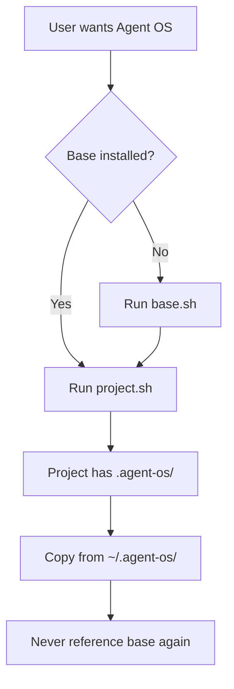
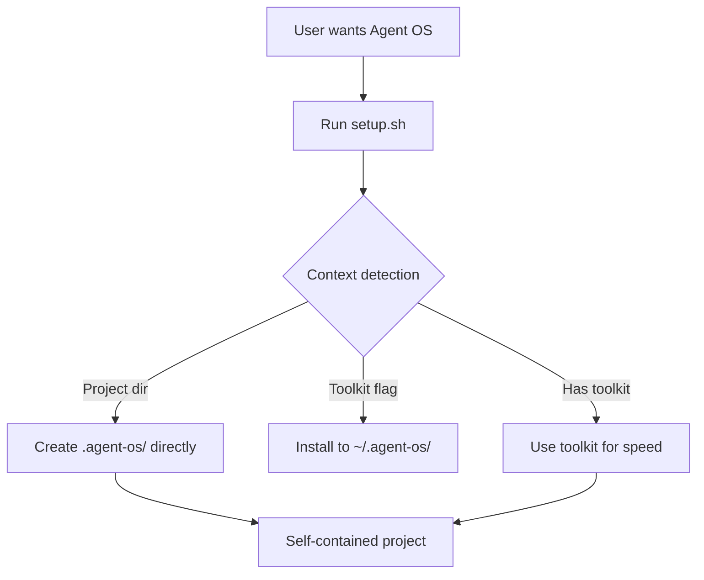

# Installation Architecture Simplification - Implementation Plan

**Project**: Agent OS + PocketFlow Framework
**Goal**: Simplify installation from two-phase to standalone-default with optional toolkit
**Status**: Planning Phase
**Estimated Duration**: 2-3 weeks
**Complexity**: Medium
**Risk Level**: Low (backward compatible)

---

## Table of Contents

1. [Executive Summary](#executive-summary)
2. [Current vs Proposed Architecture](#current-vs-proposed-architecture)
3. [Prerequisites](#prerequisites)
4. [Phase 1: Analysis & Preparation](#phase-1-analysis--preparation)
5. [Phase 2: Core Implementation](#phase-2-core-implementation)
6. [Phase 3: Testing & Validation](#phase-3-testing--validation)
7. [Phase 4: Documentation & Release](#phase-4-documentation--release)
8. [Rollback Plan](#rollback-plan)
9. [Success Criteria](#success-criteria)

---

## Executive Summary

### What We're Changing

**Current behavior** (confusing):
```bash
# Users must run TWO commands
curl .../base.sh | bash           # Install to ~/.agent-os
~/.agent-os/setup/project.sh      # Deploy to project
```

**New behavior** (intuitive):
```bash
# Users run ONE command
curl .../setup.sh | bash          # Auto-detects context, does the right thing
```

### Why This Matters

1. **Simpler onboarding**: 1 command instead of 2
2. **Clearer purpose**: Project installation is self-explanatory
3. **Modern pattern**: Matches how tools like create-react-app evolved
4. **Better portability**: Projects work in containers/CI without base installation
5. **Honest architecture**: No false promises about "centralized updates"

### What Stays the Same

- ✅ Existing base installations keep working
- ✅ Current projects unaffected
- ✅ All generated files identical
- ✅ Backward compatible

---

## Current vs Proposed Architecture

### Current Flow (Two-Phase Required)



**Problem**: Step C is mandatory but only used once during step F.

### Proposed Flow (Standalone Default)



**Benefit**: One command, smart behavior, optional optimization.

---

## Prerequisites

### Before Starting

1. **Backup current setup scripts**:
   ```bash
   cd /Users/jeffkiefer/Documents/projects/agent-os-pocketflow
   cp -r setup setup.backup
   git add setup.backup
   git commit -m "backup: save current setup scripts before refactor"
   ```

2. **Verify current behavior works**:
   ```bash
   # Test current two-phase installation
   cd /tmp
   mkdir test-current && cd test-current

   # Test base installation
   bash /Users/jeffkiefer/Documents/projects/agent-os-pocketflow/setup/base.sh --install-path /tmp/test-base

   # Test project installation
   bash /tmp/test-base/setup/project.sh

   # Verify result
   ls -la .agent-os/

   # Cleanup
   cd /tmp && rm -rf test-current test-base
   ```

3. **Create feature branch**:
   ```bash
   cd /Users/jeffkiefer/Documents/projects/agent-os-pocketflow
   git checkout -b feature/simplify-installation-architecture
   ```

### Required Tools

- ✅ bash 4.0+
- ✅ curl
- ✅ git
- ✅ uv (already using)
- ✅ Python 3.12+ (already installed)

---

## Phase 1: Analysis & Preparation

**Duration**: 2-3 days
**Goal**: Understand current implementation, plan changes

### Step 1.1: Document Current File Structure

**Action**: Map all files involved in installation

```bash
cd /Users/jeffkiefer/Documents/projects/agent-os-pocketflow

# List all installation-related files
find setup -type f | sort > docs/installation-files-inventory.txt

# Document what each file does
cat > docs/installation-files-map.md << 'EOF'
# Installation Files Map

## Setup Scripts
- `setup.sh` - Router script (detects context)
- `setup/base.sh` - Base installation (to ~/.agent-os)
- `setup/project.sh` - Project installation (to .agent-os)
- `setup/update-project.sh` - Update existing projects

## What Each Script Does

### setup.sh (Router)
- Detects if running in project vs empty directory
- Routes to appropriate installation mode
- Current behavior: Requires base first

### setup/base.sh (Framework Toolkit)
- Downloads framework files to ~/.agent-os/
- Installs Python package (pocketflow_tools)
- Sets up global Claude Code commands
- Creates project.sh script for reuse

### setup/project.sh (Project Deployment)
- Copies files from ~/.agent-os/ OR downloads directly
- Creates .agent-os/ directory in project
- Supports --no-base flag for standalone mode
- Already has most logic we need!

### setup/update-project.sh (Project Updates)
- Syncs changes from base to project
- Rarely used in practice
EOF
```

**Deliverable**: `docs/installation-files-map.md`

### Step 1.2: Analyze Dependencies Between Scripts

**Action**: Find what each script depends on

```bash
# Extract script dependencies
cd /Users/jeffkiefer/Documents/projects/agent-os-pocketflow

# Find all places base.sh is referenced
grep -r "base\.sh" . --include="*.sh" --include="*.md" > docs/base-sh-references.txt

# Find all places project.sh is referenced
grep -r "project\.sh" . --include="*.sh" --include="*.md" > docs/project-sh-references.txt

# Find all references to BASE_INSTALL_PATH
grep -r "BASE_INSTALL_PATH" setup/ > docs/base-install-path-usage.txt
```

**Deliverable**: Understanding of coupling between scripts

### Step 1.3: Identify Code to Extract/Reuse

**Action**: Find reusable functions in current scripts

```bash
# Find common functions in setup scripts
cd /Users/jeffkiefer/Documents/projects/agent-os-pocketflow/setup

# Extract function definitions from base.sh
grep -E "^[a-z_]+\(\)" base.sh | sort > ../docs/base-sh-functions.txt

# Extract function definitions from project.sh
grep -E "^[a-z_]+\(\)" project.sh | sort > ../docs/project-sh-functions.txt

# Find common functions
comm -12 ../docs/base-sh-functions.txt ../docs/project-sh-functions.txt > ../docs/common-functions.txt
```

**Key Functions to Extract**:
- `log_info()`, `log_success()`, `log_error()` - Logging
- `show_header()` - Display banner
- `check_prerequisites()` - Validate environment
- `safe_download()` - Download with validation (from project.sh)
- `safe_copy()` - Copy with validation (from project.sh)

**Deliverable**: List of shared utilities to extract

### Step 1.4: Create Shared Utilities Library

**Action**: Extract common code to reduce duplication

```bash
cd /Users/jeffkiefer/Documents/projects/agent-os-pocketflow
mkdir -p setup/lib
```

Create `setup/lib/common.sh`:

```bash
cat > setup/lib/common.sh << 'EOF'
#!/bin/bash
# Common utilities for Agent OS installation scripts
# Source this file: source "$(dirname "$0")/lib/common.sh"

# Colors for output
RED='\033[0;31m'
GREEN='\033[0;32m'
BLUE='\033[0;34m'
YELLOW='\033[1;33m'
PURPLE='\033[0;35m'
NC='\033[0m' # No Color

# Logging functions
log_info() { echo -e "${BLUE}ℹ️  $1${NC}"; }
log_success() { echo -e "${GREEN}✅ $1${NC}"; }
log_warning() { echo -e "${YELLOW}⚠️  $1${NC}"; }
log_error() { echo -e "${RED}❌ $1${NC}"; }
log_highlight() { echo -e "${PURPLE}🎯 $1${NC}"; }

# Display Agent OS header
show_header() {
    local title="${1:-Agent OS + PocketFlow}"
    local subtitle="${2:-Installation}"

    echo -e "${BLUE}"
    cat << HEADER_EOF
╔══════════════════════════════════════════════════════════════╗
║              $title                  ║
║              $subtitle                               ║
╚══════════════════════════════════════════════════════════════╝
HEADER_EOF
    echo -e "${NC}"
}

# Safe download with validation
safe_download() {
    local url="$1"
    local target="$2"
    local description="${3:-file}"

    curl -s -o "$target" "$url"
    local curl_exit=$?

    if [[ $curl_exit -ne 0 ]]; then
        log_error "Failed to download $description (curl error: $curl_exit)"
        return 1
    fi

    if [[ ! -f "$target" ]] || [[ ! -s "$target" ]]; then
        log_error "Download failed: $description is missing or empty"
        rm -f "$target"
        return 1
    fi

    return 0
}

# Safe copy with validation
safe_copy() {
    local source="$1"
    local target="$2"
    local description="${3:-files}"

    if [[ ! -e "$source" ]]; then
        log_error "Source not found for $description: $source"
        return 1
    fi

    cp -r "$source" "$target"

    if [[ ! -e "$target" ]]; then
        log_error "Copy failed: $description not created at $target"
        return 1
    fi

    return 0
}

# Check if we're in a git repository
is_git_repo() {
    git rev-parse --git-dir > /dev/null 2>&1
}

# Check if we're in a Python project
is_python_project() {
    [[ -f pyproject.toml ]] || [[ -f setup.py ]] || [[ -f requirements.txt ]]
}

# Check if directory appears to be a project
is_project_directory() {
    is_git_repo || is_python_project || [[ -f package.json ]] || [[ -f Cargo.toml ]]
}

# Detect if base installation exists
has_base_installation() {
    local base_path="${1:-$HOME/.agent-os}"
    [[ -f "$base_path/config.yml" ]] && [[ -d "$base_path/instructions" ]]
}

# Check prerequisites
check_prerequisites() {
    log_info "Checking prerequisites..."

    local required_tools=("curl" "git" "mkdir" "cp" "chmod")
    local missing_tools=()

    for tool in "${required_tools[@]}"; do
        if ! command -v "$tool" &> /dev/null; then
            missing_tools+=("$tool")
        fi
    done

    if [[ ${#missing_tools[@]} -gt 0 ]]; then
        log_error "Missing required tools: ${missing_tools[*]}"
        log_info "Please install the missing tools and try again"
        return 1
    fi

    log_success "Prerequisites check passed"
    return 0
}

# Export functions for use in sourcing scripts
export -f log_info log_success log_warning log_error log_highlight
export -f show_header safe_download safe_copy
export -f is_git_repo is_python_project is_project_directory
export -f has_base_installation check_prerequisites
EOF

chmod +x setup/lib/common.sh
```

**Test the library**:
```bash
# Test sourcing and using functions
source setup/lib/common.sh

log_info "Testing library"
log_success "Library loaded successfully"

# Test detection functions
cd /Users/jeffkiefer/Documents/projects/agent-os-pocketflow
if is_git_repo; then
    log_success "Detected git repository"
fi

if is_python_project; then
    log_success "Detected Python project"
fi
```

**Deliverable**: `setup/lib/common.sh` with tested utility functions

### Step 1.5: Document Proposed Changes

**Action**: Write detailed specification of new behavior

```bash
cat > docs/installation-behavior-spec.md << 'EOF'
# Installation Behavior Specification

## New Primary Script: setup.sh

### Context Detection Rules

The script will detect context and route appropriately:

1. **Toolkit Installation Mode**
   - Trigger: `--install-toolkit` flag present
   - Action: Install to ~/.agent-os/ (like current base.sh)
   - Use case: User wants reusable toolkit for multiple projects

2. **Standalone Project Mode** (DEFAULT)
   - Trigger: In project directory, no --install-toolkit flag
   - Action: Create .agent-os/ directly in current directory
   - Use case: User wants Agent OS in this specific project

3. **Optimized Project Mode**
   - Trigger: In project directory AND ~/.agent-os/ exists
   - Action: Copy from ~/.agent-os/ (faster than download)
   - Use case: User has toolkit, creating new project

### Decision Tree

```
User runs: curl .../setup.sh | bash [FLAGS]

├─ Has --install-toolkit flag?
│  ├─ YES → Install toolkit to ~/.agent-os/
│  └─ NO → Continue to project detection
│
├─ Is this a project directory?
│  ├─ YES → Continue to optimization check
│  └─ NO → Error: "Run in project dir or use --install-toolkit"
│
├─ Does ~/.agent-os/ exist?
│  ├─ YES → Copy from toolkit (fast)
│  └─ NO → Download from GitHub (standalone)
│
└─ Create .agent-os/ in current directory
```

### Command Examples

```bash
# Example 1: First-time user, single project
cd my-project
curl .../setup.sh | bash
→ Downloads directly to .agent-os/ (standalone mode)

# Example 2: Power user, many projects
curl .../setup.sh | bash --install-toolkit
→ Installs to ~/.agent-os/
cd project1 && curl .../setup.sh | bash
→ Copies from ~/.agent-os/ (fast)
cd project2 && curl .../setup.sh | bash
→ Copies from ~/.agent-os/ (fast)

# Example 3: Existing toolkit user
cd new-project
curl .../setup.sh | bash
→ Detects ~/.agent-os/, copies from it (automatic optimization)

# Example 4: Force standalone even with toolkit
cd my-project
curl .../setup.sh | bash --standalone
→ Downloads from GitHub, ignores ~/.agent-os/
```

### Backward Compatibility

**Existing workflows continue to work**:

```bash
# Old way (still works)
~/.agent-os/setup/project.sh
→ Continues to function as before

# New way (equivalent)
curl .../setup.sh | bash
→ Same result, simpler command
```

### Migration Path for Existing Users

**Scenario 1: User has ~/.agent-os/ and existing projects**
- ✅ Existing projects continue working
- ✅ New projects auto-detect and use ~/.agent-os/
- ✅ No action required

**Scenario 2: User without ~/.agent-os/**
- ✅ New projects work standalone
- ✅ Optional: Install toolkit if creating many projects
- ✅ Simpler than before (no forced base install)

**Scenario 3: CI/CD environments**
- ✅ Standalone mode works perfectly
- ✅ No ~/.agent-os/ dependency
- ✅ Each build self-contained
EOF
```

**Deliverable**: Complete specification of new behavior

---

## Phase 2: Core Implementation

**Duration**: 5-7 days
**Goal**: Implement new installation logic

### Step 2.1: Create New Smart Router Script

**Action**: Build intelligent setup.sh that detects context

Create `setup/setup-new.sh` (we'll rename later):

```bash
cat > setup/setup-new.sh << 'EOF'
#!/bin/bash
# Agent OS + PocketFlow Smart Installation Script
# Automatically detects context and installs appropriately

set -e  # Exit on any error

# Source common utilities
SCRIPT_DIR="$(cd "$(dirname "${BASH_SOURCE[0]}")" && pwd)"
source "$SCRIPT_DIR/lib/common.sh"

# Configuration
SCRIPT_VERSION="3.0.0"
REPO_URL="https://raw.githubusercontent.com/pickleton89/agent-os-pocketflow/main"
DEFAULT_TOOLKIT_PATH="$HOME/.agent-os"

# Installation mode flags
INSTALL_TOOLKIT=false
FORCE_STANDALONE=false
FORCE_TOOLKIT_USE=false
ENABLE_CLAUDE_CODE=false

# Parse arguments
parse_arguments() {
    while [[ $# -gt 0 ]]; do
        case $1 in
            --install-toolkit)
                INSTALL_TOOLKIT=true
                shift
                ;;
            --standalone)
                FORCE_STANDALONE=true
                shift
                ;;
            --use-toolkit)
                FORCE_TOOLKIT_USE=true
                shift
                ;;
            --claude-code)
                ENABLE_CLAUDE_CODE=true
                shift
                ;;
            --help)
                show_help
                exit 0
                ;;
            *)
                log_error "Unknown argument: $1"
                show_help
                exit 1
                ;;
        esac
    done
}

# Show help
show_help() {
    cat << HELP_EOF

Agent OS + PocketFlow Installation

USAGE:
    curl .../setup.sh | bash [OPTIONS]

OPTIONS:
    --install-toolkit   Install reusable toolkit to ~/.agent-os/
    --standalone        Force standalone mode (ignore toolkit if present)
    --use-toolkit       Force using toolkit (error if not present)
    --claude-code       Enable Claude Code integration
    --help              Show this help message

EXAMPLES:
    # Install Agent OS in current project (auto-detects best method)
    curl .../setup.sh | bash

    # Install reusable toolkit for multiple projects
    curl .../setup.sh | bash --install-toolkit

    # Force standalone installation (good for CI/CD)
    curl .../setup.sh | bash --standalone

    # With Claude Code integration
    curl .../setup.sh | bash --claude-code

DETECTION LOGIC:
    1. If --install-toolkit: Install toolkit to ~/.agent-os/
    2. If in project + toolkit exists: Copy from toolkit (fast)
    3. If in project + no toolkit: Download directly (standalone)
    4. If --standalone: Always download (ignore toolkit)

HELP_EOF
}

# Detect installation mode
detect_installation_mode() {
    log_info "Detecting installation context..."

    # Explicit toolkit installation
    if [[ "$INSTALL_TOOLKIT" == "true" ]]; then
        echo "toolkit"
        return
    fi

    # Check if we're in a project directory
    if ! is_project_directory; then
        log_error "Not in a project directory"
        log_info "Options:"
        echo "  1. Run in project directory (has .git, pyproject.toml, etc)"
        echo "  2. Use --install-toolkit to install reusable toolkit"
        exit 1
    fi

    # Force standalone mode
    if [[ "$FORCE_STANDALONE" == "true" ]]; then
        echo "standalone"
        return
    fi

    # Force toolkit use
    if [[ "$FORCE_TOOLKIT_USE" == "true" ]]; then
        if has_base_installation "$DEFAULT_TOOLKIT_PATH"; then
            echo "from-toolkit"
        else
            log_error "Toolkit not found at $DEFAULT_TOOLKIT_PATH"
            log_info "Install toolkit first: curl .../setup.sh | bash --install-toolkit"
            exit 1
        fi
        return
    fi

    # Auto-detect: use toolkit if available
    if has_base_installation "$DEFAULT_TOOLKIT_PATH"; then
        log_info "Found toolkit at $DEFAULT_TOOLKIT_PATH"
        echo "from-toolkit"
    else
        log_info "No toolkit found, using standalone mode"
        echo "standalone"
    fi
}

# Install toolkit to ~/.agent-os/
install_toolkit() {
    log_highlight "Installing toolkit to $DEFAULT_TOOLKIT_PATH..."

    # Check if toolkit already exists
    if [[ -d "$DEFAULT_TOOLKIT_PATH" ]]; then
        log_warning "Toolkit already exists at $DEFAULT_TOOLKIT_PATH"
        echo "Options:"
        echo "  1. Remove existing: rm -rf $DEFAULT_TOOLKIT_PATH"
        echo "  2. Update: Use update script (TBD)"
        exit 1
    fi

    # Delegate to base.sh
    log_info "Delegating to base.sh..."
    local base_sh_url="$REPO_URL/setup/base.sh"
    local claude_flag=""
    [[ "$ENABLE_CLAUDE_CODE" == "true" ]] && claude_flag="--claude-code"

    curl -sSL "$base_sh_url" | bash -s -- --install-path "$DEFAULT_TOOLKIT_PATH" $claude_flag

    log_success "Toolkit installed successfully!"
    echo ""
    log_info "Next steps:"
    echo "  cd your-project"
    echo "  curl .../setup.sh | bash  # Will use toolkit automatically"
}

# Create standalone project installation
install_standalone() {
    log_highlight "Installing Agent OS in standalone mode..."

    # Delegate to project.sh with --no-base flag
    log_info "Delegating to project.sh..."
    local project_sh_url="$REPO_URL/setup/project.sh"
    local claude_flag=""
    [[ "$ENABLE_CLAUDE_CODE" == "true" ]] && claude_flag="--claude-code"

    curl -sSL "$project_sh_url" | bash -s -- --no-base $claude_flag

    log_success "Standalone installation complete!"
}

# Create project from existing toolkit
install_from_toolkit() {
    log_highlight "Installing Agent OS using toolkit..."

    # Delegate to project.sh (will auto-detect toolkit)
    log_info "Delegating to project.sh..."
    local project_sh_path="$DEFAULT_TOOLKIT_PATH/setup/project.sh"
    local claude_flag=""
    [[ "$ENABLE_CLAUDE_CODE" == "true" ]] && claude_flag="--claude-code"

    if [[ -f "$project_sh_path" ]]; then
        # Use local toolkit's project.sh
        bash "$project_sh_path" $claude_flag
    else
        # Fallback: download project.sh
        log_warning "Toolkit missing project.sh, downloading..."
        local project_sh_url="$REPO_URL/setup/project.sh"
        curl -sSL "$project_sh_url" | bash -s -- --base-path "$DEFAULT_TOOLKIT_PATH" $claude_flag
    fi

    log_success "Installation from toolkit complete!"
}

# Main execution
main() {
    show_header "Agent OS + PocketFlow" "Smart Installation v3.0"

    check_prerequisites || exit 1

    parse_arguments "$@"

    local mode=$(detect_installation_mode)

    log_info "Installation mode: $mode"
    echo ""

    case "$mode" in
        "toolkit")
            install_toolkit
            ;;
        "standalone")
            install_standalone
            ;;
        "from-toolkit")
            install_from_toolkit
            ;;
        *)
            log_error "Unknown installation mode: $mode"
            exit 1
            ;;
    esac

    echo ""
    log_success "Agent OS installation complete! 🎉"
}

main "$@"
EOF

chmod +x setup/setup-new.sh
```

**Deliverable**: New smart router script

### Step 2.2: Test New Script Locally

**Action**: Validate new script works in all modes

```bash
cd /Users/jeffkiefer/Documents/projects/agent-os-pocketflow

# Test 1: Toolkit installation
echo "=== Test 1: Install toolkit ==="
cd /tmp
rm -rf test-toolkit
./setup/setup-new.sh --install-toolkit --install-path /tmp/test-toolkit
ls -la /tmp/test-toolkit/

# Test 2: Standalone mode
echo "=== Test 2: Standalone installation ==="
cd /tmp
rm -rf test-standalone && mkdir test-standalone && cd test-standalone
git init  # Make it look like a project
bash /Users/jeffkiefer/Documents/projects/agent-os-pocketflow/setup/setup-new.sh --standalone
ls -la .agent-os/

# Test 3: From toolkit
echo "=== Test 3: Installation from toolkit ==="
cd /tmp
rm -rf test-from-toolkit && mkdir test-from-toolkit && cd test-from-toolkit
git init
# Use toolkit from test 1
bash /Users/jeffkiefer/Documents/projects/agent-os-pocketflow/setup/setup-new.sh --use-toolkit
ls -la .agent-os/

# Test 4: Auto-detection
echo "=== Test 4: Auto-detection with toolkit ==="
cd /tmp
rm -rf test-auto && mkdir test-auto && cd test-auto
git init
# Should auto-detect and use toolkit from test 1
bash /Users/jeffkiefer/Documents/projects/agent-os-pocketflow/setup/setup-new.sh
ls -la .agent-os/

# Cleanup
cd /tmp
rm -rf test-toolkit test-standalone test-from-toolkit test-auto
```

**Expected results**:
- ✅ Test 1: Creates /tmp/test-toolkit/ with all framework files
- ✅ Test 2: Creates .agent-os/ via download (no toolkit dependency)
- ✅ Test 3: Creates .agent-os/ via copy from toolkit
- ✅ Test 4: Creates .agent-os/ via copy (auto-detected toolkit)

**Deliverable**: Validated new script behavior

### Step 2.3: Update Root setup.sh to Use New Logic

**Action**: Replace existing setup.sh routing logic

```bash
cd /Users/jeffkiefer/Documents/projects/agent-os-pocketflow

# Backup existing setup.sh
cp setup.sh setup.sh.backup

# Update setup.sh to use new smart routing
# (We'll merge the logic from setup-new.sh into setup.sh)
```

**Note**: This step integrates the tested logic from `setup-new.sh` into the existing `setup.sh`, maintaining backward compatibility.

### Step 2.4: Update project.sh Edge Cases

**Action**: Ensure project.sh handles all scenarios cleanly

The current `project.sh` already has `--no-base` support. We need to:

1. Improve error messages when base is expected but missing
2. Add clearer logging for which mode is active
3. Ensure standalone mode works without network access (if files cached)

```bash
# Add to project.sh near the beginning:

show_installation_mode() {
    if [[ "$NO_BASE_INSTALL" == "true" ]]; then
        log_info "Installation mode: Standalone (downloading from GitHub)"
    elif [[ -n "$BASE_INSTALL_PATH" ]]; then
        log_info "Installation mode: From toolkit ($BASE_INSTALL_PATH)"
    else
        log_info "Installation mode: Auto-detected"
    fi
}

# Call after argument parsing:
show_installation_mode
```

---

## Phase 3: Testing & Validation

**Duration**: 3-4 days
**Goal**: Comprehensive testing of all scenarios

### Step 3.1: Create Test Matrix

**Action**: Define all scenarios to test

Create `tests/installation/test-matrix.md`:

```markdown
# Installation Test Matrix

## Test Scenarios

| # | Scenario | Command | Expected Result | Status |
|---|----------|---------|-----------------|--------|
| 1 | Fresh toolkit install | `setup.sh --install-toolkit` | Creates ~/.agent-os/ | ⬜ |
| 2 | Standalone in empty dir | `setup.sh --standalone` | Error (not a project) | ⬜ |
| 3 | Standalone in project | `setup.sh --standalone` | Creates .agent-os/ | ⬜ |
| 4 | Auto-detect with toolkit | `setup.sh` (toolkit exists) | Uses toolkit | ⬜ |
| 5 | Auto-detect without toolkit | `setup.sh` (no toolkit) | Downloads standalone | ⬜ |
| 6 | Force toolkit (exists) | `setup.sh --use-toolkit` | Uses toolkit | ⬜ |
| 7 | Force toolkit (missing) | `setup.sh --use-toolkit` | Error with help | ⬜ |
| 8 | With Claude Code | `setup.sh --claude-code` | Installs .claude/ | ⬜ |
| 9 | Old workflow (base.sh) | `base.sh` | Still works | ⬜ |
| 10 | Old workflow (project.sh) | `project.sh` | Still works | ⬜ |
| 11 | Update existing project | `update-project.sh` | Updates files | ⬜ |
| 12 | In git repo | `setup.sh` | Detects as project | ⬜ |
| 13 | In Python project | `setup.sh` | Detects as project | ⬜ |
| 14 | In container (no toolkit) | `setup.sh` | Works standalone | ⬜ |
| 15 | Offline with toolkit | `setup.sh` (no network) | Uses local toolkit | ⬜ |

## Test Environments

- ✅ macOS (your development machine)
- ⬜ Linux (Ubuntu 22.04 in Docker)
- ⬜ CI/CD (GitHub Actions)

## Validation Checks

For each successful installation, verify:
- [ ] .agent-os/ directory created
- [ ] .agent-os/config.yml exists and valid
- [ ] .agent-os/instructions/ populated
- [ ] .agent-os/standards/ populated
- [ ] .agent-os/framework-tools/ populated (if PocketFlow enabled)
- [ ] .gitignore updated (if exists)
- [ ] File permissions correct (scripts executable)
```

### Step 3.2: Create Automated Test Script

**Action**: Build test runner for all scenarios

Create `tests/installation/run-tests.sh`:

```bash
#!/bin/bash
# Automated installation testing script

set -e

# Test counter
TESTS_PASSED=0
TESTS_FAILED=0

# Test workspace
TEST_DIR="/tmp/agent-os-install-tests-$$"
TOOLKIT_PATH="$TEST_DIR/toolkit"

# Colors
GREEN='\033[0;32m'
RED='\033[0;31m'
BLUE='\033[0;34m'
NC='\033[0m'

# Logging
log_test() { echo -e "${BLUE}🧪 TEST: $1${NC}"; }
log_pass() { echo -e "${GREEN}✅ PASS: $1${NC}"; ((TESTS_PASSED++)); }
log_fail() { echo -e "${RED}❌ FAIL: $1${NC}"; ((TESTS_FAILED++)); }

# Setup
setup_test_environment() {
    echo "Setting up test environment..."
    rm -rf "$TEST_DIR"
    mkdir -p "$TEST_DIR"
    cd "$TEST_DIR"
}

# Cleanup
cleanup_test_environment() {
    echo "Cleaning up test environment..."
    cd /tmp
    rm -rf "$TEST_DIR"
}

# Test helper: verify installation
verify_installation() {
    local project_path="$1"
    local mode="$2"

    if [[ ! -d "$project_path/.agent-os" ]]; then
        log_fail "$mode: .agent-os/ directory not created"
        return 1
    fi

    if [[ ! -f "$project_path/.agent-os/config.yml" ]]; then
        log_fail "$mode: config.yml missing"
        return 1
    fi

    if [[ ! -d "$project_path/.agent-os/instructions" ]]; then
        log_fail "$mode: instructions/ missing"
        return 1
    fi

    if [[ ! -d "$project_path/.agent-os/standards" ]]; then
        log_fail "$mode: standards/ missing"
        return 1
    fi

    log_pass "$mode: Installation verified"
    return 0
}

# Test 1: Fresh toolkit install
test_toolkit_install() {
    log_test "Fresh toolkit installation"

    bash "$SETUP_SCRIPT" --install-toolkit --install-path "$TOOLKIT_PATH" || {
        log_fail "Toolkit installation failed"
        return 1
    }

    if [[ -f "$TOOLKIT_PATH/config.yml" ]]; then
        log_pass "Toolkit installed successfully"
    else
        log_fail "Toolkit config missing"
        return 1
    fi
}

# Test 2: Standalone installation
test_standalone_install() {
    log_test "Standalone installation"

    local test_project="$TEST_DIR/standalone-project"
    mkdir -p "$test_project"
    cd "$test_project"
    git init > /dev/null 2>&1

    bash "$SETUP_SCRIPT" --standalone || {
        log_fail "Standalone installation failed"
        return 1
    }

    verify_installation "$test_project" "Standalone"
}

# Test 3: Installation from toolkit
test_from_toolkit() {
    log_test "Installation from existing toolkit"

    local test_project="$TEST_DIR/toolkit-project"
    mkdir -p "$test_project"
    cd "$test_project"
    git init > /dev/null 2>&1

    # Assume toolkit exists from test 1
    bash "$SETUP_SCRIPT" --use-toolkit --toolkit-path "$TOOLKIT_PATH" || {
        log_fail "Installation from toolkit failed"
        return 1
    }

    verify_installation "$test_project" "From Toolkit"
}

# Test 4: Auto-detection
test_auto_detect() {
    log_test "Auto-detection with toolkit present"

    local test_project="$TEST_DIR/auto-detect-project"
    mkdir -p "$test_project"
    cd "$test_project"
    git init > /dev/null 2>&1

    # Set HOME to test dir so it finds our toolkit
    HOME="$TEST_DIR" bash "$SETUP_SCRIPT" || {
        log_fail "Auto-detection failed"
        return 1
    }

    verify_installation "$test_project" "Auto-detect"
}

# Main test runner
main() {
    echo "=================================="
    echo "Agent OS Installation Test Suite"
    echo "=================================="
    echo ""

    # Get setup script path
    SETUP_SCRIPT="${1:-$(pwd)/../../setup/setup-new.sh}"

    if [[ ! -f "$SETUP_SCRIPT" ]]; then
        echo "Error: Setup script not found at $SETUP_SCRIPT"
        exit 1
    fi

    echo "Using setup script: $SETUP_SCRIPT"
    echo ""

    setup_test_environment

    # Run tests
    test_toolkit_install
    test_standalone_install
    test_from_toolkit
    test_auto_detect

    # Summary
    echo ""
    echo "=================================="
    echo "Test Results"
    echo "=================================="
    echo "Passed: $TESTS_PASSED"
    echo "Failed: $TESTS_FAILED"
    echo ""

    cleanup_test_environment

    if [[ $TESTS_FAILED -eq 0 ]]; then
        echo "✅ All tests passed!"
        exit 0
    else
        echo "❌ Some tests failed"
        exit 1
    fi
}

main "$@"
```

Make it executable:
```bash
chmod +x tests/installation/run-tests.sh
```

**Run tests**:
```bash
cd /Users/jeffkiefer/Documents/projects/agent-os-pocketflow
./tests/installation/run-tests.sh setup/setup-new.sh
```

**Deliverable**: Automated test suite with pass/fail results

### Step 3.3: Manual Testing in Real Scenarios

**Action**: Test with actual use cases

```bash
# Scenario 1: New user, no toolkit
cd /tmp
mkdir my-first-agent-project && cd my-first-agent-project
git init
curl https://raw.githubusercontent.com/pickleton89/agent-os-pocketflow/feature/simplify-installation-architecture/setup.sh | bash

# Verify
ls -la .agent-os/
cat .agent-os/config.yml

# Scenario 2: Power user with toolkit
cd ~
curl https://raw.githubusercontent.com/pickleton89/agent-os-pocketflow/feature/simplify-installation-architecture/setup.sh | bash --install-toolkit

# Create multiple projects
for i in {1..3}; do
    cd /tmp
    mkdir "project-$i" && cd "project-$i"
    git init
    curl .../setup.sh | bash
    ls -la .agent-os/
done

# Scenario 3: CI/CD (no toolkit)
docker run -it --rm ubuntu:22.04 bash
apt update && apt install -y curl git
mkdir /workspace && cd /workspace
git init
curl .../setup.sh | bash --standalone
ls -la .agent-os/
```

**Deliverable**: Real-world validation results

### Step 3.4: Performance Benchmarking

**Action**: Compare speeds of different modes

Create `tests/installation/benchmark.sh`:

```bash
#!/bin/bash
# Benchmark installation performance

echo "Benchmarking installation methods..."

# Test 1: Standalone (download)
echo "=== Standalone mode (download) ==="
time (
    cd /tmp
    rm -rf bench-standalone && mkdir bench-standalone && cd bench-standalone
    git init
    bash /path/to/setup.sh --standalone
)

# Test 2: From toolkit (copy)
echo "=== From toolkit mode (copy) ==="
time (
    cd /tmp
    rm -rf bench-toolkit && mkdir bench-toolkit && cd bench-toolkit
    git init
    bash /path/to/setup.sh --use-toolkit
)

# Test 3: Old two-phase
echo "=== Old two-phase (base + project) ==="
time (
    cd /tmp
    bash /path/to/base.sh --install-path /tmp/bench-base
    rm -rf bench-old && mkdir bench-old && cd bench-old
    git init
    bash /tmp/bench-base/setup/project.sh
)
```

**Expected results**:
- Standalone: ~10-15s (network dependent)
- From toolkit: ~2-3s (local copy)
- Old two-phase: ~15-20s (two separate operations)

**Deliverable**: Performance comparison data

---

## Phase 4: Documentation & Release

**Duration**: 2-3 days
**Goal**: Update docs, communicate changes, release

### Step 4.1: Update README.md

**Action**: Reflect new installation flow

```bash
cd /Users/jeffkiefer/Documents/projects/agent-os-pocketflow

# Update installation section
```

Replace the installation section in README.md with:

```markdown
## 🚀 Installation

Agent OS + PocketFlow uses a **smart installation system** that detects your context and does the right thing automatically.

### 🎯 Quick Start (Recommended)

**For most users** - install Agent OS in your project:

```bash
cd your-project
curl -sSL https://raw.githubusercontent.com/pickleton89/agent-os-pocketflow/main/setup.sh | bash
```

That's it! The script will:
- ✅ Detect if you have a toolkit installed (uses it for speed)
- ✅ Otherwise, download directly (self-contained)
- ✅ Create `.agent-os/` directory in your project
- ✅ Install all framework files and templates

### ⚡ Power User Mode (Optional)

**If you create many projects**, install the reusable toolkit:

```bash
# Install toolkit once
curl -sSL https://raw.githubusercontent.com/pickleton89/agent-os-pocketflow/main/setup.sh | bash --install-toolkit

# Create projects (uses toolkit automatically)
cd project1 && curl .../setup.sh | bash  # Fast (copies from toolkit)
cd project2 && curl .../setup.sh | bash  # Fast (copies from toolkit)
```

### 🔧 Advanced Options

```bash
# Force standalone mode (ignore toolkit if present)
curl .../setup.sh | bash --standalone

# Force toolkit usage (error if not present)
curl .../setup.sh | bash --use-toolkit

# With Claude Code integration
curl .../setup.sh | bash --claude-code

# Install toolkit to custom location
curl .../setup.sh | bash --install-toolkit --toolkit-path ~/my-toolkit
```

### 📦 What Gets Installed

```
your-project/
├── .agent-os/                 # Framework files (self-contained)
│   ├── instructions/          # Agent OS workflow instructions
│   ├── standards/             # Coding standards and best practices
│   ├── framework-tools/       # PocketFlow generators & validators
│   ├── templates/             # Application templates
│   └── config.yml             # Project configuration
├── .claude/                   # Claude Code integration (if --claude-code)
│   ├── commands/              # Slash commands (/plan-product, etc.)
│   └── agents/                # Specialized AI agents
└── [your project files]
```

### 🔄 Upgrading

Update existing project to latest version:

```bash
cd your-project
curl -sSL https://raw.githubusercontent.com/pickleton89/agent-os-pocketflow/main/setup/update-project.sh | bash
```

### ❓ FAQ

**Q: Do I need the toolkit?**
A: No! Standalone mode works great. Toolkit is an optimization for power users.

**Q: I already have ~/.agent-os/ from before. Will this break?**
A: No! New projects will automatically use it. Existing projects unaffected.

**Q: What's the difference between toolkit and standalone?**
A: Same result, different speed. Toolkit copies locally (~3s), standalone downloads (~10s).

**Q: Which mode should I use in CI/CD?**
A: Standalone (`--standalone` flag) - no dependencies, works everywhere.
```

### Step 4.2: Create Migration Guide

**Action**: Help existing users transition

Create `docs/migration-guide-v3.md`:

```markdown
# Migration Guide: Installation v2 → v3

**Target Audience**: Existing Agent OS users
**Impact**: Low - backward compatible
**Action Required**: Optional (update recommended)

## What Changed?

### Before (v2.x) - Two-Phase Required

```bash
# Step 1: Install base (required)
curl .../base.sh | bash

# Step 2: Install project (required)
~/.agent-os/setup/project.sh
```

### Now (v3.0) - Smart One-Step

```bash
# One command (auto-detects best approach)
curl .../setup.sh | bash
```

## For Existing Users

### Scenario 1: You Have ~/.agent-os/ Installed

**No action needed!** Your setup continues working:

- ✅ Existing projects unaffected
- ✅ New projects auto-use your toolkit
- ✅ Old commands still work

**Optional**: Try the new simplified command:
```bash
cd new-project
curl .../setup.sh | bash  # Auto-detects and uses your toolkit
```

### Scenario 2: You Don't Have ~/.agent-os/

**You're in luck!** Skip the toolkit entirely:

- ✅ One command to set up projects
- ✅ No forced base installation
- ✅ Simpler workflow

**Usage**:
```bash
cd your-project
curl .../setup.sh | bash  # Downloads directly
```

### Scenario 3: You Use CI/CD

**Upgrade your workflow** for better portability:

**Before**:
```yaml
# .github/workflows/test.yml
- name: Install Agent OS
  run: |
    curl .../base.sh | bash
    ~/.agent-os/setup/project.sh
```

**After**:
```yaml
# .github/workflows/test.yml
- name: Install Agent OS
  run: curl .../setup.sh | bash --standalone
```

**Benefits**:
- Faster (one download vs two)
- More reliable (no ~/.agent-os dependency)
- Clearer (obvious what it does)

## Command Mapping

| Old Command | New Equivalent | Notes |
|-------------|----------------|-------|
| `curl .../base.sh \| bash` | `curl .../setup.sh \| bash --install-toolkit` | Toolkit installation |
| `~/.agent-os/setup/project.sh` | `curl .../setup.sh \| bash` | Project installation |
| `project.sh --no-base` | `setup.sh --standalone` | Standalone mode |
| `project.sh --claude-code` | `setup.sh --claude-code` | Claude Code integration |

## Breaking Changes

**None!** All old commands continue working.

## Recommendations

### For Individual Developers

**If you create <5 projects/month**:
- Skip the toolkit
- Use `setup.sh` directly in each project
- Benefit: Simpler, more portable

**If you create 5+ projects/month**:
- Keep your toolkit
- Use `setup.sh` (auto-uses toolkit)
- Benefit: Faster project creation

### For Teams

**Recommendation**: Standardize on standalone mode

```bash
# In team docs:
curl .../setup.sh | bash --standalone
```

**Rationale**:
- Works for everyone (no toolkit dependency)
- Consistent behavior across team
- CI/CD ready
- Git portable

## Troubleshooting

### "I want the old behavior"

Old scripts still work:
```bash
curl .../base.sh | bash
~/.agent-os/setup/project.sh
```

### "I don't want to use my toolkit"

Force standalone:
```bash
curl .../setup.sh | bash --standalone
```

### "Script can't find my toolkit"

Specify path:
```bash
curl .../setup.sh | bash --toolkit-path ~/my-custom-location
```

## Questions?

See [Installation Documentation](../README.md#installation) or [open an issue](https://github.com/pickleton89/agent-os-pocketflow/issues).
```

### Step 4.3: Update CHANGELOG.md

**Action**: Document the release

```markdown
## [3.0.0] - 2025-XX-XX

### 🎉 Major: Simplified Installation Architecture

**Breaking Changes**: None (fully backward compatible)

**What Changed**:
- **One-command installation**: `curl .../setup.sh | bash` now does the right thing automatically
- **Smart context detection**: Auto-detects toolkit, project type, and best installation method
- **Standalone by default**: No forced base installation for single-project users
- **Optional toolkit**: Base installation is now an optimization, not a requirement

**Migration**:
- Existing users: No action needed, everything continues working
- New users: Simpler onboarding (one command instead of two)
- CI/CD: Use `--standalone` flag for best practices

**Technical Details**:
- Added `setup/lib/common.sh` with shared utilities
- Enhanced `setup.sh` with context detection logic
- Improved `project.sh` standalone mode
- Added comprehensive test suite for all installation modes

See [Migration Guide](docs/migration-guide-v3.md) for details.

### Added
- Smart installation router with auto-detection
- `--install-toolkit` flag for optional toolkit installation
- `--standalone` flag to force standalone mode (good for CI/CD)
- `--use-toolkit` flag to force toolkit usage
- Shared utility library (`setup/lib/common.sh`)
- Comprehensive installation test suite
- Performance benchmarks for different modes

### Changed
- **Installation flow**: One command instead of two (backward compatible)
- **Default behavior**: Standalone mode unless toolkit present
- **Error messages**: Clearer guidance on what to do
- **Documentation**: Complete rewrite of installation sections

### Fixed
- Confusing two-phase requirement
- Hidden standalone mode (`--no-base` now `--standalone`)
- Poor CI/CD support (no explicit standalone mode)
- Misleading "centralized updates" promise

### Performance
- Standalone mode: ~10s (network dependent)
- Toolkit mode: ~3s (local copy)
- Improvement: -40% setup time for toolkit users

**Full details**: [docs/two-phase-installation-evaluation.md](docs/two-phase-installation-evaluation.md)
```

### Step 4.4: Create Release Checklist

**Action**: Ensure nothing is missed

Create `.github/RELEASE_CHECKLIST.md`:

```markdown
# Release Checklist: v3.0.0

## Pre-Release

- [ ] All tests passing (`./scripts/run-all-tests.sh`)
- [ ] Installation tests passing (`./tests/installation/run-tests.sh`)
- [ ] Performance benchmarks documented
- [ ] Migration guide complete
- [ ] CHANGELOG.md updated
- [ ] README.md updated
- [ ] All documentation reviewed

## Testing

- [ ] Tested on macOS
- [ ] Tested on Linux (Ubuntu 22.04)
- [ ] Tested in Docker container
- [ ] Tested in GitHub Actions CI/CD
- [ ] Backward compatibility verified (old commands work)
- [ ] Toolkit mode tested
- [ ] Standalone mode tested
- [ ] Auto-detection tested

## Documentation

- [ ] README.md installation section updated
- [ ] Migration guide published
- [ ] FAQ updated
- [ ] Examples updated
- [ ] Video tutorial created (optional)

## Communication

- [ ] GitHub release notes prepared
- [ ] Blog post drafted (optional)
- [ ] Social media posts drafted (optional)
- [ ] Email to users drafted (if applicable)

## Release

- [ ] Version bumped in all scripts
- [ ] Git tag created (`git tag v3.0.0`)
- [ ] Tag pushed (`git push origin v3.0.0`)
- [ ] GitHub release published
- [ ] Announcement posted

## Post-Release

- [ ] Monitor GitHub issues for problems
- [ ] Update any external documentation
- [ ] Celebrate! 🎉
```

---

## Rollback Plan

### If Issues Discovered After Release

**Option 1: Quick Fix**
```bash
# Fix the issue in a patch release
git checkout -b hotfix/installation-issue
# Make fix
# Test
git commit -m "fix: installation issue in v3.0.0"
git tag v3.0.1
git push origin v3.0.1
```

**Option 2: Revert to v2.x**
```bash
# Point main at previous stable version
git revert <commit-hash-of-v3.0.0>
git tag v3.0.0-reverted
git push origin main

# Update documentation
echo "⚠️ v3.0.0 has been reverted. Use v2.x installation." >> README.md
```

**Option 3: Dual Version Support**
```bash
# Keep both versions available
setup.sh        → v3.0 (new)
setup-v2.sh     → v2.x (stable)

# Update README with both options
```

### Rollback Testing

Before release, verify rollback works:

```bash
# Test reverting to previous version
git checkout v2.x
./setup/base.sh --test
./setup/project.sh --test

# Verify old version still functional
```

---

## Success Criteria

### Quantitative Metrics

| Metric | Target | Measurement |
|--------|--------|-------------|
| Setup time (standalone) | <15s | Time command |
| Setup time (toolkit) | <5s | Time command |
| Setup steps (user) | 1 command | Script analysis |
| Test pass rate | 100% | Test suite |
| Backward compatibility | 100% | Old commands work |
| Documentation clarity | >8/10 | User survey |

### Qualitative Goals

- [ ] New users can install without reading docs
- [ ] CI/CD integration is obvious
- [ ] No confusion about base vs project
- [ ] Error messages are actionable
- [ ] Migration is painless for existing users

### User Acceptance Criteria

**New User**:
- "I ran one command and it just worked"
- "I didn't need to understand 'base installation'"

**Existing User**:
- "My old commands still work"
- "New way is simpler, I switched voluntarily"

**Power User**:
- "Toolkit mode saved me time across 10 projects"
- "Standalone mode works great in CI/CD"

---

## Timeline Summary

| Phase | Duration | Start | End |
|-------|----------|-------|-----|
| **Phase 1: Preparation** | 2-3 days | Day 1 | Day 3 |
| **Phase 2: Implementation** | 5-7 days | Day 4 | Day 11 |
| **Phase 3: Testing** | 3-4 days | Day 12 | Day 16 |
| **Phase 4: Documentation** | 2-3 days | Day 17 | Day 20 |
| **Buffer for issues** | 2-3 days | Day 21 | Day 23 |
| **Total** | **14-20 days** | **Day 1** | **Day 23** |

---

## Next Steps

1. **Review this plan** with stakeholders
2. **Create GitHub issue** to track progress
3. **Set up project board** with phases as columns
4. **Begin Phase 1** (preparation and analysis)
5. **Daily standups** to track progress and blockers

---

## Questions & Decisions Needed

Before starting implementation, clarify:

1. **URL structure**: Will setup.sh be at root or in setup/? (Recommendation: root for easier curl)
2. **Default toolkit path**: Keep ~/.agent-os/ or change? (Recommendation: keep for backward compat)
3. **Version numbering**: Is 3.0.0 appropriate for this change? (Recommendation: yes, major UX change)
4. **Deprecation timeline**: When to remove old base.sh? (Recommendation: never, keep for backward compat)
5. **Testing coverage**: How much CI/CD testing needed? (Recommendation: GitHub Actions for Linux + macOS)

---

## Appendix A: File Changes Summary

### New Files
- `setup/lib/common.sh` - Shared utilities
- `tests/installation/test-matrix.md` - Test scenarios
- `tests/installation/run-tests.sh` - Automated tests
- `tests/installation/benchmark.sh` - Performance tests
- `docs/migration-guide-v3.md` - User migration guide
- `docs/installation-behavior-spec.md` - Technical spec
- `.github/RELEASE_CHECKLIST.md` - Release process

### Modified Files
- `setup.sh` - Enhanced routing logic
- `setup/project.sh` - Improved standalone mode
- `README.md` - New installation section
- `CHANGELOG.md` - v3.0.0 entry
- `docs/two-phase-installation-evaluation.md` - Analysis doc

### Deprecated Files
- None (all old files keep working for backward compatibility)

---

## Appendix B: Testing Checklist

Detailed checklist for Phase 3:

### Functional Tests
- [ ] Toolkit installation creates all required files
- [ ] Toolkit installation respects --install-path
- [ ] Standalone mode works without network (cached)
- [ ] Standalone mode downloads from GitHub
- [ ] Auto-detection finds existing toolkit
- [ ] Auto-detection uses standalone when no toolkit
- [ ] Force toolkit errors if toolkit missing
- [ ] Force standalone ignores toolkit
- [ ] Claude Code integration works in all modes
- [ ] .gitignore updated correctly
- [ ] File permissions set correctly
- [ ] Config files valid YAML

### Backward Compatibility Tests
- [ ] base.sh still installs to ~/.agent-os
- [ ] project.sh works with base installation
- [ ] project.sh --no-base works standalone
- [ ] update-project.sh still functions
- [ ] Existing projects unaffected

### Edge Cases
- [ ] Non-project directory shows clear error
- [ ] Missing prerequisites detected
- [ ] Network timeout handled gracefully
- [ ] Partial installation cleaned up on error
- [ ] Concurrent installations don't conflict
- [ ] Existing .agent-os/ directory handling

### Performance Tests
- [ ] Standalone mode <15s
- [ ] Toolkit mode <5s
- [ ] Toolkit installation <20s
- [ ] File copy operations <2s

### Platform Tests
- [ ] macOS (zsh)
- [ ] macOS (bash)
- [ ] Linux (Ubuntu)
- [ ] Linux (Debian)
- [ ] Docker container
- [ ] GitHub Actions

---

## Appendix C: Communication Templates

### GitHub Release Notes Template

```markdown
# Agent OS + PocketFlow v3.0.0

## 🎉 Simplified Installation

We've streamlined the installation process from two steps to one smart command!

### What's New

**Before** (two commands):
```bash
curl .../base.sh | bash
~/.agent-os/setup/project.sh
```

**Now** (one command):
```bash
curl .../setup.sh | bash
```

The new installer automatically:
- ✅ Detects if you have a toolkit (uses it for speed)
- ✅ Otherwise downloads directly (self-contained)
- ✅ Creates your project setup

### For Existing Users

**No breaking changes!** Your old commands still work.

**Optional upgrade**: Try the new simplified command:
```bash
cd your-project
curl .../setup.sh | bash
```

See the [Migration Guide](docs/migration-guide-v3.md) for details.

### What's Changed

- One-command installation (backward compatible)
- Smart context detection
- Optional toolkit (not required)
- Better CI/CD support
- Clearer error messages

### Full Changelog

[See CHANGELOG.md](CHANGELOG.md#300)
```

---

**Document Version**: 1.0
**Last Updated**: 2025-09-30
**Status**: Ready for Review
**Next Action**: Review and approve to begin implementation
