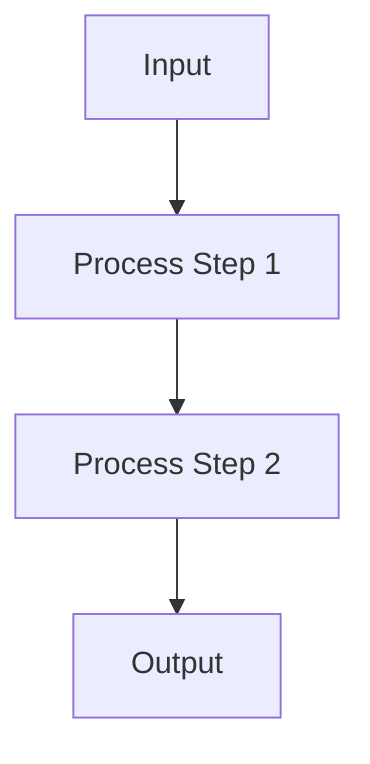

# PocketFlow + Agent OS Integration Implementation Plan

> **Document Version:** 1.0.0  
> **Created:** 2025-01-13  
> **Status:** Ready for Implementation  
> **Estimated Timeline:** 2-3 weeks  

## 📋 **Executive Summary**

This document provides a comprehensive implementation plan to transform the current Agent OS + PocketFlow integration from a **6.5/10 documentation-focused** system to a **9/10 intelligent, workflow-enforced** development platform.

### **Current State Analysis**
- ✅ **Documentation**: Excellent (9/10) - All PocketFlow principles documented
- ⚠️ **Workflow Integration**: Poor (4/10) - Missing enforcement mechanisms  
- ❌ **Template System**: Critical Gap (2/10) - Referenced but not implemented
- ❌ **Design-First Enforcement**: Missing (0/10) - No blocking mechanisms

### **Target State Goals**
- ✅ **Active Workflow Enforcement**: Orchestrator guides every step
- ✅ **Modular Architecture**: Clean separation of concerns  
- ✅ **Robust Coordination**: Cross-file communication and validation
- ✅ **Complete Template System**: Working code generation
- ✅ **Setup Script Integration**: One-command deployment

---

## 🎯 **Implementation Phases**

### **Phase 1: Modular Architecture Foundation** 
*Timeline: Week 1 (Days 1-5)*

#### **Objectives**
- Split monolithic instruction files into modular components
- Create clean separation between core logic and conditional features
- Establish foundation for orchestration system

#### **Deliverables**
- [ ] Modular directory structure
- [ ] Split instruction files (core + extensions)
- [ ] Orchestration coordination framework
- [ ] Updated setup scripts

### **Phase 2: Orchestration System**
*Timeline: Week 2 (Days 6-10)*

#### **Objectives**  
- Implement PocketFlow Orchestrator agent
- Create cross-file coordination mechanisms
- Build validation gates and dependency management

#### **Deliverables**
- [x] PocketFlow Orchestrator agent file
- [ ] Coordination system with hooks
- [ ] Cross-file dependency validation
- [ ] Orchestration configuration files

### **Phase 3: Template System & Code Generation**
*Timeline: Week 2-3 (Days 11-15)*

#### **Objectives**
- Create missing template files
- Implement auto-generation of PocketFlow code
- Build complete workflow implementations

#### **Deliverables**
- [ ] Complete PocketFlow templates
- [ ] FastAPI integration templates  
- [ ] Auto-generation workflows
- [ ] Code validation systems

### **Phase 4: Integration Testing & Setup**
*Timeline: Week 3 (Days 16-21)*

#### **Objectives**
- Comprehensive testing of all components
- Setup script updates and validation
- End-to-end workflow verification

#### **Deliverables**
- [ ] Complete setup script overhaul
- [ ] Integration validation scripts
- [ ] End-to-end testing suite
- [ ] Documentation updates

---

## 🏗️ **Detailed Implementation Specifications**

### **Phase 1: Modular Architecture Foundation**

#### **1.1 Directory Structure Redesign**

**Current Structure:**
```
.agent-os/
├── instructions/core/
│   ├── plan-product.md
│   ├── create-spec.md  
│   └── execute-tasks.md
└── standards/
```

**Target Structure:**
```
.agent-os/
├── instructions/
│   ├── core/                          # Base instruction logic
│   │   ├── plan-product.md
│   │   ├── create-spec.md
│   │   └── execute-tasks.md
│   ├── extensions/                    # Conditional feature logic
│   │   ├── pocketflow-integration.md
│   │   ├── llm-workflow-extension.md
│   │   └── design-first-enforcement.md
│   └── orchestration/                 # Cross-file coordination
│       ├── coordination.yaml
│       ├── orchestrator-hooks.md
│       └── dependency-validation.md
├── workflows/                         # Generated PocketFlow implementations
├── templates/                         # Complete template system
│   ├── pocketflow-templates.md
│   ├── fastapi-templates.md
│   └── task-templates.md
└── standards/                         # Existing standards (unchanged)
```

**Implementation Tasks:**

1. **Create New Directory Structure**
   ```bash
   mkdir -p .agent-os/{instructions/{extensions,orchestration},workflows,templates}
   mkdir -p .claude/{agents,commands}
   mkdir -p scripts/{validation,coordination}
   ```

2. **Split Existing Instruction Files**
   - Extract LLM/AI conditional blocks from `create-spec.md` → `extensions/llm-workflow-extension.md`
   - Extract PocketFlow-specific logic → `extensions/pocketflow-integration.md`
   - Extract design enforcement logic → `extensions/design-first-enforcement.md`

3. **Create Orchestration Framework**
   - Design `orchestration/coordination.yaml` with file dependencies
   - Create `orchestration/orchestrator-hooks.md` with reusable logic
   - Build `orchestration/dependency-validation.md` for cross-file checks

#### **1.2 Core Instruction File Updates**

**File: `instructions/core/create-spec.md`**

**Changes Required:**
```markdown
<!-- OLD: Embedded conditional logic -->
<conditional_execution>
  <if_llm_detected>
    [Large block of LLM-specific logic]
  </if_llm_detected>
</conditional_execution>

<!-- NEW: Modular include -->
@include extensions/llm-workflow-extension.md if involves_llm_ai
@include orchestration/orchestrator-hooks.md hook="design_document_validation"
```

**File: `instructions/core/execute-tasks.md`**

**Changes Required:**
```markdown
<!-- NEW: Add orchestration validation step -->
<step number="2.5" name="orchestration_validation">
@include orchestration/orchestrator-hooks.md hook="validate_orchestrated_plan"
@include extensions/design-first-enforcement.md
</step>
```

#### **1.3 Coordination System Design**

**File: `orchestration/coordination.yaml`**
```yaml
# Cross-file coordination configuration
coordination_map:
  plan-product:
    triggers_orchestrator: true
    orchestrator_scope: "full_product_planning"
    outputs: 
      - ".agent-os/product/"
      - ".agent-os/workflows/"
    next_files: ["create-spec"]
    
  create-spec:
    depends_on: ["plan-product"]
    checks_for_orchestrator: true
    fallback_to_orchestrator: true
    coordination_points:
      - step_4_5: "design_document_creation"
      - step_12: "task_decomposition"
    outputs:
      - ".agent-os/specs/"
      - ".agent-os/workflows/[feature-name].py"
    next_files: ["execute-tasks"]
    
  execute-tasks:
    depends_on: ["create-spec"]
    requires_orchestrator_plan: true
    validation_gates:
      - "orchestrated_workflow_exists"
      - "design_document_complete"
      - "pydantic_models_defined"
    blocks_without: ["workflow_implementation"]

# Hook definitions
hooks:
  design_document_validation:
    file: "orchestration/orchestrator-hooks.md"
    section: "validate_design_document"
    required_for: ["create-spec", "execute-tasks"]
    
  validate_orchestrated_plan:
    file: "orchestration/orchestrator-hooks.md" 
    section: "validate_workflow_implementation"
    required_for: ["execute-tasks"]
    
  invoke_orchestrator_if_missing:
    file: "orchestration/orchestrator-hooks.md"
    section: "orchestrator_fallback"
    used_by: ["create-spec", "execute-tasks"]

# Error handling
error_handling:
  missing_dependency:
    action: "invoke_prerequisite_instruction"
    wait_for_completion: true
  failed_validation:
    action: "invoke_orchestrator_for_repair"
    max_retries: 3
  orchestrator_unavailable:
    action: "graceful_fallback_to_manual"
    notify_user: true
```

---

### **Phase 2: Orchestration System Implementation**

#### **2.1 PocketFlow Orchestrator Agent**

**File: `.claude/agents/pocketflow-orchestrator.md`**

**Key Requirements:**
- Automatic invocation on planning/design keywords
- Integration with Agent OS instruction files
- Code generation capabilities
- Cross-file coordination awareness

**Agent Configuration:**
```yaml
---
name: pocketflow-orchestrator
description: MUST BE USED PROACTIVELY for planning, designing, and orchestrating complex Agent OS workflows using PocketFlow's graph-based architecture. Automatically invoked for LLM/AI features and complex planning tasks.
tools: Read, Write, Grep, Glob, Bash, CreateFile, EditFile, TodoWrite
model: claude-opus-4-1-20250805
auto_invoke_triggers:
  - "think about"
  - "plan"
  - "design" 
  - "architect"
  - "implement"
  - "create spec for"
coordination_aware: true
generates_code: true
---
```

**Agent Responsibilities:**
1. **Strategic Planning**: Analyze requirements and select PocketFlow patterns
2. **Workflow Design**: Create complete workflow graphs with Mermaid diagrams
3. **Code Generation**: Generate working PocketFlow implementations
4. **Agent OS Integration**: Create proper Agent OS file structures
5. **Coordination**: Communicate with instruction files through hooks

#### **2.2 Orchestration Hooks System**

**File: `orchestration/orchestrator-hooks.md`**

```markdown
# Orchestration Hooks System

## Hook: validate_design_document
**Purpose:** Ensure design.md exists and is complete before implementation
**Used by:** create-spec.md, execute-tasks.md

**Implementation:**
1. Check if docs/design.md exists
2. Validate required sections:
   - [ ] Requirements (with PocketFlow pattern identification)
   - [ ] Flow Design (with Mermaid diagram)  
   - [ ] Utilities (with input/output contracts)
   - [ ] Data Design (SharedStore schema)
   - [ ] Node Design (prep/exec/post specifications)
3. If incomplete: Invoke orchestrator to complete
4. If missing: Block progression with error

**Error States:**
- `design_document_missing`: Invoke orchestrator for creation
- `design_incomplete`: Invoke orchestrator for completion
- `mermaid_diagram_missing`: Invoke orchestrator for diagram creation

## Hook: validate_workflow_implementation  
**Purpose:** Ensure PocketFlow workflow exists and matches spec
**Used by:** execute-tasks.md

**Implementation:**
1. Look for .agent-os/workflows/[feature-name].py
2. Validate workflow structure:
   - [ ] Proper Node definitions with prep/exec/post
   - [ ] SharedStore schema matches design
   - [ ] Flow connections match Mermaid diagram
   - [ ] Pydantic models for data validation
3. If missing: Invoke orchestrator to generate
4. If mismatched: Invoke orchestrator to fix

## Hook: orchestrator_fallback
**Purpose:** Automatically invoke orchestrator when needed
**Used by:** All instruction files

**Implementation:**
1. Detect if current task requires orchestration
2. Check if orchestrator outputs exist
3. If missing: Invoke pocketflow-orchestrator with context
4. Wait for completion and validate outputs
5. Continue with enhanced workflow

**Coordination Protocol:**
```python
def invoke_orchestrator_hook(context: dict, hook_type: str):
    """Standard orchestrator invocation protocol"""
    
    # 1. Prepare context for orchestrator
    orchestrator_context = {
        "instruction_file": context["current_file"],
        "step": context["current_step"], 
        "hook_type": hook_type,
        "feature_context": context.get("feature", {}),
        "validation_requirements": get_requirements(hook_type)
    }
    
    # 2. Invoke orchestrator with context
    result = invoke_agent("pocketflow-orchestrator", orchestrator_context)
    
    # 3. Validate orchestrator outputs
    validation = validate_orchestrator_outputs(result, hook_type)
    
    # 4. Update coordination state
    update_coordination_state(context["current_file"], result)
    
    return validation
```
```

#### **2.3 Cross-File Dependency Management**

**File: `orchestration/dependency-validation.md`**

```markdown
# Cross-File Dependency Validation

## Dependency Chain
```
plan-product.md → create-spec.md → execute-tasks.md
                      ↓
               pocketflow-orchestrator
                      ↓  
              .agent-os/workflows/
```

## Validation Rules

### execute-tasks.md Dependencies
**Required Inputs:**
- [ ] `.agent-os/specs/[date-feature]/spec.md` (from create-spec.md)
- [ ] `.agent-os/workflows/[feature].py` (from orchestrator)
- [ ] `docs/design.md` (from orchestrator)
- [ ] Pydantic models defined (from orchestrator)

**Validation Logic:**
```python
def validate_execute_tasks_dependencies(feature_name: str) -> ValidationResult:
    """Validate all required inputs exist for execute-tasks.md"""
    
    missing = []
    
    # Check spec file
    spec_path = f".agent-os/specs/{get_latest_spec_folder(feature_name)}/spec.md"
    if not file_exists(spec_path):
        missing.append(f"Spec file: {spec_path}")
    
    # Check workflow implementation
    workflow_path = f".agent-os/workflows/{feature_name}.py"
    if not file_exists(workflow_path):
        missing.append(f"Workflow: {workflow_path}")
    
    # Check design document
    design_path = "docs/design.md"
    if not file_exists(design_path) or not is_complete(design_path):
        missing.append(f"Design document: {design_path}")
    
    # Check for Pydantic models
    if not has_pydantic_models(workflow_path):
        missing.append("Pydantic models not defined in workflow")
    
    if missing:
        return ValidationResult(
            valid=False,
            missing_dependencies=missing,
            resolution="invoke_orchestrator_for_missing_dependencies"
        )
    
    return ValidationResult(valid=True)
```

### create-spec.md Dependencies  
**Required Inputs:**
- [ ] `.agent-os/product/mission.md` (from plan-product.md)
- [ ] `.agent-os/product/roadmap.md` (from plan-product.md)
- [ ] `.agent-os/product/tech-stack.md` (from plan-product.md)

**Optional Orchestrator Outputs:**
- [ ] `.agent-os/workflows/[feature].py` (if LLM/AI feature)
- [ ] `docs/design.md` (if complex feature)

## Dependency Resolution Protocol

### Step 1: Detect Missing Dependencies
```python
def check_dependencies(instruction_file: str, context: dict) -> List[Dependency]:
    """Check all dependencies for current instruction file"""
    
    config = load_coordination_config()
    dependencies = config[instruction_file]["depends_on"]
    
    missing_deps = []
    for dep in dependencies:
        if not validate_dependency(dep, context):
            missing_deps.append(dep)
    
    return missing_deps
```

### Step 2: Auto-Resolution
```python
def resolve_dependencies(missing_deps: List[Dependency], context: dict):
    """Automatically resolve missing dependencies"""
    
    for dep in missing_deps:
        if dep.type == "instruction_file":
            # Invoke prerequisite instruction file
            invoke_instruction_file(dep.file, context)
        
        elif dep.type == "orchestrator_output":
            # Invoke orchestrator to generate missing output
            invoke_orchestrator_for_output(dep.output_type, context)
        
        elif dep.type == "validation_gate":
            # Run validation and fix if possible
            validation_result = run_validation(dep.validation_type, context)
            if not validation_result.valid:
                invoke_repair_action(validation_result.repair_action, context)
```

### Step 3: Failure Handling
```python
def handle_dependency_failure(dep: Dependency, context: dict):
    """Handle cases where dependency cannot be resolved"""
    
    if dep.critical:
        # Block progression with clear error message
        raise DependencyError(
            f"Critical dependency {dep.name} cannot be resolved. "
            f"Please {dep.manual_resolution_instruction}"
        )
    else:
        # Warn user but allow graceful degradation
        warn(f"Optional dependency {dep.name} missing. Continuing with reduced functionality.")
```
```

---

### **Phase 3: Template System & Code Generation**

#### **3.1 Complete PocketFlow Templates**

**File: `templates/pocketflow-templates.md`**

This file was referenced throughout the existing system but never created. It needs:

```markdown
# PocketFlow Templates & Code Generation

## Design Document Template

### Complete Design Document Structure
```markdown
# Design Doc: [Feature Name]

> **IMPORTANT**: This document MUST be completed before any implementation begins.
> Following PocketFlow's "Agentic Coding" methodology: **Humans design, agents code**.

## Requirements

### User Story
As a [user type], I want to [action], so that [benefit].

### Functional Requirements
1. [Requirement 1] - [Acceptance criteria]
2. [Requirement 2] - [Acceptance criteria]

### PocketFlow Pattern Classification
**Selected Pattern:** [Workflow|Agent|RAG|MapReduce|Multi-Agent|Structured Output]
**Rationale:** [Why this pattern fits the requirements]

### Complexity Assessment
**Score:** [0.1-1.0] 
**Factors:** [What makes this complex/simple]

## Flow Design

### High-Level Workflow


### Node Overview
1. **[NodeName]**: [One-line description]
2. **[NodeName]**: [One-line description]

### Flow Control
- **Default path**: [Node1] → [Node2] → [Node3]
- **Error path**: [Node1] → [ErrorHandler] → [Recovery]
- **Branching logic**: [Conditions for different paths]

## Utilities

### Required External Functions
1. **[utility_name]** (`utils/[file].py`)
   - **Input**: [Type and description]
   - **Output**: [Type and description]  
   - **Purpose**: [Why this utility is needed]
   - **Dependencies**: [External services/libraries]

### Example Utility Implementation
```python
def example_utility(input_data: str) -> dict:
    """
    Example utility function following PocketFlow standards.
    
    Args:
        input_data: Description of input
        
    Returns:
        dict: Description of output
        
    Raises:
        ValueError: When input is invalid
    """
    # Implementation here
    pass

if __name__ == "__main__":
    # Test the utility
    test_input = "example"
    result = example_utility(test_input)
    print(f"Result: {result}")
```

## Data Design

### SharedStore Schema
```python
from pydantic import BaseModel, Field
from typing import Optional, Dict, Any

class SharedStoreSchema(BaseModel):
    """
    Complete schema for SharedStore data structure.
    All nodes read from and write to this structure.
    """
    
    # Input data
    request: Optional[Dict[str, Any]] = Field(None, description="Original request data")
    
    # Processing state
    current_step: str = Field("start", description="Current processing step")
    
    # Node outputs
    node_outputs: Dict[str, Any] = Field(default_factory=dict, description="Results from each node")
    
    # Final results
    result: Optional[Dict[str, Any]] = Field(None, description="Final workflow result")
    
    # Metadata
    metadata: Dict[str, Any] = Field(default_factory=dict, description="Processing metadata")

shared_store_example = {
    "request": {"user_id": "123", "action": "process"},
    "current_step": "validation",
    "node_outputs": {
        "validate_node": {"valid": True, "user": {...}},
        "process_node": {"result": "success"}
    },
    "result": {"status": "completed", "data": {...}},
    "metadata": {"start_time": "2024-01-15T10:00:00Z", "node_count": 3}
}
```

## Node Design

### Node Specifications

#### [NodeName]Node
**Purpose:** [Single responsibility description]
**Type:** [Node|AsyncNode|BatchNode|AsyncParallelBatchNode]

**Implementation:**
```python
class [NodeName]Node(AsyncNode):
    """[Detailed description of what this node does]"""
    
    async def prep_async(self, shared: dict) -> [InputType]:
        """
        Prepare data for processing.
        
        Args:
            shared: SharedStore dictionary
            
        Returns:
            [InputType]: Prepared data for exec_async
        """
        # Extract data from shared store
        return shared["relevant_data"]
    
    async def exec_async(self, prep_result: [InputType]) -> [OutputType]:
        """
        Core processing logic.
        
        Args:
            prep_result: Data from prep_async
            
        Returns:
            [OutputType]: Processing result
            
        Raises:
            [ExceptionType]: When processing fails
        """
        # Core logic here - avoid try/except, let Node handle retries
        return processed_result
    
    async def post_async(
        self, 
        shared: dict, 
        prep_result: [InputType], 
        exec_result: [OutputType]
    ) -> str:
        """
        Update shared store and determine next action.
        
        Args:
            shared: SharedStore dictionary
            prep_result: Result from prep_async
            exec_result: Result from exec_async
            
        Returns:
            str: Action string for flow control
        """
        # Update shared store
        shared["node_outputs"]["[node_name]"] = exec_result
        
        # Determine next action
        if exec_result.success:
            return "success"
        else:
            return "retry"  # or "error", "alternate_path", etc.
```

### Error Handling Strategy
**Pattern**: Convert exceptions to flow branches
```python
# ✅ CORRECT: Exceptions determine flow routing
def exec_async(self, data):
    try:
        result = process_data(data)
        return {"success": True, "data": result}
    except ValidationError:
        return {"success": False, "error_type": "validation"}
    except APIError:
        return {"success": False, "error_type": "api"}

def post_async(self, shared, prep_res, exec_res):
    if exec_res["success"]:
        shared["result"] = exec_res["data"]
        return "success"
    elif exec_res["error_type"] == "validation":
        return "validation_error"  # Routes to validation handler
    else:
        return "retry"  # Routes to retry logic
```

### Retry Configuration
```python
# Configure retries for unreliable operations
node = [NodeName]Node(
    max_retries=3,    # Retry up to 3 times
    wait=5           # Wait 5 seconds between retries
)
```

## Implementation Plan

### Phase 1: Utilities (Day 1)
- [ ] Implement utility functions
- [ ] Add standalone tests for each utility
- [ ] Validate input/output contracts

### Phase 2: Data Models (Day 1)  
- [ ] Create Pydantic models for all data structures
- [ ] Define SharedStore schema
- [ ] Add validation rules

### Phase 3: Nodes (Day 2-3)
- [ ] Implement each node following prep/exec/post pattern
- [ ] Add proper error handling (exceptions as flow branches)
- [ ] Configure retry strategies for unreliable operations

### Phase 4: Flow Assembly (Day 3-4)
- [ ] Connect nodes according to Mermaid diagram
- [ ] Test all flow paths (happy path, error paths, edge cases)
- [ ] Validate SharedStore updates

### Phase 5: Integration (Day 4-5)
- [ ] Create FastAPI endpoints (if needed)
- [ ] Add comprehensive testing
- [ ] Integration with existing systems

### Validation Checklist
- [ ] All nodes have single responsibility
- [ ] SharedStore schema matches design
- [ ] Error handling uses flow branches, not inline try/catch
- [ ] Retry mechanisms configured appropriately
- [ ] Mermaid diagram matches implementation
- [ ] All utilities have standalone tests
- [ ] Pydantic models validate all data
- [ ] Flow paths tested end-to-end
```

## Node Implementation Templates

### Basic Node Template
```python
from pocketflow import Node
from typing import Any

class TemplateNode(Node):
    """Template for basic synchronous node."""
    
    def prep(self, shared: dict) -> Any:
        """Extract and prepare data from shared store."""
        return shared.get("input_key")
    
    def exec(self, prep_result: Any) -> Any:
        """Execute core logic."""
        # Implement your logic here
        return prep_result
    
    def post(self, shared: dict, prep_result: Any, exec_result: Any) -> str:
        """Update shared store and return action."""
        shared["output_key"] = exec_result
        return "default"
```

### Async Node Template
```python
from pocketflow import AsyncNode
from typing import Any

class AsyncTemplateNode(AsyncNode):
    """Template for asynchronous node."""
    
    async def prep_async(self, shared: dict) -> Any:
        """Async preparation of data."""
        return shared.get("input_key")
    
    async def exec_async(self, prep_result: Any) -> Any:
        """Async execution of core logic."""
        # Implement async logic here (API calls, I/O, etc.)
        return prep_result
    
    async def post_async(self, shared: dict, prep_result: Any, exec_result: Any) -> str:
        """Async post-processing."""
        shared["output_key"] = exec_result
        return "default"
```

### Batch Node Template
```python
from pocketflow import BatchNode
from typing import List, Any

class BatchTemplateNode(BatchNode):
    """Template for batch processing node."""
    
    def prep(self, shared: dict) -> List[Any]:
        """Return iterable for batch processing."""
        return shared.get("items", [])
    
    def exec(self, item: Any) -> Any:
        """Process single item."""
        # Process one item from the batch
        return item
    
    def post(self, shared: dict, prep_result: List[Any], exec_results: List[Any]) -> str:
        """Handle all batch results."""
        shared["batch_results"] = exec_results
        return "default"
```

## Flow Assembly Templates

### Basic Flow Template
```python
from pocketflow import Flow

def create_basic_flow():
    """Create a basic linear workflow."""
    
    # Create nodes
    node1 = Node1()
    node2 = Node2()
    node3 = Node3()
    
    # Connect nodes (linear flow)
    node1 >> node2 >> node3
    
    # Create flow
    return Flow(start=node1)
```

### Branching Flow Template
```python
from pocketflow import Flow

def create_branching_flow():
    """Create workflow with conditional branching."""
    
    # Create nodes
    decision_node = DecisionNode()
    path_a_node = PathANode()
    path_b_node = PathBNode()
    merge_node = MergeNode()
    
    # Connect with branching
    decision_node - "path_a" >> path_a_node
    decision_node - "path_b" >> path_b_node
    path_a_node >> merge_node
    path_b_node >> merge_node
    
    return Flow(start=decision_node)
```

### Error Handling Flow Template
```python
from pocketflow import Flow

def create_error_handling_flow():
    """Create workflow with comprehensive error handling."""
    
    # Main processing nodes
    validate_node = ValidateNode()
    process_node = ProcessNode()
    finalize_node = FinalizeNode()
    
    # Error handling nodes
    validation_error_node = ValidationErrorNode()
    retry_node = RetryNode()
    failure_node = FailureNode()
    
    # Happy path
    validate_node - "valid" >> process_node
    process_node - "success" >> finalize_node
    
    # Error paths
    validate_node - "invalid" >> validation_error_node
    process_node - "retry" >> retry_node
    process_node - "failure" >> failure_node
    
    # Recovery paths
    validation_error_node >> validate_node  # Try validation again
    retry_node >> process_node              # Retry processing
    
    return Flow(start=validate_node)
```

## FastAPI Integration Templates

### Basic FastAPI + PocketFlow Integration
```python
from fastapi import FastAPI, HTTPException
from pydantic import BaseModel
from pocketflow import Flow
from typing import Any, Dict

app = FastAPI()

class ProcessRequest(BaseModel):
    """Request model for PocketFlow endpoint."""
    data: Dict[str, Any]
    options: Dict[str, Any] = {}

class ProcessResponse(BaseModel):
    """Response model for PocketFlow endpoint."""
    success: bool
    result: Dict[str, Any]
    metadata: Dict[str, Any] = {}

@app.post("/process", response_model=ProcessResponse)
async def process_endpoint(request: ProcessRequest):
    """
    FastAPI endpoint that triggers PocketFlow workflow.
    """
    try:
        # Create workflow
        workflow = create_processing_workflow()
        
        # Prepare shared store
        shared = {
            "request": request.dict(),
            "result": None,
            "metadata": {}
        }
        
        # Execute workflow
        await workflow.run_async(shared)
        
        # Return results
        return ProcessResponse(
            success=True,
            result=shared["result"],
            metadata=shared["metadata"]
        )
        
    except Exception as e:
        raise HTTPException(
            status_code=500,
            detail=f"Workflow execution failed: {str(e)}"
        )

# Async workflow function
def create_processing_workflow() -> Flow:
    """Create the PocketFlow workflow for this endpoint."""
    # Implementation specific to your workflow
    pass
```
```

#### **3.2 FastAPI Integration Templates**

**File: `templates/fastapi-templates.md`**

```markdown
# FastAPI + PocketFlow Integration Templates

## Pydantic Schema Templates

### Request/Response Models
```python
from pydantic import BaseModel, Field, validator
from typing import Optional, Dict, Any, List
from datetime import datetime

class BaseRequest(BaseModel):
    """Base class for all API requests."""
    request_id: Optional[str] = Field(None, description="Optional request tracking ID")
    metadata: Dict[str, Any] = Field(default_factory=dict, description="Additional metadata")

class BaseResponse(BaseModel):
    """Base class for all API responses."""
    success: bool = Field(..., description="Whether the request succeeded")
    message: Optional[str] = Field(None, description="Human-readable status message")
    timestamp: datetime = Field(default_factory=datetime.utcnow, description="Response timestamp")

class WorkflowRequest(BaseRequest):
    """Request to execute a PocketFlow workflow."""
    workflow_type: str = Field(..., description="Type of workflow to execute")
    parameters: Dict[str, Any] = Field(..., description="Workflow parameters")
    
    @validator('workflow_type')
    def validate_workflow_type(cls, v):
        allowed_types = ['agent', 'workflow', 'rag', 'batch', 'chain_of_thought']
        if v not in allowed_types:
            raise ValueError(f"workflow_type must be one of: {allowed_types}")
        return v

class WorkflowResponse(BaseResponse):
    """Response from PocketFlow workflow execution."""
    result: Optional[Dict[str, Any]] = Field(None, description="Workflow execution result")
    execution_metadata: Dict[str, Any] = Field(default_factory=dict, description="Execution details")
```

## FastAPI Endpoint Templates

### Basic PocketFlow Endpoint
```python
from fastapi import FastAPI, HTTPException, Depends
from fastapi.middleware.cors import CORSMiddleware
from pocketflow import Flow
import asyncio

app = FastAPI(
    title="PocketFlow API",
    description="FastAPI endpoints powered by PocketFlow workflows",
    version="1.0.0"
)

# Configure CORS
app.add_middleware(
    CORSMiddleware,
    allow_origins=["*"],  # Configure appropriately for production
    allow_credentials=True,
    allow_methods=["*"],
    allow_headers=["*"],
)

@app.post("/workflows/execute", response_model=WorkflowResponse)
async def execute_workflow(request: WorkflowRequest):
    """
    Execute a PocketFlow workflow based on request parameters.
    """
    try:
        # Create workflow based on type
        workflow = create_workflow_by_type(request.workflow_type)
        
        # Prepare shared store
        shared = {
            "request": request.dict(),
            "parameters": request.parameters,
            "result": None,
            "metadata": {
                "start_time": datetime.utcnow().isoformat(),
                "workflow_type": request.workflow_type
            }
        }
        
        # Execute workflow
        if isinstance(workflow, AsyncFlow):
            await workflow.run_async(shared)
        else:
            workflow.run(shared)
        
        # Add execution metadata
        shared["metadata"]["end_time"] = datetime.utcnow().isoformat()
        shared["metadata"]["execution_time"] = calculate_execution_time(shared["metadata"])
        
        return WorkflowResponse(
            success=True,
            message="Workflow executed successfully",
            result=shared["result"],
            execution_metadata=shared["metadata"]
        )
        
    except ValueError as e:
        raise HTTPException(status_code=400, detail=str(e))
    except Exception as e:
        raise HTTPException(status_code=500, detail=f"Workflow execution failed: {str(e)}")

def create_workflow_by_type(workflow_type: str) -> Flow:
    """Factory function to create workflows by type."""
    workflow_map = {
        "agent": create_agent_workflow,
        "workflow": create_basic_workflow,
        "rag": create_rag_workflow,
        "batch": create_batch_workflow,
        "chain_of_thought": create_cot_workflow
    }
    
    if workflow_type not in workflow_map:
        raise ValueError(f"Unknown workflow type: {workflow_type}")
    
    return workflow_map[workflow_type]()
```

### Health Check & Status Endpoints
```python
@app.get("/health")
async def health_check():
    """Basic health check endpoint."""
    return {"status": "healthy", "timestamp": datetime.utcnow().isoformat()}

@app.get("/workflows/status/{workflow_id}")
async def get_workflow_status(workflow_id: str):
    """Get status of a running workflow."""
    # Implementation depends on your workflow tracking system
    return {"workflow_id": workflow_id, "status": "running"}

@app.get("/workflows/types")
async def list_workflow_types():
    """List available workflow types."""
    return {
        "workflow_types": [
            {"type": "agent", "description": "Dynamic decision-making workflow"},
            {"type": "workflow", "description": "Sequential task processing"},
            {"type": "rag", "description": "Retrieval-augmented generation"},
            {"type": "batch", "description": "Batch processing of multiple items"},
            {"type": "chain_of_thought", "description": "Step-by-step reasoning"}
        ]
    }
```

## Error Handling Templates

### Custom Exception Classes
```python
from fastapi import HTTPException

class WorkflowError(Exception):
    """Base exception for workflow-related errors."""
    pass

class WorkflowValidationError(WorkflowError):
    """Raised when workflow input validation fails."""
    pass

class WorkflowExecutionError(WorkflowError):
    """Raised when workflow execution fails."""
    pass

class WorkflowTimeoutError(WorkflowError):
    """Raised when workflow execution times out."""
    pass

# Exception handlers
@app.exception_handler(WorkflowValidationError)
async def workflow_validation_exception_handler(request, exc):
    return HTTPException(
        status_code=422,
        detail={"error": "Workflow validation failed", "message": str(exc)}
    )

@app.exception_handler(WorkflowExecutionError)
async def workflow_execution_exception_handler(request, exc):
    return HTTPException(
        status_code=500,
        detail={"error": "Workflow execution failed", "message": str(exc)}
    )

@app.exception_handler(WorkflowTimeoutError)
async def workflow_timeout_exception_handler(request, exc):
    return HTTPException(
        status_code=408,
        detail={"error": "Workflow timeout", "message": str(exc)}
    )
```

## Dependency Injection Templates

### Workflow Dependencies
```python
from fastapi import Depends
from typing import Optional

class WorkflowDependencies:
    """Container for workflow dependencies."""
    
    def __init__(self):
        self.db_connection = None
        self.external_api_client = None
        self.cache_client = None

async def get_workflow_dependencies() -> WorkflowDependencies:
    """Dependency injection for workflow components."""
    deps = WorkflowDependencies()
    # Initialize dependencies here
    return deps

@app.post("/workflows/with-deps")
async def workflow_with_dependencies(
    request: WorkflowRequest,
    deps: WorkflowDependencies = Depends(get_workflow_dependencies)
):
    """Endpoint that uses dependency injection."""
    # Use deps in workflow creation
    workflow = create_workflow_with_dependencies(request.workflow_type, deps)
    # ... rest of implementation
```

## Authentication & Authorization Templates

### Basic API Key Authentication
```python
from fastapi import HTTPException, Depends
from fastapi.security import HTTPBearer, HTTPAuthorizationCredentials

security = HTTPBearer()

async def verify_api_key(credentials: HTTPAuthorizationCredentials = Depends(security)):
    """Verify API key authentication."""
    expected_api_key = "your-api-key-here"  # Load from environment
    
    if credentials.credentials != expected_api_key:
        raise HTTPException(
            status_code=401,
            detail="Invalid API key"
        )
    return credentials.credentials

@app.post("/workflows/secure")
async def secure_workflow_endpoint(
    request: WorkflowRequest,
    api_key: str = Depends(verify_api_key)
):
    """Secured endpoint requiring API key."""
    # Implementation here
    pass
```

## Monitoring & Observability Templates

### Logging Integration
```python
import logging
from fastapi import Request
import time

# Configure logging
logging.basicConfig(level=logging.INFO)
logger = logging.getLogger(__name__)

@app.middleware("http")
async def log_requests(request: Request, call_next):
    """Log all HTTP requests."""
    start_time = time.time()
    
    logger.info(f"Request: {request.method} {request.url}")
    
    response = await call_next(request)
    
    process_time = time.time() - start_time
    logger.info(f"Response: {response.status_code} in {process_time:.2f}s")
    
    return response

@app.post("/workflows/logged")
async def logged_workflow_endpoint(request: WorkflowRequest):
    """Endpoint with detailed logging."""
    logger.info(f"Executing workflow: {request.workflow_type}")
    
    try:
        # Workflow execution
        result = await execute_workflow_logic(request)
        logger.info(f"Workflow completed successfully")
        return result
    except Exception as e:
        logger.error(f"Workflow failed: {str(e)}")
        raise
```

### Metrics Collection
```python
from prometheus_client import Counter, Histogram, generate_latest
import time

# Metrics
REQUEST_COUNT = Counter('api_requests_total', 'Total API requests', ['method', 'endpoint'])
REQUEST_LATENCY = Histogram('api_request_duration_seconds', 'Request latency')

@app.middleware("http")
async def collect_metrics(request: Request, call_next):
    """Collect Prometheus metrics."""
    start_time = time.time()
    
    response = await call_next(request)
    
    # Record metrics
    REQUEST_COUNT.labels(method=request.method, endpoint=str(request.url.path)).inc()
    REQUEST_LATENCY.observe(time.time() - start_time)
    
    return response

@app.get("/metrics")
async def get_metrics():
    """Prometheus metrics endpoint."""
    return Response(generate_latest(), media_type="text/plain")
```
```

#### **3.3 Task Templates with 8-Step Methodology**

**File: `templates/task-templates.md`**

```markdown
# Task Breakdown Templates

## 8-Step Agentic Coding Task Template (LLM/AI Features)

### Phase 1: Design Document Creation & Validation
**Duration:** 0.5-1 day  
**Prerequisites:** Feature requirements gathered

#### Tasks:
- [ ] **Create docs/design.md**
  - [ ] Requirements section with PocketFlow pattern identification
  - [ ] Flow Design with Mermaid diagram
  - [ ] Utilities specification with input/output contracts
  - [ ] Data Design with SharedStore schema
  - [ ] Node Design with prep/exec/post specifications
  - [ ] Error handling and retry strategies

- [ ] **Validate Design Document**
  - [ ] All sections complete and detailed
  - [ ] Mermaid diagram accurately represents flow
  - [ ] SharedStore schema defined with Pydantic models
  - [ ] Each node's responsibility clearly defined
  - [ ] Error paths identified and planned

**Blocking Condition:** Implementation CANNOT proceed without completed design.md

### Phase 2: Pydantic Schema Implementation
**Duration:** 0.5 day  
**Prerequisites:** Design document validated

#### Tasks:
- [ ] **Create Data Models**
  - [ ] Define all Pydantic models from design
  - [ ] Implement SharedStore schema
  - [ ] Add validation rules and constraints
  - [ ] Create request/response models (if API needed)

- [ ] **Test Data Models**
  - [ ] Unit tests for all Pydantic models
  - [ ] Validation rule testing
  - [ ] Schema compatibility verification

**Deliverables:**
- `schemas/models.py` - All Pydantic models
- `tests/test_models.py` - Model validation tests

### Phase 3: Utility Function Implementation
**Duration:** 1-2 days  
**Prerequisites:** Pydantic schemas complete

#### Tasks:
- [ ] **Implement External Interface Functions**
  - [ ] Create each utility function from design
  - [ ] Follow input/output contracts exactly
  - [ ] Avoid exception handling (let Node retry mechanisms handle)
  - [ ] Add main() function for standalone testing

- [ ] **Test Utility Functions**
  - [ ] Standalone tests for each utility
  - [ ] Integration tests with external services
  - [ ] Performance validation

**Deliverables:**
- `utils/[function_name].py` - Each utility function
- `tests/test_utils.py` - Utility function tests

### Phase 4: FastAPI Endpoint Creation (if needed)
**Duration:** 0.5-1 day  
**Prerequisites:** Schemas and utilities complete

#### Tasks:
- [ ] **Create API Endpoints**
  - [ ] Define FastAPI routes
  - [ ] Implement request/response handling
  - [ ] Add proper error handling
  - [ ] Configure CORS and middleware

- [ ] **API Testing**
  - [ ] Endpoint functionality tests
  - [ ] Request validation tests
  - [ ] Error response tests

**Deliverables:**
- `api/endpoints.py` - FastAPI routes
- `tests/test_api.py` - API endpoint tests

### Phase 5: PocketFlow Node Implementation
**Duration:** 1-2 days  
**Prerequisites:** Utilities and schemas complete

#### Tasks:
- [ ] **Implement Nodes**
  - [ ] Create each node following prep/exec/post pattern
  - [ ] Use proper node types (Node, AsyncNode, BatchNode, etc.)
  - [ ] Implement error handling as flow branches
  - [ ] Configure retry strategies for unreliable operations

- [ ] **Node Testing**
  - [ ] Unit tests for each node
  - [ ] Mock external dependencies
  - [ ] Test error handling and retry logic

**Deliverables:**
- `nodes.py` - All PocketFlow nodes
- `tests/test_nodes.py` - Node unit tests

### Phase 6: Flow Assembly & Integration
**Duration:** 0.5-1 day  
**Prerequisites:** All nodes implemented and tested

#### Tasks:
- [ ] **Assemble Workflow**
  - [ ] Connect nodes according to Mermaid diagram
  - [ ] Implement branching logic
  - [ ] Test all flow paths

- [ ] **Integration Testing**
  - [ ] End-to-end workflow tests
  - [ ] Error path validation
  - [ ] Performance testing

**Deliverables:**
- `flow.py` - Complete PocketFlow workflow
- `tests/test_integration.py` - End-to-end tests

### Phase 7: FastAPI + PocketFlow Integration (if needed)
**Duration:** 0.5 day  
**Prerequisites:** Both API and workflow components complete

#### Tasks:
- [ ] **Connect API to Workflow**
  - [ ] Integrate FastAPI endpoints with PocketFlow workflows
  - [ ] Implement async execution patterns
  - [ ] Add proper error propagation

- [ ] **Full Integration Testing**
  - [ ] API to workflow integration tests
  - [ ] Load testing
  - [ ] Error scenario testing

**Deliverables:**
- `main.py` - Complete FastAPI + PocketFlow application
- `tests/test_full_integration.py` - Full stack tests

### Phase 8: Optimization & Production Readiness
**Duration:** 0.5-1 day  
**Prerequisites:** All implementation complete

#### Tasks:
- [ ] **Performance Optimization**
  - [ ] Profile workflow execution
  - [ ] Optimize bottlenecks
  - [ ] Implement caching where appropriate

- [ ] **Production Preparation**
  - [ ] Add monitoring and logging
  - [ ] Configure error tracking
  - [ ] Implement health checks
  - [ ] Add metrics collection

- [ ] **Documentation Finalization**
  - [ ] Update API documentation
  - [ ] Create deployment guide
  - [ ] Document configuration options

**Deliverables:**
- Optimized and production-ready application
- Complete documentation
- Monitoring and observability setup

## Simplified Task Template (Traditional Features)

### Phase 1: Data Models & Business Logic
**Duration:** 1 day

#### Tasks:
- [ ] **Create Pydantic Models**
  - [ ] Define data structures
  - [ ] Add validation rules
  - [ ] Create request/response models

- [ ] **Implement Business Logic**
  - [ ] Core feature functionality
  - [ ] Error handling
  - [ ] Input validation

### Phase 2: FastAPI Implementation
**Duration:** 1 day

#### Tasks:
- [ ] **Create API Endpoints**
  - [ ] Route definitions
  - [ ] Request/response handling
  - [ ] Error responses

- [ ] **Testing**
  - [ ] Unit tests
  - [ ] Integration tests
  - [ ] API testing

### Phase 3: Integration & Testing
**Duration:** 0.5 day

#### Tasks:
- [ ] **System Integration**
  - [ ] Database integration
  - [ ] External service integration
  - [ ] End-to-end testing

## Task Execution Coordination

### Dependency Validation
Before starting any phase, validate:
- [ ] All prerequisites completed
- [ ] Required files exist
- [ ] Tests passing
- [ ] Documentation updated

### Quality Gates
Each phase must pass:
- [ ] All tests passing
- [ ] Linting (ruff) successful
- [ ] Type checking (ty) successful
- [ ] Code review completed

### Parallel Execution Opportunities
Tasks that can run in parallel:
- **Phase 2 & 3**: Schemas and utilities (if utilities don't depend on schemas)
- **Phase 4 & 5**: API endpoints and nodes (if separate responsibilities)
- **Testing tasks**: Can often run parallel to implementation

### Coordination Protocol
```python
def execute_task_phase(phase_name: str, tasks: List[Task]) -> PhaseResult:
    """Execute a phase with proper coordination."""
    
    # 1. Validate prerequisites
    prereq_result = validate_prerequisites(phase_name)
    if not prereq_result.valid:
        raise PrerequisiteError(f"Phase {phase_name} prerequisites not met: {prereq_result.missing}")
    
    # 2. Execute tasks (parallel where possible)
    task_results = []
    parallel_tasks = identify_parallel_tasks(tasks)
    sequential_tasks = identify_sequential_tasks(tasks)
    
    # Execute parallel tasks
    if parallel_tasks:
        parallel_results = await asyncio.gather(*[
            execute_task(task) for task in parallel_tasks
        ])
        task_results.extend(parallel_results)
    
    # Execute sequential tasks
    for task in sequential_tasks:
        result = await execute_task(task)
        task_results.append(result)
        
        # Validate after each critical task
        if task.critical:
            validation = validate_task_output(task, result)
            if not validation.valid:
                raise TaskValidationError(f"Task {task.name} failed validation: {validation.error}")
    
    # 3. Validate phase completion
    phase_validation = validate_phase_completion(phase_name, task_results)
    if not phase_validation.valid:
        raise PhaseValidationError(f"Phase {phase_name} completion validation failed")
    
    # 4. Update coordination state
    update_coordination_state(phase_name, task_results)
    
    return PhaseResult(
        phase=phase_name,
        success=True,
        task_results=task_results,
        next_phase=get_next_phase(phase_name)
    )
```

## Task Templates by Complexity

### Simple Feature (1-2 days)
- API endpoint creation
- CRUD operations  
- Basic data validation

**Template:** Simplified 3-phase approach

### Medium Feature (3-5 days)
- Complex business logic
- Multiple API endpoints
- External service integration

**Template:** Modified 8-phase (skip PocketFlow for non-LLM features)

### Complex LLM Feature (5-10 days)
- Multi-step reasoning
- External knowledge integration
- Complex workflow orchestration

**Template:** Full 8-phase Agentic Coding methodology

### Epic Feature (2-4 weeks)
- Multiple sub-features
- Cross-system integration
- Significant architectural changes

**Template:** Recursive application of 8-phase methodology with sub-orchestrators
```

---

### **Phase 4: Integration Testing & Setup Script Overhaul**

#### **4.1 Setup Script Complete Redesign**

**File: `setup.sh` (Complete Rewrite)**

```bash
#!/bin/bash
# Agent OS + PocketFlow Integration Setup
# Version: 2.0.0 - Complete Integration

set -e  # Exit on any error

# Colors for output
RED='\033[0;31m'
GREEN='\033[0;32m'
BLUE='\033[0;34m'
YELLOW='\033[1;33m'
NC='\033[0m' # No Color

# Logging functions
log_info() { echo -e "${BLUE}ℹ️  $1${NC}"; }
log_success() { echo -e "${GREEN}✅ $1${NC}"; }
log_warning() { echo -e "${YELLOW}⚠️  $1${NC}"; }
log_error() { echo -e "${RED}❌ $1${NC}"; }

# Configuration
SETUP_VERSION="2.0.0"
REQUIRED_PYTHON_VERSION="3.12"

# Main setup function
main() {
    log_info "Starting Agent OS + PocketFlow Integration Setup v${SETUP_VERSION}"
    
    # Phase 1: Prerequisites
    log_info "Phase 1: Checking prerequisites..."
    check_prerequisites
    
    # Phase 2: Directory Structure
    log_info "Phase 2: Creating modular directory structure..."
    create_directory_structure
    
    # Phase 3: Core Files
    log_info "Phase 3: Installing core instruction files..."
    install_core_files
    
    # Phase 4: Extensions
    log_info "Phase 4: Installing extension modules..."
    install_extensions
    
    # Phase 5: Orchestration System
    log_info "Phase 5: Setting up orchestration system..."
    setup_orchestration
    
    # Phase 6: Templates
    log_info "Phase 6: Installing template system..."
    install_templates
    
    # Phase 7: Agent Installation
    log_info "Phase 7: Installing PocketFlow Orchestrator agent..."
    install_orchestrator_agent
    
    # Phase 8: Validation
    log_info "Phase 8: Validating installation..."
    validate_installation
    
    log_success "Setup completed successfully!"
    display_next_steps
}

check_prerequisites() {
    # Check Python version
    if command -v python3 &> /dev/null; then
        PYTHON_VERSION=$(python3 --version | grep -oE '[0-9]+\.[0-9]+')
        if [[ "$(printf '%s\n' "$REQUIRED_PYTHON_VERSION" "$PYTHON_VERSION" | sort -V | head -n1)" != "$REQUIRED_PYTHON_VERSION" ]]; then
            log_error "Python $REQUIRED_PYTHON_VERSION or higher required. Found: $PYTHON_VERSION"
            exit 1
        fi
        log_success "Python version check passed: $PYTHON_VERSION"
    else
        log_error "Python 3 not found. Please install Python $REQUIRED_PYTHON_VERSION or higher."
        exit 1
    fi
    
    # Check for required tools
    local tools=("git" "curl")
    for tool in "${tools[@]}"; do
        if ! command -v "$tool" &> /dev/null; then
            log_error "$tool not found. Please install $tool."
            exit 1
        fi
    done
    log_success "All required tools found"
    
    # Check if we're in a git repository
    if ! git rev-parse --git-dir > /dev/null 2>&1; then
        log_warning "Not in a git repository. Some features may not work optimally."
    fi
}

create_directory_structure() {
    # Create main directories
    local directories=(
        ".agent-os/instructions/core"
        ".agent-os/instructions/extensions" 
        ".agent-os/instructions/orchestration"
        ".agent-os/workflows"
        ".agent-os/templates"
        ".claude/agents"
        ".claude/commands"
        "scripts/validation"
        "scripts/coordination"
        "docs"
        "src/nodes"
        "src/flows"
        "src/schemas"
        "src/utils"
        "tests/unit"
        "tests/integration"
    )
    
    for dir in "${directories[@]}"; do
        mkdir -p "$dir"
        log_success "Created directory: $dir"
    done
}

install_core_files() {
    # Split existing instruction files into modular components
    if [[ -f "instructions/core/create-spec.md" ]]; then
        log_info "Backing up existing instruction files..."
        mkdir -p .agent-os/backup
        cp -r instructions/core/* .agent-os/backup/ 2>/dev/null || true
    fi
    
    # Move core instruction files to new location
    if [[ -d "instructions/core" ]]; then
        cp -r instructions/core/* .agent-os/instructions/core/
        log_success "Core instruction files installed"
    fi
    
    # Update file references to use modular includes
    update_instruction_file_includes
}

update_instruction_file_includes() {
    local files=(
        ".agent-os/instructions/core/create-spec.md"
        ".agent-os/instructions/core/execute-tasks.md"
        ".agent-os/instructions/core/plan-product.md"
    )
    
    for file in "${files[@]}"; do
        if [[ -f "$file" ]]; then
            # Add orchestration hooks (this would be more sophisticated in practice)
            if ! grep -q "orchestrator-hooks" "$file"; then
                echo -e "\n<!-- Orchestration Integration -->" >> "$file"
                echo "@include orchestration/orchestrator-hooks.md" >> "$file"
                log_success "Added orchestration hooks to $(basename "$file")"
            fi
        fi
    done
}

install_extensions() {
    # Create extension files for modular features
    
    # LLM/AI workflow extension
    cat > .agent-os/instructions/extensions/llm-workflow-extension.md << 'EOF'
# LLM/AI Workflow Extension

## Design Document Requirement (LLM/AI Features Only)

@include orchestration/orchestrator-hooks.md hook="design_document_validation"

**Blocking Condition:** Implementation CANNOT proceed without completed docs/design.md

## PocketFlow Pattern Selection

When LLM/AI components detected:
1. Analyze feature complexity
2. Select appropriate PocketFlow pattern:
   - **Agent**: Dynamic decision making
   - **Workflow**: Sequential processing  
   - **RAG**: Knowledge-enhanced responses
   - **MapReduce**: Large data processing
   - **Multi-Agent**: Collaborative systems

## Code Generation Requirements

Generate complete PocketFlow implementation:
- [ ] Pydantic models for all data structures
- [ ] Node implementations with proper lifecycle
- [ ] Flow assembly with error handling
- [ ] Utility functions with standalone tests
EOF
    
    # Design-first enforcement
    cat > .agent-os/instructions/extensions/design-first-enforcement.md << 'EOF'
# Design-First Enforcement

## Validation Gate: Design Document Required

**Purpose:** Ensure proper design before implementation

### Validation Steps:
1. Check if docs/design.md exists
2. Validate all required sections complete:
   - [ ] Requirements with pattern identification
   - [ ] Flow Design with Mermaid diagram
   - [ ] Utilities with input/output contracts  
   - [ ] Data Design with SharedStore schema
   - [ ] Node Design with prep/exec/post specs

### Enforcement Actions:
- **Missing design.md**: Invoke orchestrator to create
- **Incomplete sections**: Block progression until complete
- **Invalid Mermaid**: Request diagram correction

### Error Handling:
```bash
if [[ ! -f "docs/design.md" ]]; then
    echo "❌ BLOCKED: Implementation requires completed design document"
    echo "Please create docs/design.md using PocketFlow methodology"
    exit 1
fi
```
EOF
    
    log_success "Extension modules installed"
}

setup_orchestration() {
    # Create coordination configuration
    cat > .agent-os/instructions/orchestration/coordination.yaml << 'EOF'
# Agent OS + PocketFlow Coordination Configuration
coordination_map:
  plan-product:
    triggers_orchestrator: true
    orchestrator_scope: "full_product_planning"
    outputs: [".agent-os/product/", ".agent-os/workflows/"]
    next_files: ["create-spec"]
    
  create-spec:
    depends_on: ["plan-product"]
    checks_for_orchestrator: true
    fallback_to_orchestrator: true
    coordination_points:
      - step_4_5: "design_document_creation"
      - step_12: "task_decomposition"
    outputs: [".agent-os/specs/", ".agent-os/workflows/[feature].py"]
    next_files: ["execute-tasks"]
    
  execute-tasks:
    depends_on: ["create-spec"]
    requires_orchestrator_plan: true
    validation_gates:
      - "orchestrated_workflow_exists"
      - "design_document_complete"
      - "pydantic_models_defined"
    blocks_without: ["workflow_implementation"]

hooks:
  design_document_validation:
    file: "orchestration/orchestrator-hooks.md"
    section: "validate_design_document"
    required_for: ["create-spec", "execute-tasks"]
    
  validate_orchestrated_plan:
    file: "orchestration/orchestrator-hooks.md"
    section: "validate_workflow_implementation"  
    required_for: ["execute-tasks"]
EOF
    
    # Create orchestrator hooks
    cat > .agent-os/instructions/orchestration/orchestrator-hooks.md << 'EOF'
# Orchestration Hooks System

## Hook: design_document_validation
**Purpose:** Ensure design.md exists and is complete
**Usage:** @include orchestration/orchestrator-hooks.md hook="design_document_validation"

### Implementation Logic:
1. Check if docs/design.md exists
2. Validate all required sections complete
3. If incomplete: Invoke orchestrator to complete
4. If missing: Block progression with error

### Error States:
- `design_document_missing`: Invoke orchestrator for creation
- `design_incomplete`: Invoke orchestrator for completion  
- `mermaid_diagram_missing`: Invoke orchestrator for diagram

## Hook: validate_workflow_implementation
**Purpose:** Ensure PocketFlow workflow exists and matches spec
**Usage:** @include orchestration/orchestrator-hooks.md hook="validate_workflow_implementation"

### Implementation Logic:
1. Look for .agent-os/workflows/[feature-name].py
2. Validate workflow structure matches design
3. Check Pydantic models are defined
4. Verify flow connections match Mermaid diagram

## Hook: orchestrator_fallback
**Purpose:** Automatically invoke orchestrator when needed
**Usage:** @include orchestration/orchestrator-hooks.md hook="orchestrator_fallback"

### Implementation Logic:
1. Detect if current task requires orchestration
2. Check if orchestrator outputs exist
3. If missing: Invoke pocketflow-orchestrator with context
4. Wait for completion and validate outputs
EOF
    
    log_success "Orchestration system configured"
}

install_templates() {
    # Copy template files (these would be the actual template files)
    local template_files=(
        "pocketflow-templates.md"
        "fastapi-templates.md"  
        "task-templates.md"
    )
    
    for template in "${template_files[@]}"; do
        if [[ -f "templates/$template" ]]; then
            cp "templates/$template" ".agent-os/templates/"
            log_success "Installed template: $template"
        else
            log_warning "Template not found: templates/$template"
            # Create placeholder
            touch ".agent-os/templates/$template"
            echo "# $template - To be implemented" > ".agent-os/templates/$template"
        fi
    done
}

install_orchestrator_agent() {
    # Create the PocketFlow Orchestrator agent
    cat > .claude/agents/pocketflow-orchestrator.md << 'EOF'
---
name: pocketflow-orchestrator
description: MUST BE USED PROACTIVELY for planning, designing, and orchestrating complex Agent OS workflows using PocketFlow's graph-based architecture. Use immediately when asked to think, plan, or implement any feature or system.
tools: Read, Write, Grep, Glob, Bash, CreateFile, EditFile, TodoWrite
model: claude-opus-4-1-20250805
auto_invoke_triggers:
  - "think about"
  - "plan"
  - "design"
  - "architect" 
  - "implement"
  - "create spec for"
coordination_aware: true
generates_code: true
---

# PocketFlow Strategic Planning & Orchestration Agent

[The complete agent implementation would go here - see the detailed agent specification from the planning discussions]
EOF
    
    # Update CLAUDE.md to use orchestrator
    if [[ -f "CLAUDE.md" ]]; then
        if ! grep -q "pocketflow-orchestrator" CLAUDE.md; then
            cat >> CLAUDE.md << 'EOF'

## 🎯 Orchestration Mode Active

This project uses the **PocketFlow Orchestrator** for all planning and implementation tasks.

### Automatic Orchestration
ALWAYS invoke the pocketflow-orchestrator agent when:
- User says: "think", "plan", "design", "architect", "implement"
- Creating any specification or workflow
- Executing complex tasks
- Solving problems requiring multiple steps

### Integration Pattern
1. First: Use pocketflow-orchestrator for planning
2. Then: Generate Agent OS files based on plan
3. Finally: Implement using generated PocketFlow workflows
EOF
            log_success "Updated CLAUDE.md with orchestration directives"
        fi
    else
        log_warning "CLAUDE.md not found. Creating minimal version."
        echo "# Project Configuration" > CLAUDE.md
        echo "Uses PocketFlow Orchestrator for planning and implementation." >> CLAUDE.md
    fi
    
    log_success "PocketFlow Orchestrator agent installed"
}

validate_installation() {
    local validation_passed=true
    
    # Check directory structure
    local required_dirs=(
        ".agent-os/instructions/core"
        ".agent-os/instructions/extensions"
        ".agent-os/instructions/orchestration"
        ".claude/agents"
    )
    
    for dir in "${required_dirs[@]}"; do
        if [[ ! -d "$dir" ]]; then
            log_error "Missing directory: $dir"
            validation_passed=false
        fi
    done
    
    # Check critical files
    local critical_files=(
        ".agent-os/instructions/orchestration/coordination.yaml"
        ".agent-os/instructions/orchestration/orchestrator-hooks.md"
        ".claude/agents/pocketflow-orchestrator.md"
    )
    
    for file in "${critical_files[@]}"; do
        if [[ ! -f "$file" ]]; then
            log_error "Missing critical file: $file"
            validation_passed=false
        fi
    done
    
    # Check CLAUDE.md contains orchestration directives
    if [[ -f "CLAUDE.md" ]] && grep -q "pocketflow-orchestrator" CLAUDE.md; then
        log_success "CLAUDE.md configured for orchestration"
    else
        log_warning "CLAUDE.md may not be properly configured"
    fi
    
    if [[ "$validation_passed" == true ]]; then
        log_success "All validation checks passed"
    else
        log_error "Validation failed. Please check the errors above."
        exit 1
    fi
}

display_next_steps() {
    cat << 'EOF'

🎉 Agent OS + PocketFlow Integration Setup Complete!

📋 Next Steps:
1. Test the orchestrator: "Think about building a simple feature"
2. Create your first orchestrated spec: "/create-spec feature-name"  
3. Execute with orchestration: "/execute-tasks"

📁 Key Files Created:
- .claude/agents/pocketflow-orchestrator.md (Strategic planning agent)
- .agent-os/instructions/orchestration/ (Coordination system)
- .agent-os/templates/ (Complete template system)

🔧 Validation Commands:
- ./scripts/validate-integration.sh (Run full validation)
- ./scripts/test-orchestrator.sh (Test orchestrator functionality)

📖 Documentation:
- docs/pocketflow-integration-implementation-plan.md (This plan)
- .agent-os/instructions/orchestration/coordination.yaml (Configuration)

⚡ Quick Test:
> Think about planning a new feature

The orchestrator should activate automatically!

EOF
}

# Create validation script
create_validation_script() {
    cat > scripts/validate-integration.sh << 'EOF'
#!/bin/bash
# Integration Validation Script

echo "🧪 Testing Agent OS + PocketFlow Integration..."

# Test 1: Directory structure
if [[ -d ".agent-os/instructions/orchestration" ]]; then
    echo "✅ Orchestration directory exists"
else
    echo "❌ Orchestration directory missing"
    exit 1
fi

# Test 2: Orchestrator agent
if [[ -f ".claude/agents/pocketflow-orchestrator.md" ]]; then
    echo "✅ Orchestrator agent found"
else
    echo "❌ Orchestrator agent missing"
    exit 1
fi

# Test 3: Coordination configuration
if [[ -f ".agent-os/instructions/orchestration/coordination.yaml" ]]; then
    echo "✅ Coordination configuration found"
else
    echo "❌ Coordination configuration missing"
    exit 1
fi

# Test 4: Templates
if [[ -d ".agent-os/templates" ]]; then
    echo "✅ Template directory exists"
else
    echo "❌ Template directory missing"
    exit 1
fi

echo "✅ All integration tests passed!"
EOF
    chmod +x scripts/validate-integration.sh
}

# Run main setup
main "$@"

# Create additional scripts
create_validation_script

log_success "Setup script completed successfully!"
```

#### **4.2 Integration Validation Scripts**

**File: `scripts/validate-integration.sh`**

```bash
#!/bin/bash
# Complete Integration Validation Script
# Tests all aspects of Agent OS + PocketFlow integration

set -e

# Colors
RED='\033[0;31m'
GREEN='\033[0;32m'
BLUE='\033[0;34m'
YELLOW='\033[1;33m'
NC='\033[0m'

# Logging
log_info() { echo -e "${BLUE}ℹ️  $1${NC}"; }
log_success() { echo -e "${GREEN}✅ $1${NC}"; }
log_warning() { echo -e "${YELLOW}⚠️  $1${NC}"; }
log_error() { echo -e "${RED}❌ $1${NC}"; }

# Test counters
TESTS_RUN=0
TESTS_PASSED=0
TESTS_FAILED=0

run_test() {
    local test_name="$1"
    local test_command="$2"
    
    TESTS_RUN=$((TESTS_RUN + 1))
    log_info "Running test: $test_name"
    
    if eval "$test_command"; then
        log_success "PASSED: $test_name"
        TESTS_PASSED=$((TESTS_PASSED + 1))
        return 0
    else
        log_error "FAILED: $test_name"
        TESTS_FAILED=$((TESTS_FAILED + 1))
        return 1
    fi
}

# Test 1: Directory Structure
test_directory_structure() {
    local required_dirs=(
        ".agent-os/instructions/core"
        ".agent-os/instructions/extensions"
        ".agent-os/instructions/orchestration"
        ".agent-os/workflows"
        ".agent-os/templates"
        ".claude/agents"
        ".claude/commands"
        "scripts/validation"
    )
    
    for dir in "${required_dirs[@]}"; do
        if [[ ! -d "$dir" ]]; then
            echo "Missing directory: $dir"
            return 1
        fi
    done
    return 0
}

# Test 2: Critical Files Exist
test_critical_files() {
    local required_files=(
        ".agent-os/instructions/orchestration/coordination.yaml"
        ".agent-os/instructions/orchestration/orchestrator-hooks.md"
        ".claude/agents/pocketflow-orchestrator.md"
        ".agent-os/templates/pocketflow-templates.md"
        ".agent-os/templates/fastapi-templates.md"
        ".agent-os/templates/task-templates.md"
    )
    
    for file in "${required_files[@]}"; do
        if [[ ! -f "$file" ]]; then
            echo "Missing file: $file"
            return 1
        fi
    done
    return 0
}

# Test 3: Orchestrator Agent Configuration
test_orchestrator_config() {
    local agent_file=".claude/agents/pocketflow-orchestrator.md"
    
    # Check YAML frontmatter
    if ! grep -q "^name: pocketflow-orchestrator" "$agent_file"; then
        echo "Agent name not properly configured"
        return 1
    fi
    
    if ! grep -q "MUST BE USED PROACTIVELY" "$agent_file"; then
        echo "Agent description missing proactive trigger"
        return 1
    fi
    
    return 0
}

# Test 4: Coordination Configuration
test_coordination_config() {
    local config_file=".agent-os/instructions/orchestration/coordination.yaml"
    
    # Check for key sections
    if ! grep -q "coordination_map:" "$config_file"; then
        echo "Coordination map not found"
        return 1
    fi
    
    if ! grep -q "plan-product:" "$config_file"; then
        echo "plan-product configuration missing"
        return 1
    fi
    
    if ! grep -q "create-spec:" "$config_file"; then
        echo "create-spec configuration missing"
        return 1
    fi
    
    if ! grep -q "execute-tasks:" "$config_file"; then
        echo "execute-tasks configuration missing"
        return 1
    fi
    
    return 0
}

# Test 5: Extension Files Integration
test_extension_integration() {
    local core_files=(
        ".agent-os/instructions/core/create-spec.md"
        ".agent-os/instructions/core/execute-tasks.md"
    )
    
    for file in "${core_files[@]}"; do
        if [[ -f "$file" ]]; then
            if ! grep -q "orchestrator-hooks" "$file"; then
                echo "File $file missing orchestration hooks"
                return 1
            fi
        fi
    done
    
    return 0
}

# Test 6: Template Files Content
test_template_content() {
    local templates=(
        ".agent-os/templates/pocketflow-templates.md"
        ".agent-os/templates/fastapi-templates.md"
        ".agent-os/templates/task-templates.md"
    )
    
    for template in "${templates[@]}"; do
        if [[ -f "$template" ]]; then
            # Check if file has meaningful content (not just placeholder)
            if [[ $(wc -l < "$template") -lt 10 ]]; then
                echo "Template $template appears to be incomplete"
                return 1
            fi
        fi
    done
    
    return 0
}

# Test 7: CLAUDE.md Integration
test_claude_md_integration() {
    if [[ -f "CLAUDE.md" ]]; then
        if ! grep -q "pocketflow-orchestrator" "CLAUDE.md"; then
            echo "CLAUDE.md missing orchestrator configuration"
            return 1
        fi
        
        if ! grep -q "Orchestration Mode" "CLAUDE.md"; then
            echo "CLAUDE.md missing orchestration mode directive"
            return 1
        fi
    else
        echo "CLAUDE.md file not found"
        return 1
    fi
    
    return 0
}

# Test 8: Cross-File Dependencies
test_cross_file_dependencies() {
    # Check if instruction files reference each other properly
    local execute_tasks=".agent-os/instructions/core/execute-tasks.md"
    
    if [[ -f "$execute_tasks" ]]; then
        # Should have dependency on create-spec outputs
        if ! grep -q -E "(spec\.md|workflow.*\.py|design\.md)" "$execute_tasks"; then
            echo "execute-tasks.md missing dependency references"
            return 1
        fi
    fi
    
    return 0
}

# Test 9: Error Handling Configuration
test_error_handling() {
    local hooks_file=".agent-os/instructions/orchestration/orchestrator-hooks.md"
    
    if [[ -f "$hooks_file" ]]; then
        if ! grep -q "Error States:" "$hooks_file"; then
            echo "Orchestrator hooks missing error handling configuration"
            return 1
        fi
    fi
    
    return 0
}

# Test 10: Setup Script Validation
test_setup_script() {
    if [[ -f "setup.sh" ]]; then
        if ! grep -q "Agent OS + PocketFlow Integration" "setup.sh"; then
            echo "setup.sh not updated for integration"
            return 1
        fi
        
        # Check if setup script is executable
        if [[ ! -x "setup.sh" ]]; then
            echo "setup.sh not executable"
            return 1
        fi
    else
        echo "setup.sh not found"
        return 1
    fi
    
    return 0
}

# Main validation function
main() {
    log_info "Starting Agent OS + PocketFlow Integration Validation"
    log_info "================================================"
    
    # Run all tests
    run_test "Directory Structure" "test_directory_structure"
    run_test "Critical Files" "test_critical_files"
    run_test "Orchestrator Configuration" "test_orchestrator_config"
    run_test "Coordination Configuration" "test_coordination_config"
    run_test "Extension Integration" "test_extension_integration"
    run_test "Template Content" "test_template_content"
    run_test "CLAUDE.md Integration" "test_claude_md_integration"
    run_test "Cross-File Dependencies" "test_cross_file_dependencies"
    run_test "Error Handling" "test_error_handling"
    run_test "Setup Script" "test_setup_script"
    
    # Results summary
    log_info "================================================"
    log_info "Validation Results:"
    log_info "Tests Run: $TESTS_RUN"
    log_success "Tests Passed: $TESTS_PASSED"
    
    if [[ $TESTS_FAILED -gt 0 ]]; then
        log_error "Tests Failed: $TESTS_FAILED"
        log_error "Integration validation FAILED"
        return 1
    else
        log_success "All tests passed! Integration is properly configured."
        return 0
    fi
}

# Run validation
main "$@"
```

---

## 🎯 **Implementation Timeline & Milestones**

### **Week 1: Foundation (Days 1-5)**
- **Day 1-2**: Modular directory structure and file splitting
- **Day 3-4**: Coordination system and orchestration hooks
- **Day 5**: Validation and testing of Phase 1

### **Week 2: Core Systems (Days 6-10)**  
- **Day 6-7**: PocketFlow Orchestrator agent implementation
- **Day 8-9**: Cross-file coordination and dependency management
- **Day 10**: Integration testing of orchestration system

### **Week 3: Templates & Polish (Days 11-15)**
- **Day 11-12**: Complete template system implementation
- **Day 13-14**: Setup script overhaul and validation scripts
- **Day 15**: End-to-end testing and documentation

### **Week 4: Buffer & Documentation (Days 16-21)**
- **Day 16-17**: Bug fixes and refinements
- **Day 18-19**: Performance optimization
- **Day 20-21**: Final documentation and user guides

---

## 📊 **Success Metrics**

### **Functional Metrics**
- [ ] Orchestrator automatically invoked for planning tasks
- [ ] Design-first enforcement blocks implementation without docs/design.md
- [ ] Templates generate working PocketFlow code
- [ ] Cross-file coordination prevents dependency violations
- [ ] Setup script deploys complete system in under 5 minutes

### **Quality Metrics**
- [ ] All validation scripts pass 100%
- [ ] No manual intervention required for standard workflows
- [ ] Error messages are clear and actionable
- [ ] Documentation is complete and accurate

### **Performance Metrics**
- [ ] Orchestrator response time < 30 seconds for complex planning
- [ ] Setup script completes in < 5 minutes
- [ ] Validation script runs in < 2 minutes
- [ ] File operations have minimal overhead

---

## 🚨 **Risk Mitigation**

### **High Risk: Orchestrator Integration Complexity**
- **Mitigation**: Implement in phases with extensive testing
- **Fallback**: Graceful degradation to manual workflows

### **Medium Risk: Cross-File Coordination Bugs**
- **Mitigation**: Comprehensive validation scripts and error handling
- **Fallback**: Clear error messages with manual resolution steps

### **Low Risk: Setup Script Failures**
- **Mitigation**: Robust error handling and rollback mechanisms
- **Fallback**: Manual installation instructions

---

## 📋 **Phase-by-Phase Checklist**

### **Phase 1: Foundation ✅**
- [x] Create modular directory structure
- [x] Split instruction files (core + extensions)
- [x] Design coordination framework
- [x] Update setup scripts for new structure

### **Phase 2: Orchestration ✓**
- [x] Implement PocketFlow Orchestrator agent
- [ ] Create orchestration hooks system
- [ ] Build cross-file coordination
- [ ] Test orchestrator integration

### **Phase 3: Templates ✓**
- [ ] Create complete PocketFlow templates
- [ ] Implement FastAPI integration templates
- [ ] Build task breakdown templates
- [ ] Test code generation workflows

### **Phase 4: Integration ✓**
- [ ] Complete setup script overhaul
- [ ] Create comprehensive validation scripts
- [ ] Perform end-to-end testing
- [ ] Update all documentation

---

## 📖 **Reference Materials**

### **Key Files to Reference During Implementation**
1. **Planning Discussions**: `docs/pocketflow-agent OS claude planning discussions.md`
2. **Original Analysis**: Previous integration analysis results
3. **PocketFlow Documentation**: `standards/pocket-flow.md`
4. **Agent OS Standards**: `standards/best-practices.md`

### **External Dependencies**
- PocketFlow framework (latest version)
- Claude Code agent system
- FastAPI for API integration
- Pydantic for data validation

---

**This implementation plan provides a complete roadmap for transforming the Agent OS + PocketFlow integration from documentation-focused to workflow-enforced. Each phase builds on the previous one, ensuring a robust and maintainable system that truly embodies the "humans design, agents code" philosophy.**

---

*Document ends - Ready for implementation reference across multiple chat sessions.*