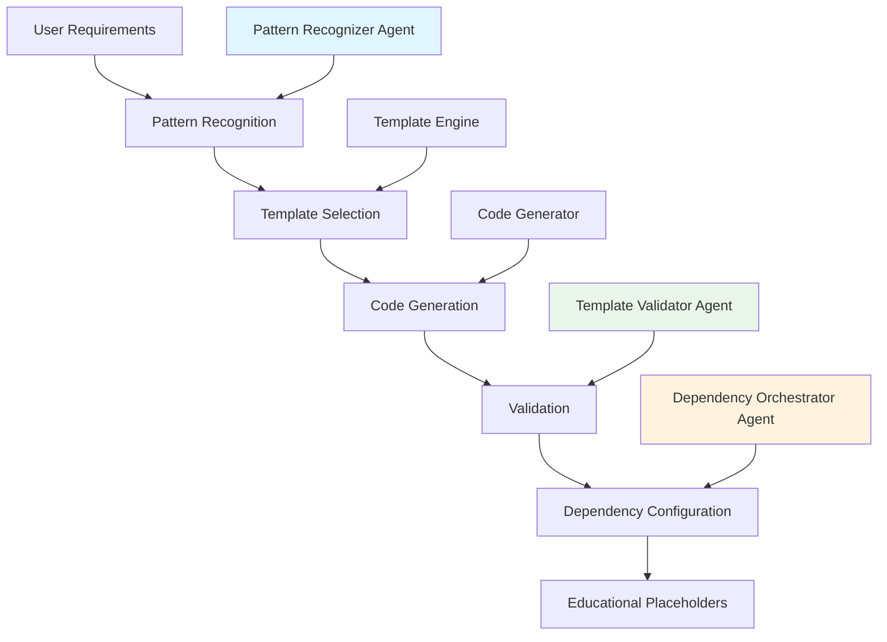

# Template Generation System

> **How the Agent OS + PocketFlow Framework Creates Templates**

## 🏗️ What This System Does

The template generation system is the core of our framework. It analyzes requirements, identifies optimal patterns, and generates educational starting points for PocketFlow applications.

**Key Principle**: We generate meaningful placeholders that teach proper implementation, not completed applications.

---

## Generation Pipeline



---

## Core Components

### 1. Pattern Recognition
**Location**: `.agent-os/workflows/pattern_analyzer.py`

Analyzes requirements and identifies optimal PocketFlow patterns:

```python
# Example pattern recognition
requirements = "Build a document search system with Q&A"
recommendation = analyzer.analyze_requirements(requirements)

# Result:
# - Primary Pattern: RAG (confidence: 0.92)
# - Secondary: Tool integration
# - Template: RAG + API integration
```

**Supported Patterns**:
- **RAG**: Document search, knowledge bases, Q&A systems
- **Agent**: Decision-making, planning, autonomous workflows  
- **Tool**: API integration, data processing, automation
- **Workflow**: Multi-step processes, business logic
- **Hybrid**: Complex combinations

### 2. Template Engine  
**Location**: `.agent-os/workflows/generator.py`

Generates structured project templates:

```python
def generate_template(pattern: str, project_name: str) -> ProjectTemplate:
    """
    Generate educational template for specified pattern.
    
    Creates:
    - Proper PocketFlow node structures
    - Educational TODO placeholders
    - Type-safe Pydantic models
    - Integration points
    - Test scaffolding
    """
```

### 3. Sub-Agent System

Three specialized agents enhance template quality:

#### Pattern Recognizer Agent
- Analyzes user requirements
- Maps to optimal PocketFlow patterns
- Provides confidence scoring
- Suggests template customizations

#### Template Validator Agent  
- Validates generated template structure
- Ensures PocketFlow pattern compliance
- Checks placeholder educational value
- Maintains framework vs usage distinction

#### Dependency Orchestrator Agent
- Generates proper dependency configurations
- Creates pyproject.toml templates
- Configures development tools
- Manages pattern-specific requirements

---

## Template Structure

### Generated Project Layout
```
generated-project/
├── __init__.py
├── main.py                 # Entry point with TODO guidance
├── flow.py                 # PocketFlow workflow definition
├── nodes.py               # Node implementations (with TODOs)
├── schemas/
│   ├── __init__.py
│   └── models.py          # Pydantic models (structured TODOs)
├── utils/                 # Utility modules (with TODOs)
├── tests/                 # Test scaffolding
├── docs/
│   └── design.md          # Generated design document
├── pyproject.toml         # Complete dependency configuration
└── README.md              # Implementation guidance
```

### Example Generated Node
```python
class DocumentRetrievalNode(Node):
    """Retrieves relevant documents for user queries."""
    
    async def prep(self, shared_store: SharedStore) -> Dict[str, Any]:
        """
        Prepare document retrieval system.
        
        TODO: Initialize your vector database:
        1. Load embedding model (sentence-transformers recommended)
        2. Connect to vector store (Chroma, Pinecone, etc.)
        3. Verify document index exists
        4. Set up error handling
        
        Example:
        ```python
        self.embedder = SentenceTransformer('all-MiniLM-L6-v2')
        self.vector_db = chromadb.Client()
        self.collection = self.vector_db.get_collection("documents")
        ```
        """
        raise NotImplementedError("Vector database initialization needed")
    
    async def exec(self, shared_store: SharedStore) -> Dict[str, Any]:
        """
        Execute document retrieval.
        
        TODO: Implement semantic search:
        1. Get query from shared_store["user_query"]
        2. Generate query embedding
        3. Search vector database for similar documents
        4. Rank and filter results by relevance threshold
        5. Store results in shared_store["retrieved_docs"]
        """
        raise NotImplementedError("Document retrieval logic needed")
```

---

## Generation Features

### 🎓 Educational Placeholders
- Detailed TODO comments explaining what to implement
- Multiple implementation approaches suggested
- Example code patterns provided
- Best practices and considerations included

### 🔧 Type Safety
- Full Pydantic model definitions
- Type hints throughout
- Proper return type annotations
- Input validation patterns

### 🧪 Test Scaffolding
- Unit test templates
- Integration test examples
- Mock patterns for external services
- Test data factories

### 📦 Dependency Management
- Complete pyproject.toml with pattern-specific deps
- Development tool configuration (ruff, mypy, pytest)
- Optional dependency suggestions
- Version compatibility matrices

### 📝 Documentation
- Auto-generated design documents
- API documentation templates
- Deployment guides
- Implementation checklists

---

## Customization Points

### Template Parameters
```python
TemplateConfig(
    pattern="RAG",
    project_name="document-qa-system",
    features=["api", "async", "monitoring"],
    deployment="docker",
    database="postgresql",
    auth_provider="jwt"
)
```

### Pattern Variants
- **RAG + API**: Web API for document Q&A
- **Agent + Planning**: Multi-step decision workflows  
- **Tool + Batch**: Large-scale data processing
- **Hybrid**: Complex multi-pattern systems

---

## Quality Standards

### Template Validation
- ✅ Python syntax correctness
- ✅ PocketFlow pattern compliance
- ✅ Educational placeholder quality
- ✅ Type annotation completeness
- ✅ Framework vs usage distinction

### Educational Value
- ✅ Clear implementation guidance
- ✅ Multiple approach options
- ✅ Best practice examples
- ✅ Common pitfall warnings
- ✅ Integration point clarity

---

## For Framework Contributors

### Adding New Patterns
1. Define pattern indicators in `pattern_analyzer.py`
2. Create template structure in generator
3. Add educational placeholder content
4. Configure pattern-specific dependencies
5. Add validation rules
6. Update documentation

### Improving Templates
1. Enhance placeholder educational value
2. Add more implementation options
3. Improve type safety
4. Expand test coverage
5. Update dependency configurations

Remember: We're building the tools that help developers learn and implement correctly, not doing the implementation for them.