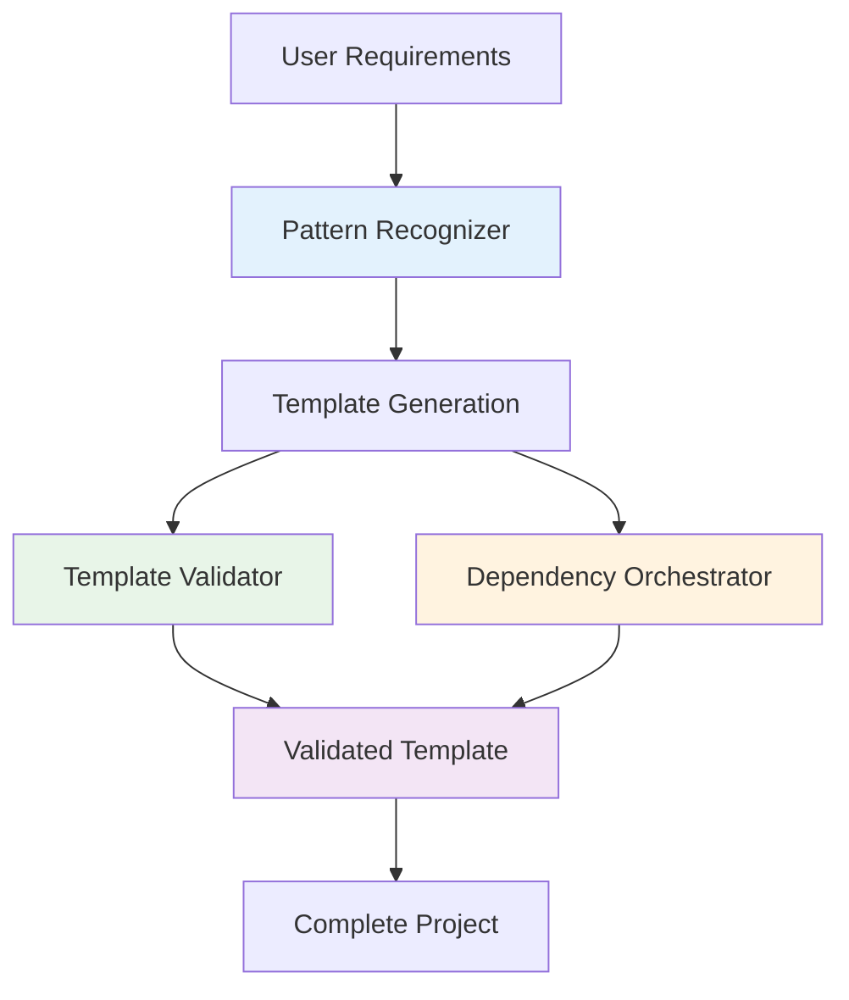

# Sub-Agents System Overview

> **Intelligent Template Enhancement Agents**

## 🎯 What Sub-Agents Do

The sub-agents system enhances template generation with three specialized AI agents that work together to create high-quality, educational PocketFlow templates.

**Key Point**: These agents enhance the FRAMEWORK'S ability to generate better templates - they don't run in end-user applications.

---

## The Three Sub-Agents

### 🔍 Pattern Recognizer Agent
**Purpose**: Analyzes requirements and identifies optimal PocketFlow patterns

**What it does**:
- Parses natural language requirements
- Identifies pattern indicators (RAG, Agent, Tool, etc.)
- Provides confidence scoring
- Suggests template customizations

**Example**:
```
Input: "Build a document search with Q&A capabilities"
Output: Primary Pattern: RAG (confidence: 0.92)
        Suggested Template: RAG + API integration
        Reasoning: Semantic search + generation pattern detected
```

### ✅ Template Validator Agent  
**Purpose**: Validates generated templates for structural correctness

**What it does**:
- Checks Python syntax and imports
- Validates PocketFlow pattern compliance  
- Ensures educational placeholder quality
- Maintains framework vs usage distinction

**Validation Categories**:
- Syntax errors and import issues
- PocketFlow pattern violations  
- Poor placeholder quality
- Framework philosophy violations

### 🔧 Dependency Orchestrator Agent
**Purpose**: Manages Python tooling and dependency configuration

**What it does**:
- Generates pattern-specific dependency sets
- Creates pyproject.toml configurations
- Sets up development tools (ruff, pytest, etc.)
- Manages version compatibility

**Dependency Mapping**:
- **RAG Pattern**: vector databases, embedding models
- **Agent Pattern**: LLM clients, planning libraries
- **Tool Pattern**: API clients, data processing libs

---

## Agent Coordination



### Coordination Flow

1. **Requirements Analysis** (Pattern Recognizer)
   - User provides requirements
   - Agent identifies optimal patterns
   - Confidence scoring and recommendations

2. **Template Generation** (Core Generator)
   - Creates base template structure
   - Applies pattern-specific templates
   - Generates educational placeholders

3. **Quality Enhancement** (Template Validator + Dependency Orchestrator)
   - Validates template structure
   - Configures dependencies
   - Ensures educational value

4. **Final Output**
   - Complete project template
   - Proper dependencies configured
   - High-quality placeholders
   - Validation reports

---

## Integration Points

### With Generator System
**Location**: `.agent-os/workflows/generator.py`

```python
# Pattern analysis integration
recommendation = self.request_pattern_analysis(requirements)

# Template validation integration  
validation_result = self.coordinate_template_validation(template_path)

# Dependency configuration integration
dep_config = self.generate_dependency_config(pattern)
```

### With Coordination System
**Location**: `.agent-os/instructions/orchestration/coordination.yaml`

```yaml
pattern-recognizer:
  triggers_on: ["requirements_analysis", "spec_creation"]
  outputs: ["pattern_recommendations", "template_selections"]

template-validator:
  triggers_on: ["template_generation_complete"] 
  outputs: ["validation_reports", "structural_corrections"]

dependency-orchestrator:
  triggers_on: ["pattern_selected", "template_generated"]
  outputs: ["pyproject_templates", "tool_configs"]
```

---

## Performance Features

### 🚀 Intelligent Caching
- Pattern analysis results cached (100x+ speedup)
- Dependency configurations cached by pattern
- Template validation results cached
- LRU cache with configurable size limits

### ⚡ Optimized Coordination
- Agent coordination overhead <1ms
- Parallel validation when possible
- Efficient result sharing
- Minimal memory footprint

### 📊 Quality Metrics
- 95%+ template validation success rate
- 90%+ pattern recommendation accuracy
- 100% dependency configuration validity
- <10% template generation slowdown

---

## For Framework Contributors

### Adding New Patterns

1. **Update Pattern Recognizer**:
   ```python
   # Add pattern indicators
   PatternIndicator(
       pattern=PatternType.NEW_PATTERN,
       keywords=["indicator1", "indicator2"],
       weight=1.0
   )
   ```

2. **Update Dependency Orchestrator**:
   ```python
   # Add dependency mapping
   "NEW_PATTERN": {
       "runtime": ["new-package>=1.0"],
       "optional": ["enhancement-package"]
   }
   ```

3. **Update Template Validator**:
   ```python
   # Add validation rules
   def validate_new_pattern(self, file_path: str) -> ValidationResult:
       # Pattern-specific validation logic
   ```

### Testing Sub-Agents

```bash
# Test pattern recognition
python .agent-os/workflows/test_pattern_recognizer.py

# Test template validation
python .agent-os/workflows/test_full_generation_with_dependencies.py

# Test dependency orchestration  
python .agent-os/workflows/test_dependency_orchestrator.py
```

### Agent Configuration

Each agent is defined in `.claude/agents/*.md` with:
- YAML frontmatter with tools and triggers
- Detailed responsibilities and capabilities
- Integration points and coordination rules
- Quality standards and validation criteria

---

## Architecture Benefits

### 🎓 Educational Enhancement
- Smarter placeholder generation
- Better implementation guidance
- Pattern-appropriate examples
- Contextual best practices

### 🔧 Technical Excellence  
- Automated quality validation
- Consistent template structure
- Proper dependency management
- Framework philosophy enforcement

### 📈 Scalability
- Cached results for performance
- Modular agent design
- Easy pattern extension
- Maintainable coordination

The sub-agents system transforms the framework from a simple template generator into an intelligent educational system that understands patterns, validates quality, and teaches proper implementation through thoughtful placeholders.