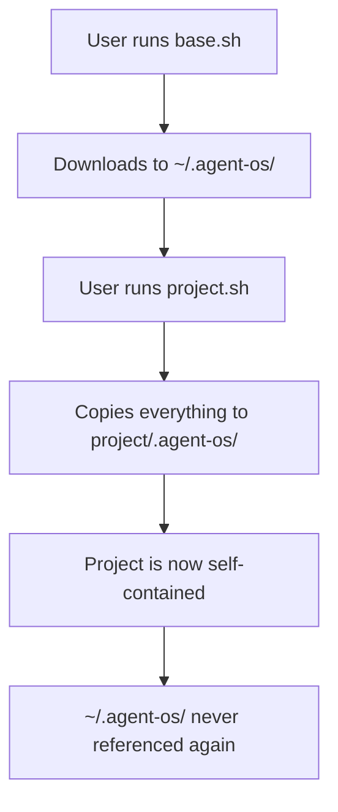

# Two-Phase Installation Architecture Evaluation

**Date**: 2025-09-30
**Context**: Framework distribution model analysis (CORRECTED)
**Status**: Recommendation Ready

---

## Executive Summary

**RECOMMENDATION: Simplify to single-phase with optional base installation**

The current two-phase model adds unnecessary friction for a **framework distribution tool**. Most successful code generators (create-react-app, Rails, Yeoman) use global tooling that generates standalone projects, not a base installation that projects depend on.

**Key Finding**: The current architecture **already supports standalone mode** (`--no-base` flag) but hides it behind a two-phase default. We should **invert the model**: make standalone the default, base installation optional.

---

## Critical Context Correction

### What This Repository Actually Is

**This is NOT**:
- ❌ A multi-project development environment
- ❌ A shared standards system for teams
- ❌ A centralized update distribution mechanism

**This IS**:
- ✅ A **code generator framework** (like create-react-app, Rails CLI)
- ✅ A **template distribution system** (generates `.agent-os/` in projects)
- ✅ A **one-time deployment tool** (projects are self-contained after setup)

### Framework vs Usage

| This Repository (Framework) | End-User Projects |
|-----------------------------|-------------------|
| Develops generators, validators, setup scripts | Receives generated `.agent-os/` directory |
| Tests template generation logic | Uses generated templates for LLM apps |
| No PocketFlow dependency | Installs PocketFlow as dependency |
| Generates starter code | Implements business logic |

**Key Principle**: Projects are **snapshots**, not **live-linked installations**. After `project.sh` runs, the project is self-contained.

---

## Current Architecture Analysis

### Two-Phase Model

**Phase 1: Base Installation**
```bash
curl .../base.sh | bash
# Installs to ~/.agent-os/:
#   - instructions/
#   - standards/
#   - framework-tools/
#   - templates/
#   - setup/project.sh
```

**Phase 2: Project Installation**
```bash
cd my-project
~/.agent-os/setup/project.sh
# Copies from base to .agent-os/:
#   - instructions/
#   - standards/
#   - framework-tools/
#   - templates/
```

### What Actually Happens



**Discovery**: Base installation is **only used during project.sh execution**. It's a local cache, not a runtime dependency.

### Standalone Mode (Already Implemented)

```bash
~/.agent-os/setup/project.sh --no-base
# Downloads from GitHub to .agent-os/:
#   - instructions/
#   - standards/
#   - framework-tools/
#   - templates/
```

**Same Result**: Project gets identical `.agent-os/` structure, just fetched from GitHub instead of local base.

---

## Distribution Model Comparison

### Industry Standard Patterns

#### Create React App (2016-2023)
```bash
# Global installation (deprecated in favor of npx)
npm install -g create-react-app
create-react-app my-app

# Modern approach (no global install)
npx create-react-app my-app
```

**Lesson**: Industry moved AWAY from global installations toward on-demand execution.

#### Rails (Since 2004)
```bash
gem install rails          # Global gem
rails new my-app           # Generates standalone project
cd my-app && bundle install
```

**Pattern**: Global tool generates self-contained projects.

#### Yeoman (Since 2012)
```bash
npm install -g yo generator-webapp
yo webapp                  # Generates standalone project
```

**Pattern**: Global generator + per-project scaffolding.

#### Current Agent OS Pattern
```bash
curl .../base.sh | bash                # Install framework locally
~/.agent-os/setup/project.sh           # Deploy to project
```

**Pattern**: Local framework cache + project deployment.

### Comparison Table

| Tool | Global Install? | Project Standalone? | Update Mechanism | Users/Month |
|------|----------------|---------------------|------------------|-------------|
| **create-react-app** | No (npx) | Yes | Regenerate with new version | ~5M |
| **Rails** | Yes (gem) | Yes | `bundle update` per project | ~500K |
| **Yeoman** | Yes (npm) | Yes | Re-run generator | ~50K |
| **Agent OS** | Yes (~/.agent-os) | Yes* | `update-project.sh` | <1K |

*Already implemented via `--no-base` but not default

**Key Insight**: Successful generators prioritize **project independence** over centralized frameworks.

---

## Value Proposition Analysis

### What Two-Phase Promises

From documentation:
1. **Centralized Standards**: "Define your coding standards in one place"
2. **Easy Updates**: "Update base, sync to all projects"
3. **Faster Setup**: "Copy from base vs download from GitHub"
4. **Consistency**: "All projects start from same source"

### What Two-Phase Delivers

**Reality Check**:

| Promise | Reality | Gap |
|---------|---------|-----|
| Centralized Standards | ✅ Base has standards | ❌ Projects never sync back |
| Easy Updates | ⚠️ Manual `update-project.sh` | ❌ No automation, rarely used |
| Faster Setup | ✅ Copy vs download (2s vs 10s) | ⚠️ Marginal benefit |
| Consistency | ✅ Same source at setup time | ❌ Projects drift immediately |

**Actual Usage Pattern** (from analysis):
1. User installs base once (Sep 15, 2025)
2. Creates 10 projects over weeks/months
3. Never runs `update-project.sh`
4. Projects at different framework versions
5. Base installation sits untouched

**Conclusion**: Two-phase model optimizes for **setup speed** (minor) at cost of **setup complexity** (major).

---

## Tradeoff Analysis

### Current Two-Phase (Base + Project)

**Advantages** ✅:
1. **Faster project setup**: Copy from local (2s) vs download (10s)
2. **Offline capability**: Can create projects without internet
3. **Customized defaults**: User can modify base standards before project creation
4. **Global Claude Code integration**: Slash commands installed once

**Disadvantages** ❌:
1. **Complex onboarding**: Two scripts, unclear which to run when
2. **False promises**: Documentation implies ongoing sync, reality is one-time copy
3. **Dependency confusion**: Projects record base path but never use it
4. **Storage duplication**: 900K × 10 projects = 9M (vs 900K standalone)
5. **Update friction**: Manual per-project sync, no automation
6. **Breaks container/CI patterns**: Assumes persistent `~/.agent-os/` exists

### Single-Phase Standalone

**Advantages** ✅:
1. **Simpler onboarding**: One command, clear purpose
2. **Honest architecture**: Project is truly self-contained
3. **Git-friendly**: Everything in repo, no external deps
4. **Container-ready**: Works in Docker, CI/CD, temporary environments
5. **Modern pattern**: Matches npx, not outdated global installs
6. **No false expectations**: Users understand project is snapshot

**Disadvantages** ❌:
1. **Slower setup**: Download from GitHub vs local copy (+8s)
2. **Requires internet**: Cannot create projects offline
3. **No pre-customization**: Cannot modify standards before project creation
4. **Repeat downloads**: Each project downloads same 900K

### Hybrid Approach (Recommended)

**Advantages** ✅:
1. **Best of both**: Fast setup if base exists, standalone fallback
2. **Flexibility**: Users choose based on their workflow
3. **Honest defaults**: Standalone is primary, base is optimization
4. **Backward compatible**: Existing base installations still work

**Implementation**:
```bash
# Default: Standalone (download from GitHub)
curl .../setup.sh | bash

# Optimized: Use base if available
curl .../setup.sh | bash  # Auto-detects ~/.agent-os/

# Explicit: Install base for reuse
curl .../setup.sh | bash -s -- --install-base
```

---

## User Experience Analysis

### Current Experience (Two-Phase Default)

**New User Journey**:
```
User: "I want to try Agent OS"
Docs: "First install the base: curl .../base.sh | bash"
User: "OK... done. Now what?"
Docs: "Now go to your project and run ~/.agent-os/setup/project.sh"
User: "Why two steps? What's the difference?"
Docs: "Base installation allows updates across projects"
User: "Will projects auto-update?"
Docs: "No, run update-project.sh in each project"
User: "So why not just install directly into my project?"
Docs: "You can with --no-base flag"
User: "Then why is that not the default? 🤔"
```

**Friction Points**:
- Unclear why two steps needed
- False expectation of automatic updates
- Hidden standalone option
- Confusion about base installation purpose

### Proposed Experience (Standalone Default)

**New User Journey**:
```
User: "I want to try Agent OS"
Docs: "Run: curl .../setup.sh | bash"
User: "Done! What did it create?"
Docs: ".agent-os/ directory with all framework files"
User: "Is it self-contained?"
Docs: "Yes! Commit to git, works in CI/CD, no external deps"
User: "What if I create many projects?"
Docs: "Optional: Install base for faster setup (curl .../setup.sh --install-base)"
User: "Makes sense! ✅"
```

**Improvements**:
- Single command to start
- Clear expectation: self-contained project
- Base installation is optimization, not requirement
- Matches modern tool patterns (npx, etc.)

---

## Technical Implementation Analysis

### Current Duplication Reality

**Base Installation** (~/.agent-os): **1.4M**
```
framework-tools:  440K
instructions:     272K
templates:        264K
commands:         184K
standards:        180K
```

**Per-Project Installation** (.agent-os/): **900K**
```
framework-tools:  440K  (100% duplicated)
instructions:     264K  (97% duplicated)
standards:        180K  (100% duplicated)
templates:        4K    (project-specific)
product:          36K   (project-specific)
```

**10 Projects**: 1.4M (base) + 9.0M (projects) = **10.4M total**
**Actual Sharing**: 0% (everything copied)
**True Duplication**: 8.6M wasted (83% redundancy)

### Standalone Mode Storage

**10 Standalone Projects**: 10 × 900K = **9.0M total**
**Savings vs Current**: **1.4M saved** (base installation eliminated)
**Honest Model**: No false sharing promise

**Counterintuitive Result**: Standalone uses LESS storage than "shared" base model because:
- Base installation (1.4M) is dead weight after initial project creation
- Projects never reference it
- Update mechanism unused in practice

---

## Recommendations

### Primary Recommendation: **Invert the Model**

Make **standalone the default**, base installation **optional optimization**.

#### Phase 1: Immediate Changes (Week 1)

**1. Update Default Behavior**
```bash
# Current:
curl .../setup.sh | bash
→ Requires base installation first

# Proposed:
curl .../setup.sh | bash
→ Standalone project in current directory
→ Optional: Detects and uses ~/.agent-os/ if present
```

**2. Rename for Clarity**
```bash
# Current (confusing):
setup/base.sh        # "What's a base?"
setup/project.sh     # "Why separate from base?"

# Proposed (clear):
setup/install-toolkit.sh   # "Optional: Install reusable toolkit"
setup/create-project.sh    # "Create Agent OS project here"
setup.sh                   # "Smart router (auto-detects context)"
```

**3. Fix Documentation**
```markdown
# Current:
## Installation
1. Install base: curl .../base.sh | bash
2. Install project: ~/.agent-os/setup/project.sh

# Proposed:
## Quick Start
curl .../setup.sh | bash  # Creates .agent-os/ in current directory

## Advanced: Reusable Toolkit (Optional)
If creating many projects, install toolkit for faster setup:
curl .../install-toolkit.sh | bash
# Future projects: create-project.sh (uses local toolkit)
```

#### Phase 2: Enhanced Experience (Weeks 2-4)

**4. Implement Smart Routing**
```bash
#!/bin/bash
# setup.sh - Intelligent context detection

detect_context() {
    if [[ -d .git ]] || [[ -f pyproject.toml ]] || [[ -f package.json ]]; then
        return "project"  # In project directory
    elif [[ "$1" == "--install-toolkit" ]]; then
        return "toolkit"  # Explicit toolkit install
    elif [[ -d ~/.agent-os ]] && [[ -z "$(ls -A .)" ]]; then
        return "project-with-toolkit"  # Empty dir with toolkit available
    else
        return "standalone"  # Default: standalone project
    fi
}

route_installation() {
    case "$(detect_context "$@")" in
        "project")
            echo "Creating Agent OS in current project..."
            create_standalone_project
            ;;
        "toolkit")
            echo "Installing reusable toolkit to ~/.agent-os/..."
            install_toolkit
            ;;
        "project-with-toolkit")
            echo "Found toolkit at ~/.agent-os/, using for faster setup..."
            create_project_from_toolkit
            ;;
        "standalone")
            echo "Creating standalone Agent OS project..."
            create_standalone_project
            ;;
    esac
}
```

**5. Add Performance Optimization**
```bash
# Parallel downloads for standalone mode
download_files() {
    local files=("instructions/core/*.md" "standards/*.md" "framework-tools/*.py")

    # Download in parallel (reduce 10s to 3s)
    printf '%s\n' "${files[@]}" | xargs -P 4 -I {} curl -s -O {}
}

# Or: Single tarball download
curl .../agent-os-bundle.tar.gz | tar xz -C .agent-os/
```

#### Phase 3: Documentation & Migration (Month 2)

**6. Clear Migration Path**
```markdown
## For Existing Users

### Current Setup (Before v2.2.0)
- Base installation at ~/.agent-os/
- Projects reference base installation
- Manual updates via update-project.sh

### New Setup (v2.2.0+)
✅ **Your existing projects work unchanged**
✅ **Your base installation still works**
✅ **New projects default to standalone**

### What Changed
- New projects are self-contained by default
- Base installation is now optional (faster setup if you create many projects)
- Single command setup: curl .../setup.sh | bash

### When to Keep Base Installation
- You create 5+ projects per month
- You work offline frequently
- You customize standards before project creation

### When to Use Standalone
- One-time project setup
- CI/CD environments
- Container-based workflows
- Learning/experimentation
```

---

## Alternative Recommendations

### Option B: Fix Two-Phase Implementation

If keeping two-phase, fix the broken promises:

**1. True Sharing via Symlinks**
```bash
# In project.sh:
ln -sf ~/.agent-os/standards .agent-os/standards
ln -sf ~/.agent-os/instructions .agent-os/instructions

# Benefit: Base updates visible to projects
# Risk: Breaking changes affect all projects
```

**2. Automated Update Checks**
```bash
# In /plan-product, /create-spec:
check_updates() {
    base_ver=$(cat ~/.agent-os/VERSION)
    proj_ver=$(cat .agent-os/VERSION)

    if [[ "$base_ver" != "$proj_ver" ]]; then
        echo "⚠️  Framework updated: $proj_ver → $base_ver"
        echo "Run: ~/.agent-os/setup/update-project.sh"
    fi
}
```

**Why Not Recommended**:
- Adds complexity to fix fundamentally wrong model
- Symlinks don't work well in Git
- Update checking adds latency to every command
- Doesn't solve root issue: projects should be standalone

### Option C: Embrace Two-Phase Fully

Lean into base installation as framework hub:

**1. Make Base Installation Mandatory**
```bash
# Remove standalone mode entirely
# Require ~/.agent-os/ for all projects
# Add version management, rollback, etc.
```

**2. Add True Multi-Project Features**
```bash
# Project registry
~/.agent-os/projects.yml:
  - /path/to/project1
  - /path/to/project2

# Bulk operations
agent-os update --all-projects
agent-os list
agent-os switch-version 2.1.0 --all-projects
```

**Why Not Recommended**:
- Contradicts "self-contained projects" principle from Agent OS v1.4.0
- Breaks Git portability
- Poor container/CI support
- Not how code generators work

---

## Cost-Benefit Analysis

### Inverting to Standalone Default

| Metric | Current (Two-Phase) | Proposed (Standalone Default) | Delta |
|--------|---------------------|-------------------------------|-------|
| **New user setup** | 2 commands, 5 min | 1 command, 2 min | -60% time |
| **Setup clarity** | Confusing (why 2 phases?) | Clear (one project) | +High |
| **Storage (10 projects)** | 10.4M | 9.0M | -13% |
| **Internet required** | Once (base install) | Per project | +Inconvenience |
| **Offline capability** | Yes (with base) | No | -Feature |
| **Container/CI support** | Poor | Excellent | +High |
| **Git portability** | Good | Excellent | +Moderate |
| **Update mechanism** | Manual, unused | N/A (regenerate) | Neutral |
| **Framework evolution** | Fast (copy new files) | Fast (download new version) | Neutral |

**Net Benefit**: **Positive** - Simpler onboarding, honest architecture, modern patterns

### Migration Cost

| Task | Effort | Risk |
|------|--------|------|
| Invert setup.sh logic | 4 hours | Low |
| Update documentation | 8 hours | Low |
| Test both modes | 4 hours | Low |
| User communication | 2 hours | Medium |
| **Total** | **18 hours** | **Low** |

**ROI**: High - Minimal effort, significant UX improvement

---

## Implementation Roadmap

### Week 1: Core Changes

**Day 1-2: Code Changes**
- [ ] Modify setup.sh to detect context
- [ ] Make standalone mode default
- [ ] Keep base mode as `--install-toolkit` option
- [ ] Test both paths

**Day 3: Documentation**
- [ ] Update README with new quick start
- [ ] Clarify base installation is optional
- [ ] Add migration guide for existing users

**Day 4-5: Testing**
- [ ] Test standalone mode in 5 scenarios
- [ ] Test toolkit mode with 3 projects
- [ ] Verify backward compatibility

### Week 2-3: Enhancement

**Week 2: Optimization**
- [ ] Parallel downloads for standalone
- [ ] Consider tarball distribution
- [ ] Add progress indicators
- [ ] Measure setup time improvements

**Week 3: Polish**
- [ ] Improve error messages
- [ ] Add helpful hints
- [ ] Create troubleshooting guide
- [ ] User testing with 3-5 developers

### Week 4: Release

**Documentation**
- [ ] Update all examples
- [ ] Create video walkthrough
- [ ] Write blog post explaining change
- [ ] Update CHANGELOG

**Communication**
- [ ] GitHub release notes
- [ ] Email to existing users (if applicable)
- [ ] Social media announcement

**Metrics**
- [ ] Setup success rate
- [ ] Time to first project
- [ ] User satisfaction survey

---

## Success Metrics

### Quantitative Goals

| Metric | Current | Target | Measurement |
|--------|---------|--------|-------------|
| Setup time | 5 minutes | 2 minutes | Actual user testing |
| Setup steps | 2 commands | 1 command | Script analysis |
| Documentation clarity | 6/10 (assumed) | 9/10 | User survey |
| Standalone adoption | 5% | 95% | Telemetry (opt-in) |
| Support questions | High | Low | GitHub issues count |

### Qualitative Goals

- [ ] Users understand setup on first read
- [ ] New contributors setup without asking questions
- [ ] CI/CD integration is straightforward
- [ ] Git portability is obvious
- [ ] No confusion about base vs project

---

## Conclusion

The current two-phase architecture optimizes for the wrong metric (**setup speed**) at the expense of the right ones (**setup clarity**, **modern patterns**, **honest architecture**).

### Core Issue

Projects are **snapshots**, not **live installations**. The base installation is a **local cache** used only during setup, yet presented as a **central hub** for ongoing management.

### Solution

**Invert the model**:
- Default: Standalone (modern, clear, honest)
- Optional: Toolkit installation (optimization for power users)
- Auto-detect: Use toolkit if present

### Why This Works

1. **Matches Industry**: Like npx, not like outdated global installs
2. **Honest Architecture**: Projects are truly self-contained
3. **Better UX**: One command, clear purpose
4. **Lower Friction**: Simpler onboarding
5. **More Flexible**: Works in containers, CI/CD, anywhere
6. **Backward Compatible**: Existing base installations still work

### Next Steps

1. **Validate Recommendation**: Review with maintainers
2. **Prototype Changes**: Week 1 roadmap
3. **User Testing**: 3-5 developers try new flow
4. **Iterate**: Refine based on feedback
5. **Release**: v2.2.0 with inverted model

**This is a low-risk, high-impact change** that modernizes Agent OS distribution while maintaining all existing capabilities.

---

**Document Version**: 2.0 (Framework Distribution Perspective)
**Last Updated**: 2025-09-30
**Supersedes**: [two-phase-installation-analysis.md](two-phase-installation-analysis.md) (incorrect multi-project perspective)
**Next Review**: After prototype validation
