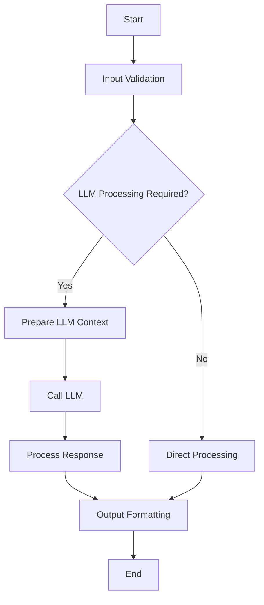
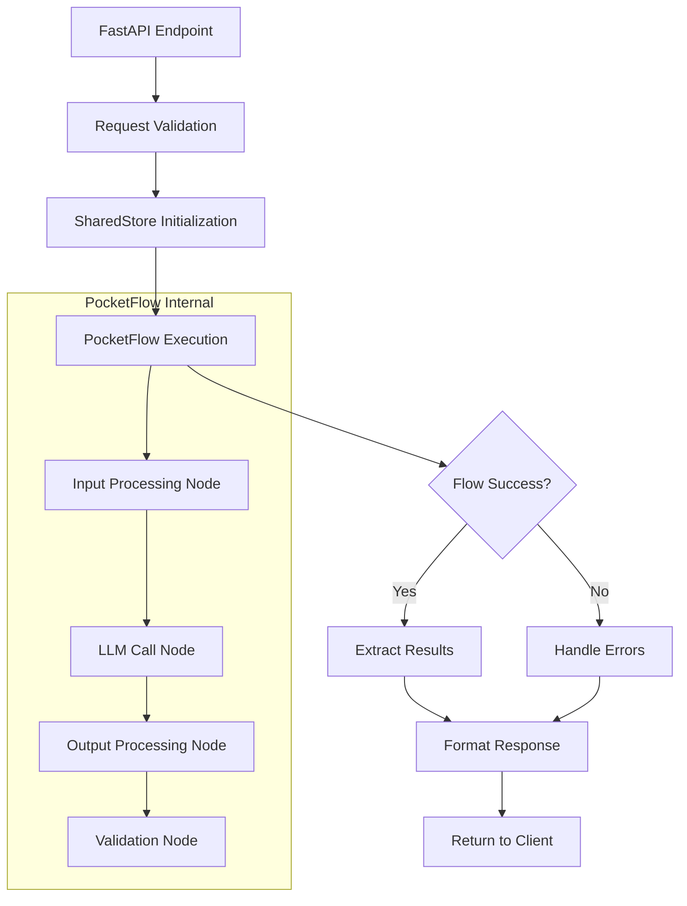

# PocketFlow Templates

> Version: 2.0  
> Last Updated: 2025-01-08  
> Purpose: Templates for PocketFlow LLM/AI workflow specifications

## Overview

This file contains all PocketFlow-specific templates for creating comprehensive LLM/AI component specifications. These templates follow PocketFlow's "Agentic Coding" methodology and minimalist graph-based approach.

## Initial Product Design Template

### Complete docs/design.md Structure for New Products

```markdown
# [PRODUCT_NAME] Design Document

> Product: [PRODUCT_NAME]
> Created: [CURRENT_DATE]
> Status: Initial Architecture Planning
> Framework: PocketFlow

**FOUNDATION**: This initial design document establishes the architectural foundation. 
Feature-specific designs will be created during spec development.

## Product Architecture Overview

### System Purpose
[PRODUCT_MISSION_SUMMARY_FROM_MISSION_MD]

### Primary PocketFlow Patterns
Based on planned features, this product will primarily use:
- **[PRIMARY_PATTERN]**: [JUSTIFICATION_FROM_FEATURE_ANALYSIS]
- **[SECONDARY_PATTERN]**: [JUSTIFICATION_IF_APPLICABLE]

### Complexity Assessment
- **Overall Complexity**: [SIMPLE_WORKFLOW/ENHANCED_WORKFLOW/COMPLEX_APPLICATION/LLM_APPLICATION]
- **Rationale**: [BASED_ON_FEATURE_COUNT_AND_INTEGRATION_REQUIREMENTS]

## System-Wide Data Flow

### High-Level Architecture
\`\`\`mermaid
graph TD
    A[User Input] --> B[API Layer]
    B --> C{Processing Required?}
    C -->|Simple| D[Direct Processing]
    C -->|Complex| E[PocketFlow Pipeline]
    E --> F[SharedStore]
    F --> G[Business Logic Nodes]
    G --> H[Output Processing]
    D --> I[Response]
    H --> I
    
    %% TODO: Replace with actual system flow based on your features
\`\`\`

### Major Data Transformations
- **Input**: [TYPICAL_USER_INPUT_FORMATS]
- **Processing**: [CORE_BUSINESS_LOGIC_TRANSFORMATIONS]
- **Output**: [EXPECTED_RESULT_FORMATS]

## Core Shared Store Schema (Outline)

### Initial Schema Planning
```python
# TODO: Define based on feature requirements from roadmap
SharedStore = {
    "user_context": "Dict[str, Any]",  # User session and preferences
    "processing_state": "Dict[str, Any]",  # Current operation state
    "feature_data": {
        # Feature-specific data structures will be defined
        # during individual feature specification
    },
    "system_metadata": {
        "product_version": "str",
        "request_id": "str", 
        "timestamp": "datetime"
    }
}
```

## External Documentation References

### Framework Documentation
- **[Framework Name]**: [Version] - [Documentation URL]
  - Key patterns utilized: [List relevant patterns]
  - Constraints considered: [List constraints]
  - Last validated: [Date]
  - Compatibility notes: [Version compatibility details]

### API Integrations
- **[API Name]**: [Version/Spec] - [Documentation URL]
  - Endpoints used: [List endpoints with documentation links]
  - Authentication method: [Method with documentation reference]
  - Rate limits: [Limits with documentation reference]
  - Error handling: [Error codes and handling from documentation]
  - SDK version: [If applicable, with compatibility notes]

### Compliance Considerations
- **[Requirement Type]**: [Specific requirements addressed]
  - Implementation approach: [How requirement is met with documentation reference]
  - Validation criteria: [How compliance is verified]
  - Documentation reference: [Link to compliance documentation]

## Architecture Decision Records

### Pattern Selection Rationale
Document why specific PocketFlow patterns were chosen:

#### [PRIMARY_PATTERN] Selection
- **Use Case Fit**: [WHY_THIS_PATTERN_FITS_THE_PROBLEM]
- **Alternatives Considered**: [OTHER_PATTERNS_EVALUATED]
- **Trade-offs**: [BENEFITS_VS_LIMITATIONS]
- **Documentation Reference**: [Link to pattern documentation]

#### Integration Strategy
- **External APIs**: [THIRD_PARTY_INTEGRATIONS_NEEDED]
  - Documentation links: [API documentation URLs]
  - Version compatibility: [Supported versions]
- **Data Persistence**: [DATABASE_OR_FILE_STORAGE_APPROACH]
  - Documentation reference: [Database/storage documentation]
- **Authentication**: [USER_AUTH_AND_SESSION_MANAGEMENT]
  - Documentation reference: [Auth provider documentation]

## Development Phases

### Phase 1: Foundation
- [ ] Core SharedStore schema implementation
- [ ] Basic API endpoints structure
- [ ] Authentication integration
- [ ] Error handling framework

### Phase 2: Core Features
- [ ] [FEATURE_1] implementation
- [ ] [FEATURE_2] implementation  
- [ ] Feature integration testing
- [ ] Performance optimization

### Phase 3: Enhancement
- [ ] Advanced features based on user feedback
- [ ] Scaling optimizations
- [ ] Analytics and monitoring
- [ ] Documentation completion

## Monitoring and Observability

### Key Metrics
- **Performance**: Response times, throughput
- **Quality**: Error rates, user satisfaction
- **Usage**: Feature adoption, usage patterns
- **Cost**: LLM API costs, infrastructure costs

### Logging Strategy
- **Request Tracking**: Full request/response logging for debugging
- **Error Monitoring**: Detailed error context and stack traces
- **Performance Monitoring**: Node execution times and bottlenecks
- **Business Metrics**: Feature usage and success rates

## Cross-Reference Navigation

### Related Documents (Generated in End-User Projects)
- **Mission Document**: @docs/mission.md - Product purpose and goals (created by end-user)
- **Roadmap Document**: @docs/roadmap.md - Feature prioritization and timeline (created by end-user)  
- **Technical Specifications**: @.agent-os/specs/ - Individual feature specifications (created by end-user)
- **Task Lists**: @.agent-os/specs/[spec-name]/tasks.md - Implementation task breakdown (created by end-user)

### Template References
- **Design Template**: See "Design Document Template" section below
- **Task Template**: @templates/task-templates.md - Implementation task structure
- **LLM Workflow Template**: See "LLM Workflow Section Template" below

### Documentation Standards
- **External References**: Use full URLs with version information
- **Internal References**: Use @-notation for relative paths
- **Cross-Links**: Reference specific sections with line numbers where applicable

### Version Compatibility Warnings
⚠️ **COMPATIBILITY NOTICE**: Always verify version compatibility before implementation

#### Framework Version Compatibility (For End-User Projects)
- **Agent OS + PocketFlow Framework**: These templates require framework installation (this repository)
- **FastAPI**: Compatible with versions 0.100.0+ (current versions have stable async/await patterns)  
- **Pydantic**: v2.x required for advanced validation features (breaking changes from v1.x)

#### LLM Provider Compatibility
- **OpenAI API**: Check model availability (GPT-4, GPT-3.5-turbo versions change frequently)
- **Anthropic Claude**: API version compatibility (v1 vs v2 API differences)
- **Model Deprecation**: Verify model availability before implementation

#### API Integration Warnings
- **Rate Limits**: API rate limits change frequently - always check current documentation
- **Authentication**: OAuth flows and API key formats may change between versions
- **Breaking Changes**: Check API changelog for breaking changes in newer versions

## Next Steps

### Immediate Actions
1. **Complete Mission Definition**: Finalize docs/mission.md with clear product goals
2. **Feature Roadmap**: Create detailed feature list in docs/roadmap.md
3. **Technical Research**: Investigate specific PocketFlow patterns for planned features
4. **Architecture Validation**: Review this design with stakeholders

### Ongoing Documentation
- Feature-specific designs will expand this foundation
- Regular architecture reviews and updates
- Performance benchmarking and optimization plans
- User feedback integration and iteration planning
```

## Design Document Template

### Complete docs/design.md Structure

```markdown
# Design Document

> Spec: [SPEC_NAME]
> Created: [CURRENT_DATE]
> Status: Design Phase
> Framework: PocketFlow

**CRITICAL**: This design document MUST be completed before any code implementation begins.

## Requirements

### Problem Statement
[CLEAR_PROBLEM_DEFINITION_FROM_USER_PERSPECTIVE]

### Success Criteria
- [MEASURABLE_OUTCOME_1]
- [MEASURABLE_OUTCOME_2]

### Design Pattern Classification
**Primary Pattern:** [AGENT/WORKFLOW/RAG/MAPREDUCE/MULTI-AGENT/STRUCTURED-OUTPUT]
**Secondary Patterns:** [IF_APPLICABLE]

### Input/Output Specification
- **Input Format:** [DATA_STRUCTURE_DESCRIPTION]
- **Output Format:** [DATA_STRUCTURE_DESCRIPTION]
- **Error Conditions:** [LIST_OF_ERROR_SCENARIOS]

## Flow Design

### High-Level Architecture


### Node Sequence
1. **[NODE_1_NAME]** - [PURPOSE_AND_RESPONSIBILITY]
2. **[NODE_2_NAME]** - [PURPOSE_AND_RESPONSIBILITY]
3. **[NODE_3_NAME]** - [PURPOSE_AND_RESPONSIBILITY]

### Branching Logic
- **Success Path:** [DESCRIBE_NORMAL_FLOW]
- **Error Paths:** [DESCRIBE_ERROR_HANDLING_FLOW]
- **Retry Strategy:** [DESCRIBE_RETRY_MECHANISMS]

### SharedStore Data Flow
```
Initial State: {"input": [INPUT_DATA]}
After Node 1: {"input": [INPUT_DATA], "validated": [VALIDATED_DATA]}
After Node 2: {"validated": [VALIDATED_DATA], "processed": [PROCESSED_DATA]}
Final State: {"processed": [PROCESSED_DATA], "result": [FINAL_OUTPUT]}
```

## Utilities

Following PocketFlow's "implement your own" philosophy, specify all utility functions needed.

### Required Utility Functions

#### [UTILITY_FUNCTION_1]
- **File:** `utils/[function_name].py`
- **Purpose:** [ONE_SENTENCE_DESCRIPTION]
- **Input:** [TYPE_AND_DESCRIPTION]
- **Output:** [TYPE_AND_DESCRIPTION]
- **Error Handling:** [EXCEPTION_TYPES_RAISED]
- **Dependencies:** [EXTERNAL_APIS_OR_LIBRARIES]

#### [UTILITY_FUNCTION_2]
- **File:** `utils/[function_name].py`
- **Purpose:** [ONE_SENTENCE_DESCRIPTION]
- **Input:** [TYPE_AND_DESCRIPTION]
- **Output:** [TYPE_AND_DESCRIPTION]
- **Error Handling:** [EXCEPTION_TYPES_RAISED]
- **Dependencies:** [EXTERNAL_APIS_OR_LIBRARIES]

### LLM Integration Specifics
- **Model/Provider:** [SPECIFIC_MODEL_E.G._GPT-4, CLAUDE-3.5]
  - Documentation: [Provider API documentation URL]
  - Version: [Model version with compatibility notes]
- **Prompt Strategy:** [FEW-SHOT/CHAIN-OF-THOUGHT/STRUCTURED]
  - Best practices reference: [Link to prompting guidelines]
- **Temperature/Parameters:** [SPECIFIC_SETTINGS]
  - Parameter documentation: [Link to parameter explanations]
- **Token Limits:** [MAX_TOKENS_CONSIDERATIONS]
  - Model limits reference: [Link to token limit documentation]
- **Cost Estimation:** [APPROXIMATE_COST_PER_OPERATION]
  - Pricing reference: [Link to current pricing documentation]

## Data Design

### SharedStore Schema
Following PocketFlow's shared store pattern, all data flows through a common dictionary.

```python
# Initial SharedStore structure
SharedStore = {
    # Input data
    "input": Dict[str, Any],
    "user_context": Dict[str, Any],
    
    # Processing states
    "validated_input": Dict[str, Any],
    "llm_context": str,
    "llm_response": str,
    "processed_data": Dict[str, Any],
    
    # Output data
    "result": Dict[str, Any],
    "metadata": Dict[str, Any],
    
    # Error handling
    "errors": List[str],
    "retry_count": int,
    
    # Timestamps for debugging
    "start_time": datetime,
    "end_time": datetime
}
```

### Data Validation Rules
- **Input Requirements:** [REQUIRED_FIELDS_AND_TYPES]
- **Output Guarantees:** [GUARANTEED_FIELDS_AND_TYPES]
- **Error States:** [ERROR_FIELD_SPECIFICATIONS]

### Pydantic Models (if FastAPI integration)
- **Request Model:** [MODEL_NAME_AND_FIELDS]
- **Response Model:** [MODEL_NAME_AND_FIELDS]
- **Error Model:** [ERROR_RESPONSE_STRUCTURE]

## Node Design

### Node Specifications

#### [NODE_1_NAME] ([NODE_TYPE: Node/AsyncNode/BatchNode])
- **Purpose:** [SINGLE_RESPONSIBILITY_DESCRIPTION]
- **prep() Logic:**
  - Reads: `shared["[KEY1]"]`, `shared["[KEY2]"]`
  - Validates: [VALIDATION_LOGIC]
  - Prepares: [PREPARATION_STEPS]
- **exec() Logic:**
  - Processes: [CORE_LOGIC_DESCRIPTION]
  - Uses Utilities: `[UTILITY_FUNCTION_NAME]`
  - Pure Computation: [COMPUTATIONAL_STEPS]
- **post() Logic:**
  - Writes: `shared["[OUTPUT_KEY]"]`
  - Updates: [METADATA_OR_STATE_UPDATES]
  - Returns Action: `"[ACTION_STRING]"`
- **Error Handling:**
  - Exceptions → Actions: [EXCEPTION_TO_ACTION_MAPPING]
  - Retry Strategy: [RETRY_MECHANISM_IF_APPLICABLE]

#### [NODE_2_NAME] ([NODE_TYPE])
[REPEAT_STRUCTURE_FOR_EACH_NODE]

### Flow Assembly Pattern
```python
# flow.py structure
flow = Flow(
    nodes={
        "[NODE_1_NAME]": Node1(),
        "[NODE_2_NAME]": Node2(),
        "error_handler": ErrorHandlerNode()
    },
    edges={
        "[NODE_1_NAME]": {
            "success": "[NODE_2_NAME]",
            "validation_error": "error_handler",
            "retry": "[NODE_1_NAME]"
        },
        "[NODE_2_NAME]": {
            "success": None,  # End flow
            "error": "error_handler"
        }
    }
)
```

### Integration Points
- **FastAPI Integration:** [IF_APPLICABLE_ENDPOINT_INTEGRATION]
- **MCP Tool Integration:** [IF_MULTI_AGENT_COORDINATION_NEEDED]
- **External APIs:** [THIRD_PARTY_INTEGRATIONS]
```

## LLM Workflow Section Template

### For spec.md LLM Workflow Section

```markdown
## LLM Workflow

**Design Document Reference:** @docs/design.md (MUST be created first)

### PocketFlow Architecture

**Primary Pattern:** [AGENT/WORKFLOW/RAG/MAPREDUCE/MULTI-AGENT/STRUCTURED-OUTPUT]
**Secondary Patterns:** [IF_APPLICABLE]
**Framework:** PocketFlow (minimalist, graph-based LLM orchestration)

### High-Level Flow Architecture


### Node-by-Node Specifications

#### [NODE_1_NAME] ([NODE_TYPE: Node/AsyncNode/BatchNode])
- **Purpose:** [SINGLE_RESPONSIBILITY_DESCRIPTION]
- **Lifecycle Methods:**
  - **prep():** Reads `shared["[INPUT_KEYS]"]`, validates input format
  - **exec():** [CORE_PROCESSING_LOGIC], calls `utils.[utility_function]`
  - **post():** Writes `shared["[OUTPUT_KEYS]"]`, determines next action
- **Utility Functions Used:** `utils.[function_name]`
- **Action Strings:** `"success"`, `"validation_error"`, `"retry"`
- **Error Handling:** Converts exceptions to action strings for flow routing

#### [NODE_2_NAME] ([NODE_TYPE])
- **Purpose:** [SINGLE_RESPONSIBILITY_DESCRIPTION]
- **Lifecycle Methods:**
  - **prep():** Reads `shared["[INPUT_KEYS]"]`, [PREPARATION_LOGIC]
  - **exec():** [CORE_PROCESSING_LOGIC], handles LLM calls if applicable
  - **post():** Writes `shared["[OUTPUT_KEYS]"]`, [POST_PROCESSING_LOGIC]
- **LLM Integration:** [IF_APPLICABLE_LLM_DETAILS]
- **Action Strings:** [LIST_OF_POSSIBLE_ACTION_STRINGS]

### SharedStore Data Flow
```
Initial State: {
  "request_data": [FASTAPI_REQUEST_MODEL],
  "user_context": {...},
  "timestamp": "2025-01-XX"
}

After Input Processing: {
  "request_data": {...},
  "validated_input": {...},
  "processing_metadata": {...}
}

After LLM Processing: {
  "validated_input": {...},
  "llm_context": "...",
  "llm_response": "...",
  "parsed_output": {...}
}

Final State: {
  "parsed_output": {...},
  "result": [FASTAPI_RESPONSE_MODEL],
  "execution_metadata": {...}
}
```

### Integration Patterns

#### FastAPI + PocketFlow Integration
**Documentation References:**
- FastAPI docs: [https://fastapi.tiangolo.com/]
- PocketFlow integration guide: [Link to integration documentation]
```python
@app.post("/process", response_model=ProcessResponse)
async def process_endpoint(request: ProcessRequest):
    flow = ProcessingWorkflow()
    shared = SharedStore({
        "request_data": request.dict(),
        "timestamp": datetime.utcnow().isoformat()
    })
    
    await flow.run_async(shared)
    
    if "result" not in shared:
        raise HTTPException(status_code=500, detail="Processing failed")
    
    return ProcessResponse(**shared["result"])
```

#### Error Handling Strategy
- **Node Level:** Exceptions convert to action strings (e.g., `"validation_error"`)
- **Flow Level:** Error nodes handle different failure types
- **API Level:** Flow failures convert to appropriate HTTP status codes
- **Retry Logic:** Built into node transitions, not try/catch blocks

### Design Pattern Details

**If Agent Pattern:**
- Single autonomous decision-making entity
- Self-contained context management
- Tool-use capabilities through utility functions

**If Workflow Pattern:**
- Multi-step sequential processing
- Clear handoffs between stages
- State persistence through SharedStore

**If RAG Pattern:**
- Document retrieval node
- Context injection node  
- LLM response generation node
- Answer synthesis node

**If MapReduce Pattern:**
- BatchNode for parallel processing
- Aggregation nodes for result combination
- Suitable for large dataset processing

**If Multi-Agent Pattern:**
- Multiple specialized agent nodes
- FastMCP coordination between agents
- Shared context management

**If Structured Output Pattern:**
- Schema-driven response formatting
- Pydantic model validation
- Type-safe data transformations

### Performance Considerations
- **Async Nodes:** For I/O operations (LLM calls, API requests)
- **Batch Processing:** For iterating over large datasets
- **Caching Strategy:** [IF_APPLICABLE_CACHING_APPROACH]
- **Token Optimization:** [COST_MANAGEMENT_STRATEGY]
- **Error Recovery:** Graceful degradation patterns

### Testing Strategy
- **Node Isolation:** Test each node's prep/exec/post independently
- **Flow Integration:** Test complete workflow paths
- **Mock LLM Calls:** Use deterministic responses for testing
- **Error Scenarios:** Test all action string paths
- **Performance Testing:** Validate latency and throughput requirements
```

## PocketFlow Utilities Template

### For technical-spec.md

```markdown
## PocketFlow Utilities (LLM/AI Components)

### Required Utility Functions
```python
# utils/[utility_name].py
async def [utility_function_name](
    [param_name]: [Type],
    [optional_param]: Optional[[Type]] = None
) -> [ReturnType]:
    """
    Purpose: [ONE_SENTENCE_DESCRIPTION]
    
    Args:
        [param_name]: [DESCRIPTION]
        [optional_param]: [DESCRIPTION]
    
    Returns:
        [ReturnType]: [DESCRIPTION]
    
    Raises:
        [ExceptionType]: [WHEN_RAISED]
    """
    # Implementation details
    pass
```

### LLM Integration Specifications
- **Model/Provider:** [MODEL_NAME] ([PROVIDER])
- **API Endpoint:** [API_URL_OR_SDK]
- **Authentication:** [AUTH_METHOD]
- **Parameters:** 
  - Temperature: [VALUE]
  - Max Tokens: [VALUE]
  - Stop Sequences: [LIST]
- **Cost Estimation:** $[COST] per [UNIT]
```

## SharedStore Schema Template

### For technical-spec.md

```markdown
## SharedStore Schema (LLM/AI Components)

### Complete Data Structure
```python
# SharedStore schema definition
SharedStoreSchema = {
    # Input phase
    "request_data": Dict[str, Any],           # From FastAPI request
    "user_context": Dict[str, Any],           # User session/auth data
    "validation_results": Dict[str, Any],     # Input validation results
    
    # Processing phase
    "[processing_key]": [DataType],           # Feature-specific data
    "[intermediate_key]": [DataType],         # Processing intermediate results
    "llm_context": str,                       # Prepared LLM context
    "llm_response": str,                      # Raw LLM response
    
    # Output phase
    "processed_results": Dict[str, Any],      # Processed LLM output
    "result": Dict[str, Any],                 # Final result for API response
    "metadata": Dict[str, Any],               # Response metadata
    
    # Error handling
    "errors": List[str],                      # Error messages
    "error_code": Optional[str],              # Error classification
    "retry_count": int,                       # Retry attempt counter
    
    # Debugging/monitoring
    "start_time": datetime,                   # Flow start timestamp
    "node_times": Dict[str, float],           # Per-node execution times
    "debug_info": Dict[str, Any]              # Additional debug data
}
```

### Key Naming Conventions
- Input data: `[source]_data` (e.g., `request_data`, `file_data`)
- Processing states: `[stage]_[data]` (e.g., `validated_input`, `processed_content`)
- Results: `[type]_result` (e.g., `llm_result`, `final_result`)
- Metadata: `[context]_metadata` (e.g., `processing_metadata`, `response_metadata`)
```

## Node Specifications Template

### For technical-spec.md

```markdown
## Node Specifications (LLM/AI Components)

### Node Implementations
```python
# nodes.py
class [NodeName](AsyncNode):  # or Node, BatchNode
    """[NODE_PURPOSE_DESCRIPTION]"""
    
    def prep(self, shared: Dict[str, Any]) -> None:
        """Data preparation and validation"""
        # Read from SharedStore: shared["input_key"]
        # Validate input data
        # Prepare data for processing
        pass
    
    async def exec_async(self, shared: Dict[str, Any]) -> str:
        """Core processing logic"""
        # Use utility functions: await utility_function()
        # Process data (pure computation or I/O operations)
        # Return action string for flow routing
        return "success"  # or "error", "retry", etc.
    
    def post(self, shared: Dict[str, Any]) -> None:
        """Post-processing and result storage"""
        # Write results to SharedStore: shared["output_key"] = result
        # Update metadata
        # Clean up temporary data
        pass
```

### Action String Definitions
- **"success":** Normal processing completed successfully
- **"[custom_action]":** Feature-specific routing (e.g., "needs_approval", "requires_input")
- **"validation_error":** Input validation failed
- **"processing_error":** Core logic failed
- **"retry":** Transient error, should retry
- **"skip":** Skip to next major step

### Error Recovery Patterns
- **Validation Errors:** Route to error handling node, return structured error
- **LLM API Errors:** Retry with exponential backoff, fallback to simpler model
- **Processing Errors:** Log error, attempt graceful degradation
- **Timeout Errors:** Cancel operation, return timeout response

### Performance Considerations
- **Async Operations:** All I/O operations use AsyncNode
- **Batch Processing:** Large datasets use BatchNode with concurrency limits
- **Caching:** [CACHING_STRATEGY_IF_APPLICABLE]
- **Rate Limiting:** [RATE_LIMITING_STRATEGY_IF_APPLICABLE]
```