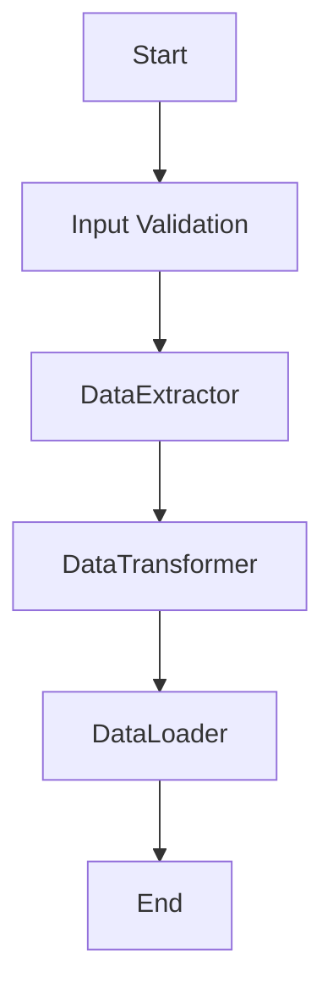

# Design Document

> Spec: SalesETL
> Created: 2025-08-26
> Status: Design Phase
> Framework: PocketFlow

**CRITICAL**: This design document MUST be completed before any code implementation begins.

## Requirements

### Problem Statement
Data processing pipeline for sales analytics

### Success Criteria
- Successful implementation of MAPREDUCE pattern
- All nodes execute correctly in sequence
- Proper error handling and validation
- Complete test coverage

### Design Pattern Classification
**Primary Pattern:** MAPREDUCE
**Secondary Patterns:** FastAPI Integration (Universal)

### Input/Output Specification
- **Input Format:** Request data from API or direct invocation
- **Output Format:** Processed results with metadata
- **Error Conditions:** Validation errors, processing failures, timeout errors

## Flow Design

### High-Level Architecture


### Node Sequence
1. **DataExtractor** - Extract data from multiple sources
2. **DataTransformer** - Transform and clean data
3. **DataLoader** - Load into data warehouse

## Utilities

Following PocketFlow's "implement your own" philosophy, specify all utility functions needed.

### Required Utility Functions


## Data Design

### SharedStore Schema
Following PocketFlow's shared store pattern, all data flows through a common dictionary.

```python
SharedStore = {
}
```

## Node Design

Following PocketFlow's node-based architecture, each processing step is implemented as a discrete node.

### 1. DataExtractor
**Purpose:** Extract data from multiple sources

**Inputs:** SharedStore
**Outputs:** Updates SharedStore

### 2. DataTransformer
**Purpose:** Transform and clean data

**Inputs:** SharedStore
**Outputs:** Updates SharedStore

### 3. DataLoader
**Purpose:** Load into data warehouse

**Inputs:** SharedStore
**Outputs:** Updates SharedStore


## Implementation Notes

- Pattern: MAPREDUCE
- Nodes: 3
- Utilities: 0
- FastAPI Integration: Enabled (Universal)

This design document was generated automatically. Please review and complete with specific implementation details.