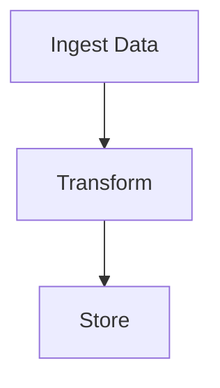

# Design Document

## Architecture
Data Processing Pipeline implemented using PocketFlow data pipeline pattern.

## Components
Core workflow nodes for processing business logic.

## Data Flow
Structured data flow through PocketFlow nodes.

## Implementation Plan
Phased implementation following PocketFlow patterns.

## Requirements
- TODO: List functional requirements
- TODO: List non-functional requirements

## Flow Design

## Node Design
- TODO: Enumerate nodes with purpose, inputs, and outputs
- TODO: Define edges and data passed between nodes
