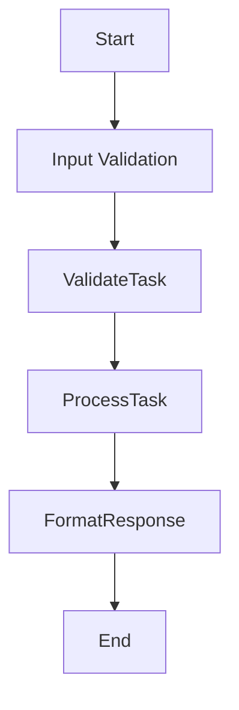

# Design Document

> Spec: TaskManager
> Created: 2025-08-26
> Status: Design Phase
> Framework: PocketFlow

**CRITICAL**: This design document MUST be completed before any code implementation begins.

## Requirements

### Problem Statement
Simple CRUD application for managing tasks

### Success Criteria
- Successful implementation of WORKFLOW pattern
- All nodes execute correctly in sequence
- Proper error handling and validation
- Complete test coverage

### Design Pattern Classification
**Primary Pattern:** WORKFLOW
**Secondary Patterns:** FastAPI Integration (Universal)

### Input/Output Specification
- **Input Format:** Request data from API or direct invocation
- **Output Format:** Processed results with metadata
- **Error Conditions:** Validation errors, processing failures, timeout errors

## Flow Design

### High-Level Architecture


### Node Sequence
1. **ValidateTask** - Validate incoming task data
2. **ProcessTask** - Process task operations (CRUD)
3. **FormatResponse** - Format API response

## Utilities

Following PocketFlow's "implement your own" philosophy, specify all utility functions needed.

### Required Utility Functions


## Data Design

### SharedStore Schema
Following PocketFlow's shared store pattern, all data flows through a common dictionary.

```python
SharedStore = {
}
```

## Node Design

Following PocketFlow's node-based architecture, each processing step is implemented as a discrete node.

### 1. ValidateTask
**Purpose:** Validate incoming task data

**Inputs:** SharedStore
**Outputs:** Updates SharedStore

### 2. ProcessTask
**Purpose:** Process task operations (CRUD)

**Inputs:** SharedStore
**Outputs:** Updates SharedStore

### 3. FormatResponse
**Purpose:** Format API response

**Inputs:** SharedStore
**Outputs:** Updates SharedStore


## Implementation Notes

- Pattern: WORKFLOW
- Nodes: 3
- Utilities: 0
- FastAPI Integration: Enabled (Universal)

This design document was generated automatically. Please review and complete with specific implementation details.